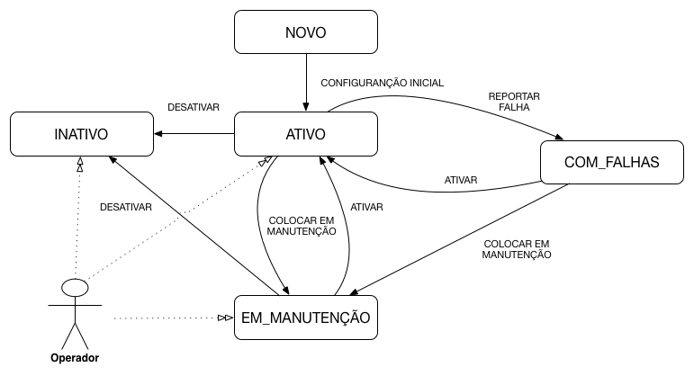
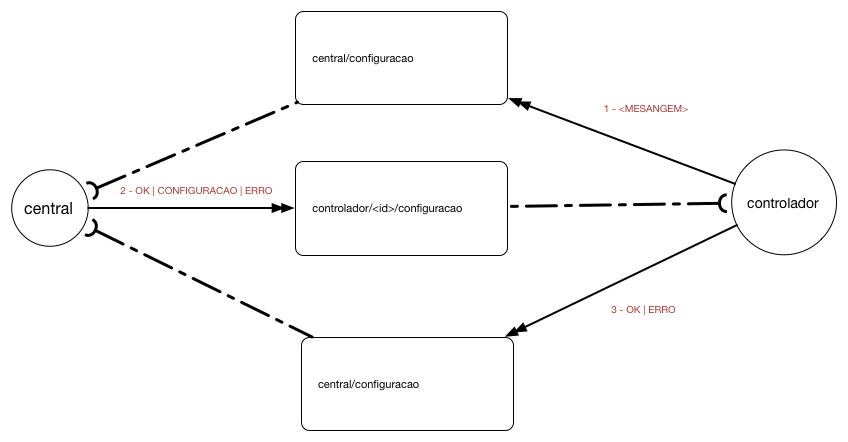
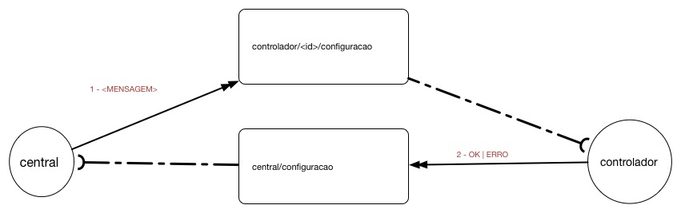

# Ciclo de Vida do Controlador
O ciclo de vida do controlador define em quais status um controlador pode estar em um devido momento, bem como as possíveis transições entre esses status. Toda vez que o controlador mudar de status a central deve ser notificada. A central também pode impor mudanças nos status do controlador.

A seguir é apresentado o diagrama de estados do controlador:




## Status
A tabela abaixo apresentado o significado de cada estado:

| Campo| Descrição |
| ------------ | ------------- |
| NOVO | O sistema foi instalado em um novo controlador, porém o mesmo ainda não recebeu sua configuração inicial|
| ATIVO | O controlador está ativo e operando normalmente |
| EM_MANUTENCAO | O controlador foi colocado em manutenção |
| COM_FALHAS |O controlador detectou uma falha de menor gravidade, porém continua operando|
| INATIVO |O controlador detectou uma falha de maior gravidade e interrompeu sua operação |

## Transições

A tabela abaixo lista as possíveis transições entre os estados do controlador. O modo de disparo pode ser __M__ (Manual) ou __A__ (Automático). O campo __mensagem__ descreve qual mensagem deve ser enviada para causar a transição:

| De| Para | Mensagem | Disparo | Descrição |
|---|------|----------|---------|-----------|
|-  |NOVO  | ---      | Automático | Todo novo controlador deve começar com o status NOVO| 
|NOVO|ATIVO|CONFIGURACAO INICIAL|Automático|O controlador recebeu da central sua configuração inicial e está pronto para entrar em operação| 
|EM MANUTENCAO, INATIVO|ATIVO|ATIVAR|Manual|O operador enviou o comando de ativar| 
|COM FALHAS|ATIVO|ATIVAR|Automático|O controlador percebeu que a falha foi sanada e que o controlador voltou a operar normalmente|
|ATIVO, COM FALHAS|EM MANUTENCAO|COLOCAR EM MANUTENCAO|Manual|O operador enviou o comando de colocar em manutenção|
|ATIVO|COM FALHAS|REPORTAR FALHA|Automático|O controlador percebeu um falha leve e continua operando mesmo assim| 
|ATIVO, EM MANUTENCAO, COM FALHAS|INATIVO|INATIVAR| Manual|O operador enviou comando para inativar o controlador| 

## Mensagem do Ciclo de Vida: Controlador / Central



## Mensagem do Ciclo de Vida: Central / Controlador




### CONFIGURAÇÃO INCIAL
Quando um controlador com status NOVO se conectar à internet ele deve solicitar à central sua configuração. Para isso, deve enviar a mensagem CONFIGURACAO_INICIAL [CONFIGURACAO_INICIAL](#CONFIGURACAO_INICIAL) para o tópico[/central/configuracao](/protocolos/alto_nivel/introducao/).

O conteúdo da mensagem é vazio.

```JSON
{}
```

### CONFIGURAÇÃO
Essa mensagem contém todas as configurações necessárias para a operação de um controlador. Pode ser enviada como resposta à mensagem [CONFIGURACAO_INICIAL] ou quando o controlador está no estado EM_MANUTENÇÃO para atualizar sua configuração.

O conteúdo dessa mensagem está especificado no tópico [Configuração do Controlador](/protocolos/alto_nivel/configuracao/)

### ATIVAR
Mensagem enviada para colocar o controlador no modo de operação ATIVO. Pode ser enviada manualmente pelo operador para tirar o controlador dos estados de INATIVO e EM_MANUTENCAO, ou pelo próprio controlador ao se recuperar de uma falha.


### COLOCAR EM MANUTENÇÃO
O operador pode enviar a mensagem COLOCAR_EM_MANUTENCAO para realizar manutenções programadas ou de exceção em um controlador.


### REPORTAR FALHA
Quando o controlador detecta uma falha que permita que ele continue operando ele deve enviar a mensagem de FALHA ao entrar no estado COM_FALHAS.


### INATIVAR
Um operador pode colocar um controlador como INATIVO. Esse estado deve ser utilizado para um controlador que não fará mais parte da rede.

