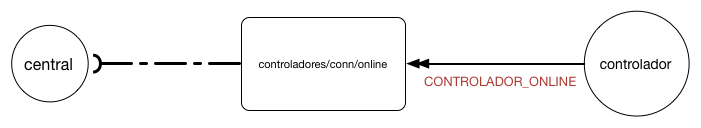
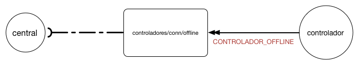
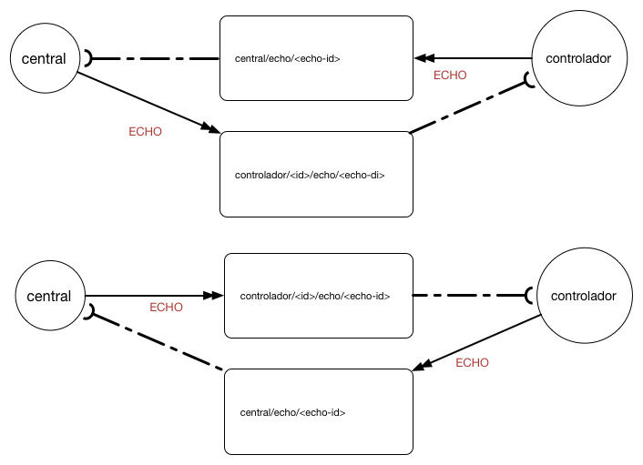

# Mantendo a Conectividade Entre os Controladores e a Central
Todo controlador deve manter a central informada dos momentos em que ele está conectado e em que perde conexão com a internet.


Para isso, ao se conectar deve enviar a mensagem [CONTROLADOR_ONLINE](#CONTROLADOR_ONLINE) e deixar como testamento a mensagem [CONTROLADOR_OFFLINE](#CONTROLADOR_OFFLINE).
Um controlador pode testar a conectividade com a central através do comando [ECHO](#ECHO). A central pode fazer o mesmo com qualquer
controlador.

## Controlador Online
Ao se conectar, o controlador deve publicar a mensagem [CONTROLADOR_ONLINE](#CONTROLADOR_ONLINE) no tópico [/controladores/conn/online](comunicao/topicos#controladores_conn_online) para avisar à central 
que ele pode receber comandos remotos. A figura abaixo abaixo apresenta o diagrama de comunicação para essa mensagem:



### Especificação da Mensagem
| Campo| Tipo | Obrigatório| Descrição |
| idControlador | Texto [UUID](https://en.wikipedia.org/wiki/Universally_unique_identifier) | SIM | Identificador do Controlador |
| dataHora | Número Longo | SIM|  Carimbo de tempo referente ao momento de criacao da mensagem. Deve estar no formato milissegundo desde 1 de janeiro de 1970|
| versao72c | Texto | SIM|  Versão do 72c|

```JSON
{
  'dataHora':'1471272798600',
  'versao72c': '1.0.0',
  'status' : 'ver tabela de status'
}
```


## Controlador Offline
Ao se conectar, o controlador deve publicar a mensagem de testamento [CONTROLADOR_OFFLINE](#CONTROLADOR_OFFLINE) que será entregue automaticamente quando ele perder conexão com o _broker MQTT_. Essa mensagem deve ser publicada no tópico [/controladores/conn/offline](comunicao/topicos#controladores_conn_offline). A figura abaixo apresenta o diagrama de comunicação para essa mensagem:



### Especificação da Mensagem
| Campo| Tipo | Obrigatório| Descrição |
| idControlador | Texto _UUID_|SIM | Identificador do Controlador |
| dataHora | Número Longo | SIM|  Carimbo de tempo referente ao momento de criacao da mensagem. Deve estar no formato milissegundo desde 1 de janeiro de 1970|

```JSON
{
  'dataHora':'1471272798600'
}
```

## Echo
A mensagem [ECHO](#ECHO) serve tanto para a central verificar se um controlador está respondendo a comandos quanto para um controlador consultar se a central está ativa. O comando [ECHO](#ECHO) deve devolver exatamente a mensagem que foi enviada. 

Quando a central desejar testar um controlador, deverá enviar a mensagem ECHO para o tópico [/controlador/\<ID\>/echo/\<ID-ECHO\>](comunicao/topicos#controlador_echo), onde \<ID\> é o identificador do controlador que responderá a mensagem e ID-ECHO é o identificador do comando de ECHO. O controlador deve reposponder a mensagem no tópico [/central/echo/\<ID-ECHO\>](comunicao/topicos#central_echo), onde \<ID-ECHO\> é o mesmo ID informado pela central para a mensagem de ECHO.

Quando o controlador desejar testar a central, deverá enviar a mensagem ECHO para o tópico [/central/echo/\<ID-ECHO\>](comunicao/topicos#central_echo), onde \<ID-ECHO\> é o identificador do comando de ECHO. A central irá responder com o comando ECHO no tópico [/controlador/\<ID\>/echo/\<ID-ECHO\>](comunicao/topicos#controlador_echo), onde \<ID\> é o identificador do controlador que envio o comando ECHO e \<ID-ECHO\> é o mesmo ID informado pela central para a mensagem de ECHO.
  


