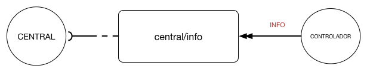

# Info
A mensagem de informação é usada para o controlador reportar sua versão para a central:




A seguir estão detalhados todos os eventos possíveis:

## Especificação 
| Campo| Tipo | Obrigatório| Descrição |
| ------------|----------- | ----------------------- |
| fabricante  | Texto      |S| Nome do Fabricante    |
| modelo      | Texto      |S| Modelo do controlador |
| versao      | Texto      |S| Versão do firmware    |


### Exemplo


```JSON
{
  "tipoMensagem": "INFO",
  "idControlador": "7abfa23d-5646-4b8c-87ae-e68addbabb36",
  "destino": "central/info",
  "qos": 2,
  "carimboDeTempo": 1479929117853,
  "conteudo": {
    "fabricante": "CET",
    "modelo": "72c",
    "versao": "1.0.4"
  }
  "emResposta": "null"
}
```


