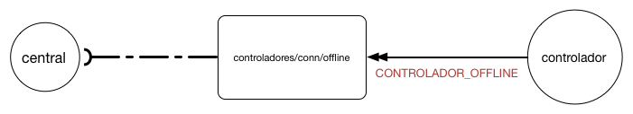
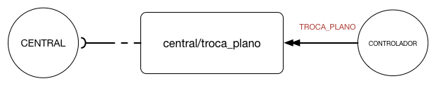

# Introdução
O protocolo de alto nível especifica todas as mensagens que são trocadas entre o controlador e a central. O 72c implementa esse protocolo. Controladores que não utilizem o 72c devem realizar sua própria implementação do mesmo.

Esse protocolo funciona via envio de envelopes para tópicos do _broker MQTT_. O envelope contém todas as informações sobre a mensagem trocada, bem como informações de origem, destino e qualidade do serviço. Os envelopes são enviados criptografados.

## Publish/Subscribe
Um tópico é uma fila de mensagens onde seus assinantes são notificados a cada nova mensagem recebida. A central é assinante dos tópicos referentes a todos os seus controladores. Cada controlador é assinante de tópicos relacionados à sua informação.

## Tópicos assinados pela central

### controladores/conn/online
Os controladores publicam mensagens nesse tópico para informar à central que estão online. Ver tópico [conectividade](/protocolos/alto_nivel/conectividade).

### controladores/conn/offline
Os controladores publicam mensagens nesse tópico para informar à central que estão offline. Ver tópico [conectividade](/protocolos/alto_nivel/conectividade).

### central/configuracao
Os controladores publicam nesse tópico para solicitar sua configuração inicial à central. Ver tópico [ciclo de vida do controlador](/protocolos/alto_nivel/ciclo_vida/)

### central/transacoes/#ID-TRANSACAO
Gerencia transações de envio de dados para o controlador. O #ID-TRANSACAO é substituído pelo id da transação que é gerado na central e informado ao controlador. Garante que o controlador fique em estado consistente. Ver tópico [transações](/protocolos/alto_nivel/transações/)

### central/alarmes_falhas/
Os controladores publicam alarmes e falhas nesse tópico para que a central tenha conhecimento. Ver tópico [Alertas e Falhas](/protocolos/alto_nivel/alertas_e_falhas/)

### central/troca_plano/
Os controladores publicam nesse tópico para informar que houve uma troca de plano.

### central/mudanca_status_controlador
Os controladores publicam nesse tópico para informar à central a mudança de status.

## Tópicos assinados pelo controlador

### controlador/#ID-CONTROLADOR/transacoes
A central publica nesse tópico transações a serem realizadas pelo controlador.

### controlador/#ID-CONTROLADOR/info
A central publica nesse tópico pedidos de leitura de dados residentes no controlador.

### controlador/#ID-CONTROLADOR/configuracao
A central publica nesse tópico a configuracao em resposta ao pedido de CONFIGURACAO_INICIAL.

  
