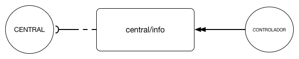

# Ler Dados
A mensagem de ler dados é usada para a central solicitar informações sobre os dados residentes no controlador.




A seguir estão detalhados todos os eventos possíveis:

## Especificação 
| Campo| Tipo | Obrigatório| Descrição |
| -----|-------|----------- | ----------------------- |
| clc         | Texto      |S| Código de Localização do Controlador|
| relogio      | Número Longo | SIM|  Carimbo de tempo referente ao relógio do controlador no momento da leitura dos dados. Deve estar no formato milissegundo desde 1 de janeiro de 1970 UTC|
| status      | Texto      |S| Status do controlador conforme [ciclo de vida](/protocolos/alto_nivel/ciclo_vida/)   |
| cla| vetor de [dados de aneis](#dados-de-aneis)|S| Lista de dados de aneis|


### Dados de Anéis

| Campo| Tipo | Obrigatório| Descrição |
| ------|------|----------- | ----------------------- |
| cla         | Texto      |S| Código de Localização do Anel|
| modoOperacao| Texto      |S| indica qual o modo de operação|
| posicaoPlano| Texto      |S| indica qual o número do plano em operação|
| impostoPorFalha| Boolean |S| Indica se o plano executado nesse momento foi imposto por falha|
| imposto      | Boolean   |S| Indica se o plano foi imposto|
| estagioAtual| Número Inteiro |S| Indica o número do estágio em execução naquele momento|
| tempoRestanteDoEstagio| Número Longo     |S| Tempo restante em milissegundos para o término da execução do estágio atual |
| tempoRestanteDoCiclo| Número Longo      |S| Tempo restante em milissegundos para o término do ciclo atual|
| momentoDoCiclo| Número Longo      |S| Tempo decorrido em milissegundos desde o início do ciclo atual|

### Exemplo


```JSON
{
  "tipoMensagem": "INFO",
  "idControlador": "7abfa23d-5646-4b8c-87ae-e68addbabb36",
  "destino": "central/info",
  "qos": 2,
  "carimboDeTempo": 1479929117853,
  "conteudo": {
    "clc": "1020121212",
    "relogio": 1479929117853,
    "status": "ativo"
    "cla":[
      {
        "cla": 123123123,
        "modeOperacao": "TEMPO_FIXO_COORDENADO",
        "posicaoPlano": 1,
        "impostoPorFalha": false,
        "imposto": false,
        "estagioAtual": 1,
        "tempoRestanteDoEstagio": 10,
        "tempoRestanteDoCiclo": 10
        "momentoDoCiclo": 50
      }
    ]
  }
  "emResposta": "null"
}
```


