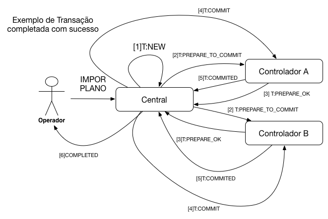
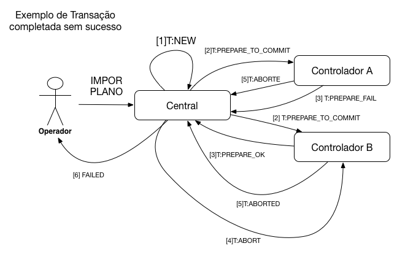

# Transações
Quando a central deseja enviar informações para o controlador e garantir que o estado final esteja consistente ela realização uma transação.
Os seguintes tipos de transações podem ser enviadas para o controlador:


##Etapas da Transação
As transações podem ser executadas para mais de um controlador ao mesmo tempo e visam garantir que só sejam aplicadas se todos os controladores forem capazes de realiza-lá. A transação segue o modelo two-phase commit comum em sistemas distribuidos. Na primeira etapa os dados que cusam a mudança de estado são enviados (fase de preparação) e na segunda etapa acontece a confirmação da transação.

O conteúdo do envelope é substituido por um objeto do tipo transação que contém os seguintes campos

| Campo| Tipo | Descrição |
| ------------ | ------------- | ------------ |
| transacaoId | String GUUID | Identificador da transação |
| etapaDaTransacao | String  | Etapa atual da transação |
| tipoTransacao | String  | Tipo de transação a ser executada |
| idControlador | String GUUID | Identificador do Controlador |
| timestamp | Número Longo | Carimbo de tempo referente ao momento de criação do envelope. Deve estar no formato milisegundo desde 1 de janeiro de 1970|
| payload | Objeto JSON ou String  representado um Objeto JSON | Mensagem a ser entregue pela transação. Pode ser direntamente o objeto JSON, ou nos casos onde seja requirido o criptografado e convertido para BASE64|


```JSON
{
  "transacaoId": "d0670924-d53e-4878-b9c8-8c1aa6edbe87",
  "etapaTransacao": "PREPARE_TO_COMMIT",
  "tipoTransacao": "IMPOSICAO_PLANO",
  "idControlador": "b5ed3a20-b91c-42e1-bc0d-2c21a2a94bd0",
  "timestamp": 1480963689345,
  "payload": {}
}
```

As transações podem ter as seguintes etapas:
##Etapas da Transação

###NEW
O usuário comando alguma ação no sistema e a central cria uma nova transação para efetuar a solicitação.
Sentido: Tela --> Central

###COMPLETED
A central informa ao usuário que a transação completou com sucesso.
Sentido: Central --> Tela

###FAILED
A central informa ao usuário que a transação falhou.
Sentido: Central --> Tela.
###PREPARE_TO_COMMIT
Informa a um controlador que ele deve se preparar para realizar uma transação.
Sentido: Central --> Controlador.
###PREPARE_OK
O controlador informa a central que está preparado para realizar a transação.
Sentido: Controlador --> Central.

###PREPARE_FAIL
O controlador informa a central que não pode realizar a transação.
Sentido: Controlador --> Central.

###COMMIT
O central informa o controlador para efetuar a transação.
Sentido: Central --> Controlador.

###ABORT
O central informa o controlador para cancelar a transação.
Sentido: Central --> Controlador.
###COMMITED
O controlador informa a central que realizou a transação
Sentido: Controlador --> Central.

###ABORTED
O controlador informa a central que abortou a transação
Sentido: Controlador --> Central.

### Exemplo de uma transação realizada com sucesso

### Exemplo de uma transação abortada


##Tipos de Transações

### PACOTE_PLANO
Envio de pacote de planos e tabela horária para o controlador.

| Campo| Tipo | Obrigatório| Descrição |
| -----|----- | ---------- | --------- |
| versoesPlanos| vetor de [versão plano](#versao-plano)|S| Lista de versões planos|
| planos| vetor de [plano](#planos)|S| Lista de planos|
| gruposSemaforicosPlanos| vetor de [grupo semafórico plano](#grupo-semaforico-plano)|S| Lista de grupos semafóricos planos|
| estagiosPlanos| vetor de [estágio plano](#estagio-plano)|S| Lista de estágios planos|
| versoesTabelasHorarias| vetor de [versão de tabela horária](#versao-tabela-horaria)|S| Lista de versões de tabelas horárias|
| tabelasHorarias| vetor de [tabela horária](#tabela-horaria)|S| Lista de tabelas horárias|
| eventos| vetor de [eventos](#evento)|S| Lista de eventos|


```JSON
{
  "versoesPlanos": [
    {
      "id": "681a8017-67db-47e8-b97d-8dd7647f3b76",
      "idJson": "dbd9cd12-845f-4657-9497-944285be3728",
      "statusVersao": "ATIVO",
      "anel": {
        "idJson": "0434c1d5-c62d-42e9-b8d6-6c7400797596"
      },
      "planos": [
        {
          "idJson": "8a47ee38-44c6-4e81-ad91-8e53df29b634"
        },
        {
          "idJson": "39ba3f57-93e7-4990-a185-fc4d47c206dc"
        },
        {
          "idJson": "12f9cc5b-0dd6-4c7f-ae0f-9e1598e8b288"
        },
        {
          "idJson": "667b5d96-3229-41ed-b9cd-207e6d56b16e"
        },
        {
          "idJson": "e01af106-bfa4-46d7-b988-6d12d700f24b"
        },
        {
          "idJson": "be1aca47-04b0-432e-b0a4-8620d5aec820"
        },
        {
          "idJson": "0ed8a499-8bbb-4421-9355-e03ced1eff12"
        },
        {
          "idJson": "0bf48c12-b459-428d-9123-46c0cc296765"
        },
        {
          "idJson": "613e373f-eec1-4b17-bc0d-e78909941a1c"
        },
        {
          "idJson": "0dd73c44-8c6c-43ca-ab29-2d24bc7e5d09"
        },
        {
          "idJson": "50be9f8d-259e-4186-9fe8-77e94c09c0f8"
        },
        {
          "idJson": "434b5021-7c62-4203-a63e-17c9e5e453f3"
        }
      ]
    },
    {
      "id": "363a5d35-5900-4e27-a5dd-925d0ac0064e",
      "idJson": "889aa679-7cc0-47a7-8c03-696907cfbc7b",
      "statusVersao": "ATIVO",
      "anel": {
        "idJson": "c40d222c-f0ff-4c26-bb2b-92e5fc99f49f"
      },
      "planos": [
        {
          "idJson": "4543d890-0897-4269-b56a-3a163e3d5973"
        },
        {
          "idJson": "d71c9338-2772-408f-b690-3cd50c38070b"
        },
        {
          "idJson": "6bee6c35-42aa-4401-b0c7-666a69255279"
        },
        {
          "idJson": "52413137-692a-4d4d-bfe4-206259344f83"
        },
        {
          "idJson": "87e8c501-23c9-4ece-b5d6-b30aee2971ef"
        },
        {
          "idJson": "e9060694-1e8a-4cf6-942e-6172a1847914"
        },
        {
          "idJson": "52c77d75-46b4-45b7-968a-99c2298bd222"
        },
        {
          "idJson": "978a5f2c-4975-4506-8134-21548e075a90"
        },
        {
          "idJson": "2477871a-729c-4167-adc9-1e0a37ede8f3"
        },
        {
          "idJson": "a3c9b320-0ec4-4e2a-8245-942891de95b6"
        },
        {
          "idJson": "8b4180a1-958a-4d2e-bd2a-62fa6da47b9d"
        }
      ]
    },
    {
      "id": "f116c0c8-2e9f-4f82-82f0-3c60549deacd",
      "idJson": "9b3d1627-fe9e-4f3b-bbf8-8faf699cb26c",
      "statusVersao": "ATIVO",
      "anel": {
        "idJson": "789cc10b-c9ab-464f-9ec3-099576aa5b27"
      },
      "planos": [
        {
          "idJson": "c7d49526-7a74-4965-a588-87ee80821264"
        },
        {
          "idJson": "872af592-4e71-4cd5-abe6-7480ee35b6e7"
        },
        {
          "idJson": "fb23ceac-f51a-46c4-adc8-438e03d96bae"
        },
        {
          "idJson": "c99a65a4-2c3c-4569-8399-4e3eb654f26c"
        },
        {
          "idJson": "ae521212-a3d0-4ab9-b92b-e3e9c6b67191"
        },
        {
          "idJson": "6aaa83c4-3bb9-46a8-8a0e-103922e3fc13"
        },
        {
          "idJson": "3d6a3d0b-d3eb-40ec-9955-7aef2992ee3b"
        },
        {
          "idJson": "1f698853-1014-4cd4-ba54-3867af6385b9"
        },
        {
          "idJson": "27c149e6-d905-4ce3-a047-1f7dec5dd92e"
        },
        {
          "idJson": "0cbdfc6a-3ef1-4601-a073-41f886b3994b"
        },
        {
          "idJson": "7b7eb07d-84ad-4925-9b7e-52b64cd75e2b"
        }
      ]
    }
  ],
  "planos": [
    {
      "id": "5dd93bee-b30c-42e5-8fd2-cb2273cffceb",
      "idJson": "fb23ceac-f51a-46c4-adc8-438e03d96bae",
      "posicao": 3,
      "descricao": "PLANO 3",
      "tempoCiclo": 58,
      "defasagem": 0,
      "posicaoTabelaEntreVerde": 1,
      "modoOperacao": "TEMPO_FIXO_COORDENADO",
      "dataCriacao": "05/12/2016 16:52:22",
      "dataAtualizacao": "05/12/2016 16:52:22",
      "anel": {
        "idJson": "789cc10b-c9ab-464f-9ec3-099576aa5b27"
      },
      "versaoPlano": {
        "idJson": "9b3d1627-fe9e-4f3b-bbf8-8faf699cb26c"
      },
      "estagiosPlanos": [
        {
          "idJson": "d3200a4f-62a7-4d9b-993a-8a98aeaacef1"
        },
        {
          "idJson": "04a98af6-872b-4dfd-8db3-ecf3faa71db7"
        },
        {
          "idJson": "c1628f77-f3e0-4cc7-a5ae-934815ec0177"
        }
      ],
      "gruposSemaforicosPlanos": [
        {
          "idJson": "5b32d91a-cefe-446f-a900-62c238e5a2b2"
        },
        {
          "idJson": "fb70dcfd-76c1-4ea6-81eb-cf2f9d07ec90"
        },
        {
          "idJson": "74c4528d-643e-4960-a7cd-497e397f5b46"
        },
        {
          "idJson": "e2ee7cb3-9a9c-496c-b527-e7a967c6b20d"
        },
        {
          "idJson": "c60f03d0-3a07-4e79-afd4-050f582f41ab"
        }
      ]
    },
    {
      "id": "32fe129a-afce-4c87-819a-a3420cce0d3c",
      "idJson": "1f698853-1014-4cd4-ba54-3867af6385b9",
      "posicao": 10,
      "descricao": "PLANO 10",
      "tempoCiclo": 58,
      "defasagem": 0,
      "posicaoTabelaEntreVerde": 1,
      "modoOperacao": "TEMPO_FIXO_ISOLADO",
      "dataCriacao": "05/12/2016 16:52:22",
      "dataAtualizacao": "05/12/2016 16:52:22",
      "anel": {
        "idJson": "789cc10b-c9ab-464f-9ec3-099576aa5b27"
      },
      "versaoPlano": {
        "idJson": "9b3d1627-fe9e-4f3b-bbf8-8faf699cb26c"
      },
      "estagiosPlanos": [
        {
          "idJson": "6124799b-fded-4b8e-9384-b6d435650f13"
        },
        {
          "idJson": "98c36441-1320-4260-a771-5dcf5c9ba7b1"
        },
        {
          "idJson": "b219707e-af6e-4fa4-bdda-fcc3ec5fbee0"
        }
      ],
      "gruposSemaforicosPlanos": [
        {
          "idJson": "55bbdeef-c0d2-4e71-bd5b-5c971b561ae8"
        },
        {
          "idJson": "060c20fc-d11c-4a54-96ea-006f5708b1f2"
        },
        {
          "idJson": "6dce7e58-285a-4277-bffd-f8eefb514d8b"
        },
        {
          "idJson": "ab292453-b476-4b17-b000-bb13a919ce9b"
        },
        {
          "idJson": "7daee88a-7641-4e5b-8633-e6ce1e698b32"
        }
      ]
    },
    {
      "id": "3d2f531f-9fad-43fb-81f8-ef236d2be4e0",
      "idJson": "12f9cc5b-0dd6-4c7f-ae0f-9e1598e8b288",
      "posicao": 3,
      "descricao": "PLANO 3",
      "tempoCiclo": 58,
      "defasagem": 10,
      "posicaoTabelaEntreVerde": 1,
      "modoOperacao": "TEMPO_FIXO_COORDENADO",
      "dataCriacao": "05/12/2016 16:52:22",
      "dataAtualizacao": "05/12/2016 16:52:22",
      "anel": {
        "idJson": "0434c1d5-c62d-42e9-b8d6-6c7400797596"
      },
      "versaoPlano": {
        "idJson": "dbd9cd12-845f-4657-9497-944285be3728"
      },
      "estagiosPlanos": [
        {
          "idJson": "0ae5bffa-4595-48ae-b87f-86a582fe94db"
        },
        {
          "idJson": "a35076ce-31fb-4bc3-8fdf-ab1c3f6ab77e"
        },
        {
          "idJson": "e4f4b1d5-f436-446a-87ae-027a833ad540"
        }
      ],
      "gruposSemaforicosPlanos": [
        {
          "idJson": "2a32a488-8138-4d1e-aa07-cecba1052836"
        },
        {
          "idJson": "1a08265e-28ee-4eaa-8a64-ee31bf46469f"
        },
        {
          "idJson": "dadf9b1f-ed18-493f-8a85-dedfa2588a0f"
        },
        {
          "idJson": "f6902a74-d182-4a24-9654-e51eefd1a068"
        },
        {
          "idJson": "6c2e1aaa-9d63-4d3a-826d-83b9f8931830"
        }
      ]
    },
    {
      "id": "5902ef90-90c3-4a8c-9fd1-f5e653cd2cbf",
      "idJson": "c7d49526-7a74-4965-a588-87ee80821264",
      "posicao": 1,
      "descricao": "PLANO 1",
      "tempoCiclo": 52,
      "defasagem": 0,
      "posicaoTabelaEntreVerde": 1,
      "modoOperacao": "TEMPO_FIXO_ISOLADO",
      "dataCriacao": "05/12/2016 16:52:22",
      "dataAtualizacao": "05/12/2016 16:52:22",
      "anel": {
        "idJson": "789cc10b-c9ab-464f-9ec3-099576aa5b27"
      },
      "versaoPlano": {
        "idJson": "9b3d1627-fe9e-4f3b-bbf8-8faf699cb26c"
      },
      "estagiosPlanos": [
        {
          "idJson": "83d4f8d5-d775-467d-99bb-d73e1521f883"
        },
        {
          "idJson": "df32e7da-4077-4448-b5c0-c069dbb3be96"
        },
        {
          "idJson": "89802539-bc89-4271-abeb-4b1e1e767303"
        }
      ],
      "gruposSemaforicosPlanos": [
        {
          "idJson": "4fb0ff06-b290-4573-afe5-755d01634841"
        },
        {
          "idJson": "f08d3ebb-5814-4936-9055-4f2637aacf70"
        },
        {
          "idJson": "da72ce2b-e8f1-4271-b13e-111c7d56357b"
        },
        {
          "idJson": "c6ca1769-ad18-40e0-8c11-93b1ca2103c4"
        },
        {
          "idJson": "e47dba29-b612-4a14-b1c8-1f72662f2602"
        }
      ]
    },
    {
      "id": "715cd679-2ea7-482a-8523-a93c7b17f20c",
      "idJson": "8a47ee38-44c6-4e81-ad91-8e53df29b634",
      "posicao": 1,
      "descricao": "PLANO 1",
      "tempoCiclo": 59,
      "defasagem": 0,
      "posicaoTabelaEntreVerde": 1,
      "modoOperacao": "TEMPO_FIXO_ISOLADO",
      "dataCriacao": "05/12/2016 16:52:22",
      "dataAtualizacao": "05/12/2016 16:52:22",
      "anel": {
        "idJson": "0434c1d5-c62d-42e9-b8d6-6c7400797596"
      },
      "versaoPlano": {
        "idJson": "dbd9cd12-845f-4657-9497-944285be3728"
      },
      "estagiosPlanos": [
        {
          "idJson": "bc134b99-d307-4f25-ae20-627a0f56f68c"
        },
        {
          "idJson": "05b51a28-a315-4b44-8448-b0e1917eb06a"
        },
        {
          "idJson": "720f4cfb-b46b-4fa8-b0f1-0a29b15654d4"
        }
      ],
      "gruposSemaforicosPlanos": [
        {
          "idJson": "880dab6e-549b-4d3d-ad42-58e27b9bc7e9"
        },
        {
          "idJson": "ff4c0797-620a-414e-a54b-e8bd16c49205"
        },
        {
          "idJson": "2a8ac87a-10b5-45a0-88c1-9c52f4501e72"
        },
        {
          "idJson": "7418aa09-ad43-444a-a534-e20e0cc2639b"
        },
        {
          "idJson": "1d8fc5ef-ed74-49f2-95e2-e343df31b00e"
        }
      ]
    },
    {
      "id": "b9f4f5ae-e925-4af2-8925-0978ed73bec2",
      "idJson": "27c149e6-d905-4ce3-a047-1f7dec5dd92e",
      "posicao": 11,
      "descricao": "PLANO 11",
      "tempoCiclo": 65,
      "defasagem": 0,
      "posicaoTabelaEntreVerde": 1,
      "modoOperacao": "TEMPO_FIXO_ISOLADO",
      "dataCriacao": "05/12/2016 16:52:22",
      "dataAtualizacao": "05/12/2016 16:52:22",
      "anel": {
        "idJson": "789cc10b-c9ab-464f-9ec3-099576aa5b27"
      },
      "versaoPlano": {
        "idJson": "9b3d1627-fe9e-4f3b-bbf8-8faf699cb26c"
      },
      "estagiosPlanos": [
        {
          "idJson": "9816a30c-f65d-47ad-be72-5eb400dd4a72"
        },
        {
          "idJson": "2d6238de-379b-4978-b0cc-f90d90e0ffc4"
        },
        {
          "idJson": "39127551-c429-4ee1-b71e-412ed81df6b0"
        },
        {
          "idJson": "de53604d-39c5-4d20-b98f-22fcc09a1d1d"
        }
      ],
      "gruposSemaforicosPlanos": [
        {
          "idJson": "c88beb0d-2099-4ee8-99f4-6b41c13b3f7b"
        },
        {
          "idJson": "f9c29885-1664-44dd-9094-d9b80366c77f"
        },
        {
          "idJson": "a4944cf5-80d5-4674-b058-cbd652694ce7"
        },
        {
          "idJson": "e25e66bd-246b-4f05-a39e-773c32cbbb6b"
        },
        {
          "idJson": "896e79c9-95ce-45a5-8c71-d2afacfbec23"
        }
      ]
    },
    {
      "id": "02e284b5-9e1a-4c29-bc3e-0577a86d6bbe",
      "idJson": "0ed8a499-8bbb-4421-9355-e03ced1eff12",
      "posicao": 7,
      "descricao": "PLANO 7",
      "tempoCiclo": 59,
      "defasagem": 0,
      "posicaoTabelaEntreVerde": 1,
      "modoOperacao": "TEMPO_FIXO_ISOLADO",
      "dataCriacao": "05/12/2016 16:52:22",
      "dataAtualizacao": "05/12/2016 16:52:22",
      "anel": {
        "idJson": "0434c1d5-c62d-42e9-b8d6-6c7400797596"
      },
      "versaoPlano": {
        "idJson": "dbd9cd12-845f-4657-9497-944285be3728"
      },
      "estagiosPlanos": [
        {
          "idJson": "a69ed7ef-bc63-411a-8461-1117ab29b2c7"
        },
        {
          "idJson": "8085cf13-3d82-4f41-b6f3-ca9401b70197"
        },
        {
          "idJson": "753102e5-6ecb-4e43-9a1f-dabf52ada458"
        }
      ],
      "gruposSemaforicosPlanos": [
        {
          "idJson": "1a6ff7de-970c-44b8-9b05-394e5d8c070e"
        },
        {
          "idJson": "33ceb9c0-dd57-462f-b118-510a31e32a6d"
        },
        {
          "idJson": "88fe3282-75e2-4d93-8b2a-11454a799761"
        },
        {
          "idJson": "397bc151-077f-4491-8abc-040fcbd66ebb"
        },
        {
          "idJson": "216c6a47-1f7f-47d3-81de-88d03c81b32e"
        }
      ]
    },
    {
      "id": "86886f64-3ba3-4b22-af8b-fa3375dae343",
      "idJson": "d71c9338-2772-408f-b690-3cd50c38070b",
      "posicao": 2,
      "descricao": "PLANO 2",
      "defasagem": 0,
      "posicaoTabelaEntreVerde": 1,
      "modoOperacao": "ATUADO",
      "dataCriacao": "05/12/2016 16:52:22",
      "dataAtualizacao": "05/12/2016 16:52:22",
      "anel": {
        "idJson": "c40d222c-f0ff-4c26-bb2b-92e5fc99f49f"
      },
      "versaoPlano": {
        "idJson": "889aa679-7cc0-47a7-8c03-696907cfbc7b"
      },
      "estagiosPlanos": [
        {
          "idJson": "04dcec2f-9593-4a49-acdc-3a104dd55595"
        },
        {
          "idJson": "a6ce6554-b727-4c28-9a3a-bbb093b0c8fe"
        },
        {
          "idJson": "65ab218e-ba0d-469f-b679-27dddc30c3a2"
        },
        {
          "idJson": "f7924eab-c9f9-4664-8562-cd2a415a2f71"
        }
      ],
      "gruposSemaforicosPlanos": [
        {
          "idJson": "6c795c41-c9fe-4051-a676-857360d57400"
        },
        {
          "idJson": "0093548a-1b91-4264-b0dc-079e5d360dc3"
        },
        {
          "idJson": "8172b64d-95cc-4d9e-bf2f-c74e2b3fc455"
        },
        {
          "idJson": "b58fd0f1-2629-42f3-80ee-ddba25a8e9b0"
        },
        {
          "idJson": "018c6e66-d7be-487d-ab1c-f0a18eadef0f"
        },
        {
          "idJson": "d31a5345-c7d6-4b08-a4e3-78c92ada8fb6"
        }
      ]
    },
    {
      "id": "54cd9d40-518d-4e37-8b03-3ecc3b5ac095",
      "idJson": "4543d890-0897-4269-b56a-3a163e3d5973",
      "posicao": 1,
      "descricao": "PLANO 1",
      "defasagem": 0,
      "posicaoTabelaEntreVerde": 1,
      "modoOperacao": "ATUADO",
      "dataCriacao": "05/12/2016 16:52:22",
      "dataAtualizacao": "05/12/2016 16:52:22",
      "anel": {
        "idJson": "c40d222c-f0ff-4c26-bb2b-92e5fc99f49f"
      },
      "versaoPlano": {
        "idJson": "889aa679-7cc0-47a7-8c03-696907cfbc7b"
      },
      "estagiosPlanos": [
        {
          "idJson": "add0f3ad-52b0-44e3-9078-ae4cc7f47bf1"
        },
        {
          "idJson": "7274911b-90cc-4a76-838f-6772f7fddbe2"
        },
        {
          "idJson": "5df60508-5d88-40ff-837c-83a439d068cd"
        },
        {
          "idJson": "ebb9ca80-ae47-41e9-a292-70eff5eea7cf"
        }
      ],
      "gruposSemaforicosPlanos": [
        {
          "idJson": "596ecbe4-59d0-4597-a4b2-da1449cc6b71"
        },
        {
          "idJson": "733c1031-ef64-4d1a-b5fd-cff1a5552c9b"
        },
        {
          "idJson": "6d7ebd77-61dc-4e01-80f8-76171855be41"
        },
        {
          "idJson": "0a52b5f4-9b37-4909-83a6-4236fe6e8d11"
        },
        {
          "idJson": "7c49641e-12c3-42f1-ad21-7d67cd8a4c51"
        },
        {
          "idJson": "89568fff-1394-4f99-8373-f5b564aa1771"
        }
      ]
    },
    {
      "id": "05919519-5994-4dfa-9da3-b4c2bc4d8764",
      "idJson": "be1aca47-04b0-432e-b0a4-8620d5aec820",
      "posicao": 6,
      "descricao": "PLANO 6",
      "tempoCiclo": 59,
      "defasagem": 0,
      "posicaoTabelaEntreVerde": 1,
      "modoOperacao": "TEMPO_FIXO_ISOLADO",
      "dataCriacao": "05/12/2016 16:52:22",
      "dataAtualizacao": "05/12/2016 16:52:22",
      "anel": {
        "idJson": "0434c1d5-c62d-42e9-b8d6-6c7400797596"
      },
      "versaoPlano": {
        "idJson": "dbd9cd12-845f-4657-9497-944285be3728"
      },
      "estagiosPlanos": [
        {
          "idJson": "a39d92df-54cf-4670-9a0d-e1c9befb7f77"
        },
        {
          "idJson": "ae27e02d-0b7f-4e72-af44-fb9b4a0f4f72"
        },
        {
          "idJson": "9b050b17-57b8-4548-85d8-c07275e84b9d"
        }
      ],
      "gruposSemaforicosPlanos": [
        {
          "idJson": "699a0701-5a7b-4837-af93-37f40c283390"
        },
        {
          "idJson": "a5186f15-8a0e-447f-bc03-20cbd45f7914"
        },
        {
          "idJson": "a95da814-1ad5-4c7f-b838-2adb16435901"
        },
        {
          "idJson": "afb8a31f-591b-4ad0-b988-3b5858400dcf"
        },
        {
          "idJson": "198aadd8-1644-42da-8d1d-504204bd74ea"
        }
      ]
    },
    {
      "id": "b09cda95-96f4-473e-8acc-efcd2515668d",
      "idJson": "c99a65a4-2c3c-4569-8399-4e3eb654f26c",
      "posicao": 4,
      "descricao": "PLANO 4",
      "tempoCiclo": 58,
      "defasagem": 0,
      "posicaoTabelaEntreVerde": 1,
      "modoOperacao": "TEMPO_FIXO_COORDENADO",
      "dataCriacao": "05/12/2016 16:52:22",
      "dataAtualizacao": "05/12/2016 16:52:22",
      "anel": {
        "idJson": "789cc10b-c9ab-464f-9ec3-099576aa5b27"
      },
      "versaoPlano": {
        "idJson": "9b3d1627-fe9e-4f3b-bbf8-8faf699cb26c"
      },
      "estagiosPlanos": [
        {
          "idJson": "327e5f35-ce9d-4217-9984-afc97fe50a81"
        },
        {
          "idJson": "833f15ce-3dac-4bf3-9ea8-b821960e0edf"
        },
        {
          "idJson": "a3bb11e8-d1bf-4b60-b575-0bf2227b3c08"
        }
      ],
      "gruposSemaforicosPlanos": [
        {
          "idJson": "0643e406-9aca-4205-b64b-c47e538f5d87"
        },
        {
          "idJson": "41cc9de9-bfe2-4529-8d1c-1d6e82304696"
        },
        {
          "idJson": "9b203bd9-e1df-43af-93d5-41cb466358ec"
        },
        {
          "idJson": "b1bb114f-7770-4707-ae16-a45dda13ecef"
        },
        {
          "idJson": "06a89a38-0c7d-40a8-9d87-ec82aecdd5f3"
        }
      ]
    },
    {
      "id": "c7b8fc7f-980c-4ef7-85a8-e7f05fe35651",
      "idJson": "ae521212-a3d0-4ab9-b92b-e3e9c6b67191",
      "posicao": 5,
      "descricao": "PLANO 5",
      "tempoCiclo": 47,
      "defasagem": 0,
      "posicaoTabelaEntreVerde": 1,
      "modoOperacao": "TEMPO_FIXO_ISOLADO",
      "dataCriacao": "05/12/2016 16:52:22",
      "dataAtualizacao": "05/12/2016 16:52:22",
      "anel": {
        "idJson": "789cc10b-c9ab-464f-9ec3-099576aa5b27"
      },
      "versaoPlano": {
        "idJson": "9b3d1627-fe9e-4f3b-bbf8-8faf699cb26c"
      },
      "estagiosPlanos": [
        {
          "idJson": "cd36f68d-8078-4b61-9f24-f27ae8cce9e1"
        },
        {
          "idJson": "b6101cd8-6f29-4476-b0e8-5b2470f011df"
        },
        {
          "idJson": "1eaca136-2d50-4012-8cc5-1148ee7225ea"
        }
      ],
      "gruposSemaforicosPlanos": [
        {
          "idJson": "36cc22a8-0da9-436c-a612-039f68a624d0"
        },
        {
          "idJson": "6a5f2926-cce0-41d4-843d-a7ce952b8810"
        },
        {
          "idJson": "eeb0d3ad-344d-4326-919f-cb43d349cf2e"
        },
        {
          "idJson": "9258d43a-e774-4be2-9725-a32af6efea01"
        },
        {
          "idJson": "c4b22d0d-c8c6-4dc8-aa62-ce3327c8e1b6"
        }
      ]
    },
    {
      "id": "3a4e8fc3-6e65-4635-a049-8c3e7ec10d6c",
      "idJson": "e9060694-1e8a-4cf6-942e-6172a1847914",
      "posicao": 6,
      "descricao": "PLANO 6",
      "defasagem": 0,
      "posicaoTabelaEntreVerde": 1,
      "modoOperacao": "APAGADO",
      "dataCriacao": "05/12/2016 16:52:22",
      "dataAtualizacao": "05/12/2016 16:52:22",
      "anel": {
        "idJson": "c40d222c-f0ff-4c26-bb2b-92e5fc99f49f"
      },
      "versaoPlano": {
        "idJson": "889aa679-7cc0-47a7-8c03-696907cfbc7b"
      },
      "estagiosPlanos": [

      ],
      "gruposSemaforicosPlanos": [
        {
          "idJson": "fcdd7467-7009-49fe-8840-7b50e5f1eeed"
        },
        {
          "idJson": "661de79a-1a52-4f87-985d-29170b2b0663"
        },
        {
          "idJson": "ff1c94bd-4513-487f-b203-e64194b9fcbd"
        },
        {
          "idJson": "66ca317b-6729-4f5d-8476-2d0e286c4c29"
        },
        {
          "idJson": "17c5c1df-e3b1-45c3-9e08-f8659c7fcbcc"
        },
        {
          "idJson": "490104f3-d034-469e-a36f-46d77e466631"
        }
      ]
    },
    {
      "id": "6773ea4c-e6d0-4cc7-9022-a34a2fbec5b9",
      "idJson": "52413137-692a-4d4d-bfe4-206259344f83",
      "posicao": 4,
      "descricao": "PLANO 4",
      "defasagem": 0,
      "posicaoTabelaEntreVerde": 1,
      "modoOperacao": "INTERMITENTE",
      "dataCriacao": "05/12/2016 16:52:22",
      "dataAtualizacao": "05/12/2016 16:52:22",
      "anel": {
        "idJson": "c40d222c-f0ff-4c26-bb2b-92e5fc99f49f"
      },
      "versaoPlano": {
        "idJson": "889aa679-7cc0-47a7-8c03-696907cfbc7b"
      },
      "estagiosPlanos": [

      ],
      "gruposSemaforicosPlanos": [
        {
          "idJson": "60aefc2c-06a9-4017-951c-a720ea0a163b"
        },
        {
          "idJson": "20141bb5-1509-4424-9708-8e14b96a12a7"
        },
        {
          "idJson": "28cb644c-1085-45e0-a426-9ef41a0da7e9"
        },
        {
          "idJson": "c635cf01-cd45-4b9f-82db-1b4ffe53f047"
        },
        {
          "idJson": "8f68febd-9d45-478a-859c-1dc4496bbaf0"
        },
        {
          "idJson": "dac8ecc4-3889-4a35-b4ff-b179480a192b"
        }
      ]
    },
    {
      "id": "bfc1ca58-66d7-46d3-b738-53a54ce50bcb",
      "idJson": "3d6a3d0b-d3eb-40ec-9955-7aef2992ee3b",
      "posicao": 7,
      "descricao": "PLANO 7",
      "tempoCiclo": 58,
      "defasagem": 0,
      "posicaoTabelaEntreVerde": 1,
      "modoOperacao": "TEMPO_FIXO_ISOLADO",
      "dataCriacao": "05/12/2016 16:52:22",
      "dataAtualizacao": "05/12/2016 16:52:22",
      "anel": {
        "idJson": "789cc10b-c9ab-464f-9ec3-099576aa5b27"
      },
      "versaoPlano": {
        "idJson": "9b3d1627-fe9e-4f3b-bbf8-8faf699cb26c"
      },
      "estagiosPlanos": [
        {
          "idJson": "11b12e5b-9d02-4a48-bd7a-95969bbb943e"
        },
        {
          "idJson": "8c9bb863-8b5f-40a1-a353-fdb69447b26b"
        },
        {
          "idJson": "7068189b-1d34-4cb2-a52b-9c6896ac9f7b"
        }
      ],
      "gruposSemaforicosPlanos": [
        {
          "idJson": "541b7b51-5056-47d8-b5b5-59163083bf62"
        },
        {
          "idJson": "cf992b4c-948f-4bb4-8938-c145c49beb5a"
        },
        {
          "idJson": "576d2801-1b01-469e-9711-bfbb60724ef2"
        },
        {
          "idJson": "f0de5753-717b-4de2-84ea-b32b25dc7122"
        },
        {
          "idJson": "5886b335-bebb-46fc-85bc-7939050a2151"
        }
      ]
    },
    {
      "id": "fb1d2cbc-52d1-4e24-b03a-545c31c812f1",
      "idJson": "8b4180a1-958a-4d2e-bd2a-62fa6da47b9d",
      "posicao": 16,
      "descricao": "PLANO 16",
      "defasagem": 0,
      "posicaoTabelaEntreVerde": 1,
      "modoOperacao": "INTERMITENTE",
      "dataCriacao": "05/12/2016 16:52:22",
      "dataAtualizacao": "05/12/2016 16:52:22",
      "anel": {
        "idJson": "c40d222c-f0ff-4c26-bb2b-92e5fc99f49f"
      },
      "versaoPlano": {
        "idJson": "889aa679-7cc0-47a7-8c03-696907cfbc7b"
      },
      "estagiosPlanos": [

      ],
      "gruposSemaforicosPlanos": [
        {
          "idJson": "e63657d0-1dc6-4232-8b09-4b8ae7c41a6b"
        },
        {
          "idJson": "5a5566cc-fcd3-4180-b5f9-f0258e3b08e3"
        },
        {
          "idJson": "4a1119eb-2acb-4ae8-b25b-10bef6204818"
        },
        {
          "idJson": "f96d40ef-2f5c-4891-b9f8-fd64023d345f"
        },
        {
          "idJson": "23fd1fa4-0c63-454f-a192-1bb6e7ac6244"
        },
        {
          "idJson": "40148d3e-1c66-4e58-a09a-2d15e2b42d81"
        }
      ]
    },
    {
      "id": "73852bcc-a732-4811-a871-7576572f1bf0",
      "idJson": "e01af106-bfa4-46d7-b988-6d12d700f24b",
      "posicao": 5,
      "descricao": "PLANO 5",
      "tempoCiclo": 59,
      "defasagem": 0,
      "posicaoTabelaEntreVerde": 1,
      "modoOperacao": "TEMPO_FIXO_ISOLADO",
      "dataCriacao": "05/12/2016 16:52:22",
      "dataAtualizacao": "05/12/2016 16:52:22",
      "anel": {
        "idJson": "0434c1d5-c62d-42e9-b8d6-6c7400797596"
      },
      "versaoPlano": {
        "idJson": "dbd9cd12-845f-4657-9497-944285be3728"
      },
      "estagiosPlanos": [
        {
          "idJson": "b12a5589-6067-4c86-bb50-61c0e37d40b2"
        },
        {
          "idJson": "a3ff8779-1077-442f-b275-04cdcf455e1f"
        },
        {
          "idJson": "7c2bd665-0a34-4ef0-9d61-ba5783ff9c6c"
        }
      ],
      "gruposSemaforicosPlanos": [
        {
          "idJson": "ebd2bea5-653c-4fef-9588-4cd40c9e587b"
        },
        {
          "idJson": "f64f7725-2e8a-4cf5-af11-7dcc2ecebfc1"
        },
        {
          "idJson": "e9117829-97db-4568-95b0-99be04b6436c"
        },
        {
          "idJson": "1875e821-57af-48cf-bf58-74f30cea296f"
        },
        {
          "idJson": "b89ae499-bc0d-4154-b249-40994de6522c"
        }
      ]
    },
    {
      "id": "9eefcaf0-0b7b-4e80-8ceb-a2f417a7591b",
      "idJson": "613e373f-eec1-4b17-bc0d-e78909941a1c",
      "posicao": 11,
      "descricao": "PLANO 11",
      "tempoCiclo": 54,
      "defasagem": 0,
      "posicaoTabelaEntreVerde": 1,
      "modoOperacao": "TEMPO_FIXO_ISOLADO",
      "dataCriacao": "05/12/2016 16:52:22",
      "dataAtualizacao": "05/12/2016 16:52:22",
      "anel": {
        "idJson": "0434c1d5-c62d-42e9-b8d6-6c7400797596"
      },
      "versaoPlano": {
        "idJson": "dbd9cd12-845f-4657-9497-944285be3728"
      },
      "estagiosPlanos": [
        {
          "idJson": "3212185e-4180-491f-ba05-949f73a4fed1"
        },
        {
          "idJson": "79f6e5ce-66da-4038-8a92-e346337ae370"
        },
        {
          "idJson": "caf9aa29-0b74-423e-95b3-091ef36415fb"
        }
      ],
      "gruposSemaforicosPlanos": [
        {
          "idJson": "7534485e-c1ff-4d10-9d51-40285cd48340"
        },
        {
          "idJson": "c12f0924-8670-4a4c-9277-e2bb0debc615"
        },
        {
          "idJson": "41a7c92b-7451-440b-a85a-5146ff906af3"
        },
        {
          "idJson": "112ef371-38d2-4737-a1e1-532cdb2aea3d"
        },
        {
          "idJson": "2ea306e3-574d-44b2-81a7-fe6c6879079b"
        }
      ]
    },
    {
      "id": "07ab96fb-205c-477d-b212-17fa9a0a666c",
      "idJson": "6aaa83c4-3bb9-46a8-8a0e-103922e3fc13",
      "posicao": 6,
      "descricao": "PLANO 6",
      "tempoCiclo": 47,
      "defasagem": 0,
      "posicaoTabelaEntreVerde": 1,
      "modoOperacao": "TEMPO_FIXO_ISOLADO",
      "dataCriacao": "05/12/2016 16:52:22",
      "dataAtualizacao": "05/12/2016 16:52:22",
      "anel": {
        "idJson": "789cc10b-c9ab-464f-9ec3-099576aa5b27"
      },
      "versaoPlano": {
        "idJson": "9b3d1627-fe9e-4f3b-bbf8-8faf699cb26c"
      },
      "estagiosPlanos": [
        {
          "idJson": "fc333221-a483-4dd3-91c9-d8d32dc5d5f9"
        },
        {
          "idJson": "7dfa6a1a-d758-4ae2-9fe2-3869c7435966"
        },
        {
          "idJson": "46c9baab-bec3-45dc-b5ea-c632f73c1ecd"
        }
      ],
      "gruposSemaforicosPlanos": [
        {
          "idJson": "a3779e16-9ff0-402b-97ba-728a2d492931"
        },
        {
          "idJson": "d069d476-ab7e-4982-b9b4-ac7ace50141b"
        },
        {
          "idJson": "f75a8638-9213-4286-b500-76d1469dacf5"
        },
        {
          "idJson": "fde19174-e765-4bce-96d7-b745c53b3e6a"
        },
        {
          "idJson": "2f8fb94f-d5cc-4d95-b080-d69515f52f27"
        }
      ]
    },
    {
      "id": "4a835093-041b-458c-ac46-7c6681b81bb8",
      "idJson": "2477871a-729c-4167-adc9-1e0a37ede8f3",
      "posicao": 11,
      "descricao": "PLANO 11",
      "defasagem": 0,
      "posicaoTabelaEntreVerde": 1,
      "modoOperacao": "INTERMITENTE",
      "dataCriacao": "05/12/2016 16:52:22",
      "dataAtualizacao": "05/12/2016 16:52:22",
      "anel": {
        "idJson": "c40d222c-f0ff-4c26-bb2b-92e5fc99f49f"
      },
      "versaoPlano": {
        "idJson": "889aa679-7cc0-47a7-8c03-696907cfbc7b"
      },
      "estagiosPlanos": [

      ],
      "gruposSemaforicosPlanos": [
        {
          "idJson": "9c56313b-03c9-408e-bd97-16de76b28f3d"
        },
        {
          "idJson": "9c9a3f8a-fa6d-4a78-a91b-3d58f7e2f45c"
        },
        {
          "idJson": "0864cf2d-1d85-4124-b0c9-b6ebed5dff21"
        },
        {
          "idJson": "2cb058fc-c8d8-4614-af6a-f5c59eb3380d"
        },
        {
          "idJson": "5fdb2884-8454-402c-b29d-fff7414418dd"
        },
        {
          "idJson": "4c8c9e18-6343-41f7-9c73-33fa19191480"
        }
      ]
    },
    {
      "id": "184a8410-05a9-46ed-b20d-98bb85ab59ce",
      "idJson": "978a5f2c-4975-4506-8134-21548e075a90",
      "posicao": 10,
      "descricao": "PLANO 10",
      "defasagem": 0,
      "posicaoTabelaEntreVerde": 1,
      "modoOperacao": "INTERMITENTE",
      "dataCriacao": "05/12/2016 16:52:22",
      "dataAtualizacao": "05/12/2016 16:52:22",
      "anel": {
        "idJson": "c40d222c-f0ff-4c26-bb2b-92e5fc99f49f"
      },
      "versaoPlano": {
        "idJson": "889aa679-7cc0-47a7-8c03-696907cfbc7b"
      },
      "estagiosPlanos": [

      ],
      "gruposSemaforicosPlanos": [
        {
          "idJson": "caab712e-c372-4d3d-9901-da55fd86e899"
        },
        {
          "idJson": "46b329d6-9c9f-449b-a624-89cad1ed24fc"
        },
        {
          "idJson": "2eb35bdd-8145-4039-a3f1-f60a3ea6e55e"
        },
        {
          "idJson": "7b3cebf3-03f2-4b29-bb6a-6ae3412a6dff"
        },
        {
          "idJson": "95bb16f8-10be-4b54-9325-e330520c0ae1"
        },
        {
          "idJson": "7fe664fb-4f2a-4b52-a205-0c01e22fc5e3"
        }
      ]
    },
    {
      "id": "34fe5d90-b116-4710-b3bc-8c249b7ab8d7",
      "idJson": "667b5d96-3229-41ed-b9cd-207e6d56b16e",
      "posicao": 4,
      "descricao": "PLANO 4",
      "tempoCiclo": 58,
      "defasagem": 10,
      "posicaoTabelaEntreVerde": 1,
      "modoOperacao": "TEMPO_FIXO_COORDENADO",
      "dataCriacao": "05/12/2016 16:52:22",
      "dataAtualizacao": "05/12/2016 16:52:22",
      "anel": {
        "idJson": "0434c1d5-c62d-42e9-b8d6-6c7400797596"
      },
      "versaoPlano": {
        "idJson": "dbd9cd12-845f-4657-9497-944285be3728"
      },
      "estagiosPlanos": [
        {
          "idJson": "a7b3dfac-fbe2-4d34-aa8f-93419ac7cc69"
        },
        {
          "idJson": "344872f5-8712-4957-8ac6-86d61bee9719"
        },
        {
          "idJson": "73d7966b-6f48-499e-b067-5e6ee5a47795"
        }
      ],
      "gruposSemaforicosPlanos": [
        {
          "idJson": "dabd41e3-27bf-4d71-b6fb-2fbe799e0f37"
        },
        {
          "idJson": "f11e6e4e-e77b-4d7e-8bdf-c2c538e02ed2"
        },
        {
          "idJson": "ff7a88a9-4a03-44ad-9555-83de60ea4cfb"
        },
        {
          "idJson": "0b34c589-e567-4efd-b6ea-fc4e802f8fde"
        },
        {
          "idJson": "d2c081d6-521d-4b58-89fd-faed35934c06"
        }
      ]
    },
    {
      "id": "ab13cd16-2871-41ee-8891-f47b495adb46",
      "idJson": "0dd73c44-8c6c-43ca-ab29-2d24bc7e5d09",
      "posicao": 12,
      "descricao": "PLANO 12",
      "tempoCiclo": 62,
      "defasagem": 0,
      "posicaoTabelaEntreVerde": 1,
      "modoOperacao": "TEMPO_FIXO_ISOLADO",
      "dataCriacao": "05/12/2016 16:52:22",
      "dataAtualizacao": "05/12/2016 16:52:22",
      "anel": {
        "idJson": "0434c1d5-c62d-42e9-b8d6-6c7400797596"
      },
      "versaoPlano": {
        "idJson": "dbd9cd12-845f-4657-9497-944285be3728"
      },
      "estagiosPlanos": [
        {
          "idJson": "36a00183-a945-4579-80d5-1847b82ab1d6"
        },
        {
          "idJson": "082538d8-11bd-4517-9f22-d5e54a6667d6"
        },
        {
          "idJson": "fcf72975-34b8-4a22-ba02-2fc406b04400"
        }
      ],
      "gruposSemaforicosPlanos": [
        {
          "idJson": "56ee6ad9-a86a-40c4-b114-1363e122be3f"
        },
        {
          "idJson": "2bc077d3-e6b5-4524-a632-a222c0476f46"
        },
        {
          "idJson": "502e6db7-65bd-488b-b4b5-c4d81a015903"
        },
        {
          "idJson": "6c9aeaf4-f3b4-4b1e-9253-5a8d88418288"
        },
        {
          "idJson": "a29fa6fc-5601-4599-806c-93f1ff816bf4"
        }
      ]
    },
    {
      "id": "eeb8c8ea-a4f9-480b-bd6f-2c504e3a6fcd",
      "idJson": "52c77d75-46b4-45b7-968a-99c2298bd222",
      "posicao": 7,
      "descricao": "PLANO 7",
      "defasagem": 0,
      "posicaoTabelaEntreVerde": 1,
      "modoOperacao": "APAGADO",
      "dataCriacao": "05/12/2016 16:52:22",
      "dataAtualizacao": "05/12/2016 16:52:22",
      "anel": {
        "idJson": "c40d222c-f0ff-4c26-bb2b-92e5fc99f49f"
      },
      "versaoPlano": {
        "idJson": "889aa679-7cc0-47a7-8c03-696907cfbc7b"
      },
      "estagiosPlanos": [

      ],
      "gruposSemaforicosPlanos": [
        {
          "idJson": "635fc7b5-e068-4fd8-85f7-d28aed948429"
        },
        {
          "idJson": "93d0e62a-8c51-4a77-bb47-db43c02a70a2"
        },
        {
          "idJson": "8508d715-ec30-4ec7-90a4-6a12f0a369ad"
        },
        {
          "idJson": "bdb08a23-2fe0-4276-85e9-92a18b5d2193"
        },
        {
          "idJson": "41b52200-6645-4c90-9571-ad1cc4cd19b1"
        },
        {
          "idJson": "81ab5855-ba81-4194-9772-6d7cfab511e1"
        }
      ]
    },
    {
      "id": "bc35c8ec-6477-4650-8a75-6f97a3ae5034",
      "idJson": "39ba3f57-93e7-4990-a185-fc4d47c206dc",
      "posicao": 2,
      "descricao": "PLANO 2",
      "tempoCiclo": 59,
      "defasagem": 0,
      "posicaoTabelaEntreVerde": 1,
      "modoOperacao": "TEMPO_FIXO_ISOLADO",
      "dataCriacao": "05/12/2016 16:52:22",
      "dataAtualizacao": "05/12/2016 16:52:22",
      "anel": {
        "idJson": "0434c1d5-c62d-42e9-b8d6-6c7400797596"
      },
      "versaoPlano": {
        "idJson": "dbd9cd12-845f-4657-9497-944285be3728"
      },
      "estagiosPlanos": [
        {
          "idJson": "2480feea-4410-498f-b9fb-f548504cd4cf"
        },
        {
          "idJson": "a5c36645-9bb5-4b02-ae82-b3ef693ce68f"
        },
        {
          "idJson": "5440e6b6-cf6a-4b90-b0b7-44233258d51d"
        }
      ],
      "gruposSemaforicosPlanos": [
        {
          "idJson": "26c5b1f0-c17f-4add-9033-6967719464f8"
        },
        {
          "idJson": "4c275fe9-1059-4d0d-9478-7ce1b55e0f74"
        },
        {
          "idJson": "6d12db93-2cdb-4128-8f82-8285c398789a"
        },
        {
          "idJson": "a433fb91-9c18-4a92-bdb9-2aa0fe6bf6d0"
        },
        {
          "idJson": "e5dfea53-8c27-4d03-bb5f-5a8db1219368"
        }
      ]
    },
    {
      "id": "0abb3e46-8e1f-446b-ac1f-4c853e0dbdcb",
      "idJson": "0bf48c12-b459-428d-9123-46c0cc296765",
      "posicao": 10,
      "descricao": "PLANO 10",
      "tempoCiclo": 63,
      "defasagem": 0,
      "posicaoTabelaEntreVerde": 1,
      "modoOperacao": "TEMPO_FIXO_ISOLADO",
      "dataCriacao": "05/12/2016 16:52:22",
      "dataAtualizacao": "05/12/2016 16:52:22",
      "anel": {
        "idJson": "0434c1d5-c62d-42e9-b8d6-6c7400797596"
      },
      "versaoPlano": {
        "idJson": "dbd9cd12-845f-4657-9497-944285be3728"
      },
      "estagiosPlanos": [
        {
          "idJson": "f933836c-814e-47e4-850d-0497c0892f19"
        },
        {
          "idJson": "ad66cc3e-c772-4260-8ae6-0214da100f8b"
        },
        {
          "idJson": "b0a33c85-6811-4bed-885b-cb25509085df"
        }
      ],
      "gruposSemaforicosPlanos": [
        {
          "idJson": "9284e70c-b1bf-4e2f-a92a-4c6caa6ee977"
        },
        {
          "idJson": "5f9e564a-539f-4cac-9804-9fc954b5fbd9"
        },
        {
          "idJson": "4a7001b8-7dc3-4e0d-810c-90ed18270300"
        },
        {
          "idJson": "f66dad42-b905-44c9-a0c0-9f3447e914b8"
        },
        {
          "idJson": "2cce9d30-3a1e-4dc6-991a-0d04d8f3796d"
        }
      ]
    },
    {
      "id": "5d01b99d-da37-421f-bbf4-e60efc3701f8",
      "idJson": "434b5021-7c62-4203-a63e-17c9e5e453f3",
      "posicao": 16,
      "descricao": "PLANO 16",
      "defasagem": 0,
      "posicaoTabelaEntreVerde": 1,
      "modoOperacao": "INTERMITENTE",
      "dataCriacao": "05/12/2016 16:52:22",
      "dataAtualizacao": "05/12/2016 16:52:22",
      "anel": {
        "idJson": "0434c1d5-c62d-42e9-b8d6-6c7400797596"
      },
      "versaoPlano": {
        "idJson": "dbd9cd12-845f-4657-9497-944285be3728"
      },
      "estagiosPlanos": [

      ],
      "gruposSemaforicosPlanos": [
        {
          "idJson": "0b0766b2-7ab3-4df1-b7b9-7d8a412bc77b"
        },
        {
          "idJson": "2b19e017-8d2f-4024-aee3-5beb6f31b2f3"
        },
        {
          "idJson": "2c1c9a98-1c77-466d-88eb-760b73f5e0e2"
        },
        {
          "idJson": "dfec6d5a-3061-441a-9ad8-669dd71d1aba"
        },
        {
          "idJson": "9ac89f79-5ff0-4b26-87fe-cb5159a8cc21"
        }
      ]
    },
    {
      "id": "8ebc34db-9397-4262-91db-3fc1f1f66316",
      "idJson": "50be9f8d-259e-4186-9fe8-77e94c09c0f8",
      "posicao": 13,
      "descricao": "PLANO 13",
      "tempoCiclo": 40,
      "defasagem": 0,
      "posicaoTabelaEntreVerde": 1,
      "modoOperacao": "TEMPO_FIXO_ISOLADO",
      "dataCriacao": "05/12/2016 16:52:22",
      "dataAtualizacao": "05/12/2016 16:52:22",
      "anel": {
        "idJson": "0434c1d5-c62d-42e9-b8d6-6c7400797596"
      },
      "versaoPlano": {
        "idJson": "dbd9cd12-845f-4657-9497-944285be3728"
      },
      "estagiosPlanos": [
        {
          "idJson": "d4c33a7d-d281-4762-af7b-525400c47a1a"
        },
        {
          "idJson": "8e39286f-1573-4b8d-a43c-d389dcbae2aa"
        }
      ],
      "gruposSemaforicosPlanos": [
        {
          "idJson": "4e2b6536-057b-44dc-8e6e-0d491a524eae"
        },
        {
          "idJson": "d831c2f5-b8f6-41b9-bd43-ea3bd12be836"
        },
        {
          "idJson": "05b47e99-3905-44bc-8738-3fdfb936d3ed"
        },
        {
          "idJson": "708585c5-b55d-4731-ada0-f8b272f84a1b"
        },
        {
          "idJson": "5b10eca6-25ff-4398-baf2-5fbb40134a56"
        }
      ]
    },
    {
      "id": "81277a57-553a-492b-b662-ea67fa2831a6",
      "idJson": "7b7eb07d-84ad-4925-9b7e-52b64cd75e2b",
      "posicao": 16,
      "descricao": "PLANO 16",
      "defasagem": 0,
      "posicaoTabelaEntreVerde": 1,
      "modoOperacao": "INTERMITENTE",
      "dataCriacao": "05/12/2016 16:52:22",
      "dataAtualizacao": "05/12/2016 16:52:22",
      "anel": {
        "idJson": "789cc10b-c9ab-464f-9ec3-099576aa5b27"
      },
      "versaoPlano": {
        "idJson": "9b3d1627-fe9e-4f3b-bbf8-8faf699cb26c"
      },
      "estagiosPlanos": [

      ],
      "gruposSemaforicosPlanos": [
        {
          "idJson": "8154f837-1183-49dd-8c5c-5fc13b17e584"
        },
        {
          "idJson": "99c72745-967e-434a-a6eb-a7a2ff2e09a2"
        },
        {
          "idJson": "557c03a2-fa6b-4b57-bd2c-552d3c373cdd"
        },
        {
          "idJson": "e89e8a77-370d-44ab-9445-e8016c5313f7"
        },
        {
          "idJson": "14456f07-5183-4f7d-b440-5aba9d8b01c1"
        }
      ]
    },
    {
      "id": "85880d9f-1e3b-4d3a-8760-1486f2f7d4f0",
      "idJson": "87e8c501-23c9-4ece-b5d6-b30aee2971ef",
      "posicao": 5,
      "descricao": "PLANO 5",
      "defasagem": 0,
      "posicaoTabelaEntreVerde": 1,
      "modoOperacao": "INTERMITENTE",
      "dataCriacao": "05/12/2016 16:52:22",
      "dataAtualizacao": "05/12/2016 16:52:22",
      "anel": {
        "idJson": "c40d222c-f0ff-4c26-bb2b-92e5fc99f49f"
      },
      "versaoPlano": {
        "idJson": "889aa679-7cc0-47a7-8c03-696907cfbc7b"
      },
      "estagiosPlanos": [

      ],
      "gruposSemaforicosPlanos": [
        {
          "idJson": "f9c82ec4-34b7-440c-aee8-122fc9522ac7"
        },
        {
          "idJson": "b516e021-ff87-4966-b269-5c4b519d4113"
        },
        {
          "idJson": "a6c03b88-6892-4b48-bc11-e568a7fd5a33"
        },
        {
          "idJson": "0756e75b-fc14-4387-80da-b716b14eba73"
        },
        {
          "idJson": "02092bc4-b106-4800-99b3-56cda5d6d7b8"
        },
        {
          "idJson": "78f3d20a-00fd-4ad3-b317-66a22292dd09"
        }
      ]
    },
    {
      "id": "d3f5f7ff-5386-452e-ab3e-ba9f0f071440",
      "idJson": "872af592-4e71-4cd5-abe6-7480ee35b6e7",
      "posicao": 2,
      "descricao": "PLANO 2",
      "tempoCiclo": 47,
      "defasagem": 0,
      "posicaoTabelaEntreVerde": 1,
      "modoOperacao": "TEMPO_FIXO_ISOLADO",
      "dataCriacao": "05/12/2016 16:52:22",
      "dataAtualizacao": "05/12/2016 16:52:22",
      "anel": {
        "idJson": "789cc10b-c9ab-464f-9ec3-099576aa5b27"
      },
      "versaoPlano": {
        "idJson": "9b3d1627-fe9e-4f3b-bbf8-8faf699cb26c"
      },
      "estagiosPlanos": [
        {
          "idJson": "830d48a2-f54c-451e-9107-d10307f44483"
        },
        {
          "idJson": "315251d8-f402-4e39-b549-4c31fc2b51a5"
        },
        {
          "idJson": "805490da-7ba1-4978-bae5-4d67a6a6457e"
        }
      ],
      "gruposSemaforicosPlanos": [
        {
          "idJson": "9af237a5-698d-4ae3-b071-ca5dae1b0222"
        },
        {
          "idJson": "b7373ed9-71b8-42a4-a702-a40524527c24"
        },
        {
          "idJson": "abdfca22-d6a0-4e09-a12a-405ce1e7fe01"
        },
        {
          "idJson": "b3d3d444-475a-42de-8263-f867a4fe1936"
        },
        {
          "idJson": "c23a0d3c-5fb0-44ba-a3ae-6b26c4be6bb7"
        }
      ]
    },
    {
      "id": "2f364eea-7d51-4e74-855c-3bc6123f6ed1",
      "idJson": "a3c9b320-0ec4-4e2a-8245-942891de95b6",
      "posicao": 12,
      "descricao": "PLANO 12",
      "defasagem": 0,
      "posicaoTabelaEntreVerde": 1,
      "modoOperacao": "INTERMITENTE",
      "dataCriacao": "05/12/2016 16:52:22",
      "dataAtualizacao": "05/12/2016 16:52:22",
      "anel": {
        "idJson": "c40d222c-f0ff-4c26-bb2b-92e5fc99f49f"
      },
      "versaoPlano": {
        "idJson": "889aa679-7cc0-47a7-8c03-696907cfbc7b"
      },
      "estagiosPlanos": [

      ],
      "gruposSemaforicosPlanos": [
        {
          "idJson": "c4d07d20-35b8-4dc4-920e-87c70b353af1"
        },
        {
          "idJson": "33244aef-fe76-472e-8b8c-1e4deddf6b25"
        },
        {
          "idJson": "835b7d5d-4255-4d31-a655-25b89d614948"
        },
        {
          "idJson": "fba707f2-66c1-47da-8cd6-d50fcdacbac1"
        },
        {
          "idJson": "1dfa4a7b-6e90-4fd6-950c-d520b5929d50"
        },
        {
          "idJson": "479eb1cd-e86e-474b-9fa6-e22df726fff0"
        }
      ]
    },
    {
      "id": "4e98eb60-8eed-40eb-91ae-72ffde294f83",
      "idJson": "6bee6c35-42aa-4401-b0c7-666a69255279",
      "posicao": 3,
      "descricao": "PLANO 3",
      "defasagem": 0,
      "posicaoTabelaEntreVerde": 1,
      "modoOperacao": "ATUADO",
      "dataCriacao": "05/12/2016 16:52:22",
      "dataAtualizacao": "05/12/2016 16:52:22",
      "anel": {
        "idJson": "c40d222c-f0ff-4c26-bb2b-92e5fc99f49f"
      },
      "versaoPlano": {
        "idJson": "889aa679-7cc0-47a7-8c03-696907cfbc7b"
      },
      "estagiosPlanos": [
        {
          "idJson": "cc50c7bc-e588-4281-8961-66fcc5cdc591"
        },
        {
          "idJson": "130e5ba5-3914-4846-905f-d751d29c5275"
        },
        {
          "idJson": "cc91434d-1ffb-4528-8c34-81d540d6d370"
        },
        {
          "idJson": "68e3a836-e9f9-487c-9554-5da60fb20e8b"
        }
      ],
      "gruposSemaforicosPlanos": [
        {
          "idJson": "80585601-1c92-4174-bcaf-0db1dc21a768"
        },
        {
          "idJson": "e8f2334b-704f-4342-8693-a730277ddbbc"
        },
        {
          "idJson": "807d554b-b2dd-486e-b000-dd91bfbcf121"
        },
        {
          "idJson": "b59e734b-3e49-4f54-b73b-6a978f01b0d2"
        },
        {
          "idJson": "e44af5d4-4ca9-45b7-a3d9-941496b193bb"
        },
        {
          "idJson": "44952b05-ef35-4293-8732-8cd53adefdfa"
        }
      ]
    },
    {
      "id": "69a8b2b0-dfd1-40fa-9fb0-7768ec7330a2",
      "idJson": "0cbdfc6a-3ef1-4601-a073-41f886b3994b",
      "posicao": 12,
      "descricao": "PLANO 12",
      "tempoCiclo": 58,
      "defasagem": 0,
      "posicaoTabelaEntreVerde": 1,
      "modoOperacao": "TEMPO_FIXO_ISOLADO",
      "dataCriacao": "05/12/2016 16:52:22",
      "dataAtualizacao": "05/12/2016 16:52:22",
      "anel": {
        "idJson": "789cc10b-c9ab-464f-9ec3-099576aa5b27"
      },
      "versaoPlano": {
        "idJson": "9b3d1627-fe9e-4f3b-bbf8-8faf699cb26c"
      },
      "estagiosPlanos": [
        {
          "idJson": "d093fc70-7e90-45b8-a920-f2a0398a802e"
        },
        {
          "idJson": "f620fb03-44a1-4d12-8141-1de0e48db16a"
        },
        {
          "idJson": "6efb2cba-bd2b-4574-a9df-7d2ed57726b5"
        }
      ],
      "gruposSemaforicosPlanos": [
        {
          "idJson": "32a12aba-466f-40a9-800d-dcddc77359d9"
        },
        {
          "idJson": "27f6d280-aef9-421c-a3d6-cb0338277329"
        },
        {
          "idJson": "53ad9510-66e7-4c39-99db-9dc46637a006"
        },
        {
          "idJson": "991982f4-d2d5-48b6-abd2-e1ee9b604019"
        },
        {
          "idJson": "d68f5e4d-ba28-4a2a-ad7b-623644b1fea1"
        }
      ]
    }
  ],
  "gruposSemaforicosPlanos": [
    {
      "id": "1a52152b-925a-4752-9c1a-c01859777972",
      "idJson": "9c9a3f8a-fa6d-4a78-a91b-3d58f7e2f45c",
      "plano": {
        "idJson": "2477871a-729c-4167-adc9-1e0a37ede8f3"
      },
      "grupoSemaforico": {
        "idJson": "51e0fa46-17ce-4d6d-b867-3f47015d9a93"
      },
      "ativado": true
    },
    {
      "id": "ffe33847-5d7f-433f-a3fa-d1d612b5b12b",
      "idJson": "a433fb91-9c18-4a92-bdb9-2aa0fe6bf6d0",
      "plano": {
        "idJson": "39ba3f57-93e7-4990-a185-fc4d47c206dc"
      },
      "grupoSemaforico": {
        "idJson": "017eb5c8-40c4-4f31-9079-46e642cb9b1f"
      },
      "ativado": true
    },
    {
      "id": "4e4bf413-e5b2-49f1-94f3-b06b09a274ab",
      "idJson": "807d554b-b2dd-486e-b000-dd91bfbcf121",
      "plano": {
        "idJson": "6bee6c35-42aa-4401-b0c7-666a69255279"
      },
      "grupoSemaforico": {
        "idJson": "7e6ed704-11f0-49cc-abbb-53ac15883ea9"
      },
      "ativado": true
    },
    {
      "id": "0b296846-3249-4797-8eb9-d746e99e79a4",
      "idJson": "c6ca1769-ad18-40e0-8c11-93b1ca2103c4",
      "plano": {
        "idJson": "c7d49526-7a74-4965-a588-87ee80821264"
      },
      "grupoSemaforico": {
        "idJson": "7b5603c7-e9eb-439d-a50f-eeea455a97cf"
      },
      "ativado": true
    },
    {
      "id": "40538113-976b-41a6-bb44-c3864c900e76",
      "idJson": "6dce7e58-285a-4277-bffd-f8eefb514d8b",
      "plano": {
        "idJson": "1f698853-1014-4cd4-ba54-3867af6385b9"
      },
      "grupoSemaforico": {
        "idJson": "06f4a708-8846-467b-9b66-42cb61998aa0"
      },
      "ativado": true
    },
    {
      "id": "1a8bde60-16ff-446d-91eb-20b805bba07b",
      "idJson": "4e2b6536-057b-44dc-8e6e-0d491a524eae",
      "plano": {
        "idJson": "50be9f8d-259e-4186-9fe8-77e94c09c0f8"
      },
      "grupoSemaforico": {
        "idJson": "0120f9a6-5657-4174-92d1-17b8f2e8236b"
      },
      "ativado": true
    },
    {
      "id": "ab0b4ff9-acaf-4d8a-94b2-6d619da2b1ab",
      "idJson": "479eb1cd-e86e-474b-9fa6-e22df726fff0",
      "plano": {
        "idJson": "a3c9b320-0ec4-4e2a-8245-942891de95b6"
      },
      "grupoSemaforico": {
        "idJson": "c7dbd42f-38c7-4313-a54c-4043d93bb30f"
      },
      "ativado": true
    },
    {
      "id": "9e9792ae-4cb9-468b-87a6-ddbdb1544172",
      "idJson": "8172b64d-95cc-4d9e-bf2f-c74e2b3fc455",
      "plano": {
        "idJson": "d71c9338-2772-408f-b690-3cd50c38070b"
      },
      "grupoSemaforico": {
        "idJson": "7e6ed704-11f0-49cc-abbb-53ac15883ea9"
      },
      "ativado": true
    },
    {
      "id": "a71ec80a-0bf7-4485-8655-8c34a7ed4ede",
      "idJson": "33ceb9c0-dd57-462f-b118-510a31e32a6d",
      "plano": {
        "idJson": "0ed8a499-8bbb-4421-9355-e03ced1eff12"
      },
      "grupoSemaforico": {
        "idJson": "8f37645b-dd55-45c8-979f-1c791187a8ed"
      },
      "ativado": true
    },
    {
      "id": "b02bcc31-e410-4c84-8d82-a770a4664bb0",
      "idJson": "66ca317b-6729-4f5d-8476-2d0e286c4c29",
      "plano": {
        "idJson": "e9060694-1e8a-4cf6-942e-6172a1847914"
      },
      "grupoSemaforico": {
        "idJson": "481da107-3872-4da3-8216-61a58206d242"
      },
      "ativado": true
    },
    {
      "id": "298ecdb4-c5fe-4035-ae31-2dedd3717af8",
      "idJson": "05b47e99-3905-44bc-8738-3fdfb936d3ed",
      "plano": {
        "idJson": "50be9f8d-259e-4186-9fe8-77e94c09c0f8"
      },
      "grupoSemaforico": {
        "idJson": "fa41aea0-8a10-418d-ac65-de1d20e276f3"
      },
      "ativado": true
    },
    {
      "id": "210d0c7b-a653-4375-8a02-34fcc6b0f4eb",
      "idJson": "2b19e017-8d2f-4024-aee3-5beb6f31b2f3",
      "plano": {
        "idJson": "434b5021-7c62-4203-a63e-17c9e5e453f3"
      },
      "grupoSemaforico": {
        "idJson": "8f37645b-dd55-45c8-979f-1c791187a8ed"
      },
      "ativado": true
    },
    {
      "id": "f74a1237-2ab9-46bb-b966-11a838a3542f",
      "idJson": "1d8fc5ef-ed74-49f2-95e2-e343df31b00e",
      "plano": {
        "idJson": "8a47ee38-44c6-4e81-ad91-8e53df29b634"
      },
      "grupoSemaforico": {
        "idJson": "ac11536f-8046-450e-991b-740433157e94"
      },
      "ativado": true
    },
    {
      "id": "5e816564-0c69-4f3d-9644-79fd85674893",
      "idJson": "e44af5d4-4ca9-45b7-a3d9-941496b193bb",
      "plano": {
        "idJson": "6bee6c35-42aa-4401-b0c7-666a69255279"
      },
      "grupoSemaforico": {
        "idJson": "77ad6da6-67d3-4753-8cbf-5e4fba4a8f24"
      },
      "ativado": true
    },
    {
      "id": "f880dce9-c47a-432a-97dd-1a0d28c56789",
      "idJson": "80585601-1c92-4174-bcaf-0db1dc21a768",
      "plano": {
        "idJson": "6bee6c35-42aa-4401-b0c7-666a69255279"
      },
      "grupoSemaforico": {
        "idJson": "800f4159-eed6-4d48-880c-26ff74d49a8b"
      },
      "ativado": true
    },
    {
      "id": "9fa8a246-626c-4b37-a090-b07789a3fb49",
      "idJson": "c4b22d0d-c8c6-4dc8-aa62-ce3327c8e1b6",
      "plano": {
        "idJson": "ae521212-a3d0-4ab9-b92b-e3e9c6b67191"
      },
      "grupoSemaforico": {
        "idJson": "6891f724-d1a3-4e8b-9b4d-a291dcec4dba"
      },
      "ativado": true
    },
    {
      "id": "dd86cbfa-7544-4617-b515-0167117e68d0",
      "idJson": "06a89a38-0c7d-40a8-9d87-ec82aecdd5f3",
      "plano": {
        "idJson": "c99a65a4-2c3c-4569-8399-4e3eb654f26c"
      },
      "grupoSemaforico": {
        "idJson": "6891f724-d1a3-4e8b-9b4d-a291dcec4dba"
      },
      "ativado": true
    },
    {
      "id": "59c91c64-bad1-4309-b22f-41d181ddbc17",
      "idJson": "896e79c9-95ce-45a5-8c71-d2afacfbec23",
      "plano": {
        "idJson": "27c149e6-d905-4ce3-a047-1f7dec5dd92e"
      },
      "grupoSemaforico": {
        "idJson": "6891f724-d1a3-4e8b-9b4d-a291dcec4dba"
      },
      "ativado": true
    },
    {
      "id": "13f518d8-b093-48cd-b7e4-25425178b7d8",
      "idJson": "41a7c92b-7451-440b-a85a-5146ff906af3",
      "plano": {
        "idJson": "613e373f-eec1-4b17-bc0d-e78909941a1c"
      },
      "grupoSemaforico": {
        "idJson": "fa41aea0-8a10-418d-ac65-de1d20e276f3"
      },
      "ativado": true
    },
    {
      "id": "f641c25f-5fca-45c8-9a01-da27563b349e",
      "idJson": "490104f3-d034-469e-a36f-46d77e466631",
      "plano": {
        "idJson": "e9060694-1e8a-4cf6-942e-6172a1847914"
      },
      "grupoSemaforico": {
        "idJson": "c7dbd42f-38c7-4313-a54c-4043d93bb30f"
      },
      "ativado": true
    },
    {
      "id": "29ac3a95-21ee-4fad-97d0-c192826f8551",
      "idJson": "f11e6e4e-e77b-4d7e-8bdf-c2c538e02ed2",
      "plano": {
        "idJson": "667b5d96-3229-41ed-b9cd-207e6d56b16e"
      },
      "grupoSemaforico": {
        "idJson": "8f37645b-dd55-45c8-979f-1c791187a8ed"
      },
      "ativado": true
    },
    {
      "id": "121efcc0-f717-44d2-9a96-399667080ec0",
      "idJson": "733c1031-ef64-4d1a-b5fd-cff1a5552c9b",
      "plano": {
        "idJson": "4543d890-0897-4269-b56a-3a163e3d5973"
      },
      "grupoSemaforico": {
        "idJson": "51e0fa46-17ce-4d6d-b867-3f47015d9a93"
      },
      "ativado": true
    },
    {
      "id": "16dc7a54-2c43-415b-b68e-613b8b0d9f9a",
      "idJson": "198aadd8-1644-42da-8d1d-504204bd74ea",
      "plano": {
        "idJson": "be1aca47-04b0-432e-b0a4-8620d5aec820"
      },
      "grupoSemaforico": {
        "idJson": "ac11536f-8046-450e-991b-740433157e94"
      },
      "ativado": true
    },
    {
      "id": "78a5a4b9-49c2-48cb-8ad7-33e1b6cf7e54",
      "idJson": "7534485e-c1ff-4d10-9d51-40285cd48340",
      "plano": {
        "idJson": "613e373f-eec1-4b17-bc0d-e78909941a1c"
      },
      "grupoSemaforico": {
        "idJson": "0120f9a6-5657-4174-92d1-17b8f2e8236b"
      },
      "ativado": true
    },
    {
      "id": "6306acf0-077d-4f14-835e-a583ef0ab971",
      "idJson": "2c1c9a98-1c77-466d-88eb-760b73f5e0e2",
      "plano": {
        "idJson": "434b5021-7c62-4203-a63e-17c9e5e453f3"
      },
      "grupoSemaforico": {
        "idJson": "fa41aea0-8a10-418d-ac65-de1d20e276f3"
      },
      "ativado": true
    },
    {
      "id": "e9109f65-8b5a-4c89-bdc8-18cf85d8a82b",
      "idJson": "557c03a2-fa6b-4b57-bd2c-552d3c373cdd",
      "plano": {
        "idJson": "7b7eb07d-84ad-4925-9b7e-52b64cd75e2b"
      },
      "grupoSemaforico": {
        "idJson": "06f4a708-8846-467b-9b66-42cb61998aa0"
      },
      "ativado": true
    },
    {
      "id": "032f8ae3-a24e-4955-8b1b-fd519a749eb4",
      "idJson": "1875e821-57af-48cf-bf58-74f30cea296f",
      "plano": {
        "idJson": "e01af106-bfa4-46d7-b988-6d12d700f24b"
      },
      "grupoSemaforico": {
        "idJson": "017eb5c8-40c4-4f31-9079-46e642cb9b1f"
      },
      "ativado": true
    },
    {
      "id": "cdd251ac-af95-4cac-85ca-c5b08f8fc186",
      "idJson": "33244aef-fe76-472e-8b8c-1e4deddf6b25",
      "plano": {
        "idJson": "a3c9b320-0ec4-4e2a-8245-942891de95b6"
      },
      "grupoSemaforico": {
        "idJson": "51e0fa46-17ce-4d6d-b867-3f47015d9a93"
      },
      "ativado": true
    },
    {
      "id": "3947672e-4761-48f9-a5a6-1210d5091654",
      "idJson": "60aefc2c-06a9-4017-951c-a720ea0a163b",
      "plano": {
        "idJson": "52413137-692a-4d4d-bfe4-206259344f83"
      },
      "grupoSemaforico": {
        "idJson": "800f4159-eed6-4d48-880c-26ff74d49a8b"
      },
      "ativado": true
    },
    {
      "id": "6bedafa3-6db2-4300-8076-64973c09befb",
      "idJson": "5a5566cc-fcd3-4180-b5f9-f0258e3b08e3",
      "plano": {
        "idJson": "8b4180a1-958a-4d2e-bd2a-62fa6da47b9d"
      },
      "grupoSemaforico": {
        "idJson": "51e0fa46-17ce-4d6d-b867-3f47015d9a93"
      },
      "ativado": true
    },
    {
      "id": "7786fa92-e9df-4cd7-ad4f-fdf272be2e92",
      "idJson": "a5186f15-8a0e-447f-bc03-20cbd45f7914",
      "plano": {
        "idJson": "be1aca47-04b0-432e-b0a4-8620d5aec820"
      },
      "grupoSemaforico": {
        "idJson": "8f37645b-dd55-45c8-979f-1c791187a8ed"
      },
      "ativado": true
    },
    {
      "id": "03fc812e-82e9-4e05-9e43-7a46f189f016",
      "idJson": "0b34c589-e567-4efd-b6ea-fc4e802f8fde",
      "plano": {
        "idJson": "667b5d96-3229-41ed-b9cd-207e6d56b16e"
      },
      "grupoSemaforico": {
        "idJson": "017eb5c8-40c4-4f31-9079-46e642cb9b1f"
      },
      "ativado": true
    },
    {
      "id": "2bf6f94e-33a5-48f3-925d-3e52700ac5b5",
      "idJson": "6a5f2926-cce0-41d4-843d-a7ce952b8810",
      "plano": {
        "idJson": "ae521212-a3d0-4ab9-b92b-e3e9c6b67191"
      },
      "grupoSemaforico": {
        "idJson": "bea72e00-d001-40c4-b9a1-7638dbdda640"
      },
      "ativado": true
    },
    {
      "id": "31f7fc22-e5c9-47d9-8ec7-8e3c9e23c866",
      "idJson": "f0de5753-717b-4de2-84ea-b32b25dc7122",
      "plano": {
        "idJson": "3d6a3d0b-d3eb-40ec-9955-7aef2992ee3b"
      },
      "grupoSemaforico": {
        "idJson": "7b5603c7-e9eb-439d-a50f-eeea455a97cf"
      },
      "ativado": true
    },
    {
      "id": "4bfdf44a-4da2-4513-bfd3-4bdad587d206",
      "idJson": "635fc7b5-e068-4fd8-85f7-d28aed948429",
      "plano": {
        "idJson": "52c77d75-46b4-45b7-968a-99c2298bd222"
      },
      "grupoSemaforico": {
        "idJson": "800f4159-eed6-4d48-880c-26ff74d49a8b"
      },
      "ativado": true
    },
    {
      "id": "3371e755-c877-476c-a0b9-d4165ccb5b40",
      "idJson": "fba707f2-66c1-47da-8cd6-d50fcdacbac1",
      "plano": {
        "idJson": "a3c9b320-0ec4-4e2a-8245-942891de95b6"
      },
      "grupoSemaforico": {
        "idJson": "481da107-3872-4da3-8216-61a58206d242"
      },
      "ativado": true
    },
    {
      "id": "1f3852a7-1557-497c-b7a8-cea2fe31e0e3",
      "idJson": "9284e70c-b1bf-4e2f-a92a-4c6caa6ee977",
      "plano": {
        "idJson": "0bf48c12-b459-428d-9123-46c0cc296765"
      },
      "grupoSemaforico": {
        "idJson": "0120f9a6-5657-4174-92d1-17b8f2e8236b"
      },
      "ativado": true
    },
    {
      "id": "29a68429-6a23-457e-8edd-baa3901145b4",
      "idJson": "f9c82ec4-34b7-440c-aee8-122fc9522ac7",
      "plano": {
        "idJson": "87e8c501-23c9-4ece-b5d6-b30aee2971ef"
      },
      "grupoSemaforico": {
        "idJson": "800f4159-eed6-4d48-880c-26ff74d49a8b"
      },
      "ativado": true
    },
    {
      "id": "a8c46794-f374-48d6-be47-5811c7f18871",
      "idJson": "cf992b4c-948f-4bb4-8938-c145c49beb5a",
      "plano": {
        "idJson": "3d6a3d0b-d3eb-40ec-9955-7aef2992ee3b"
      },
      "grupoSemaforico": {
        "idJson": "bea72e00-d001-40c4-b9a1-7638dbdda640"
      },
      "ativado": true
    },
    {
      "id": "4662be0e-ef50-4f7f-a2d4-9ccb82c688c0",
      "idJson": "d31a5345-c7d6-4b08-a4e3-78c92ada8fb6",
      "plano": {
        "idJson": "d71c9338-2772-408f-b690-3cd50c38070b"
      },
      "grupoSemaforico": {
        "idJson": "c7dbd42f-38c7-4313-a54c-4043d93bb30f"
      },
      "ativado": true
    },
    {
      "id": "8c6e416c-7a06-452a-83a9-f781102a873f",
      "idJson": "b1bb114f-7770-4707-ae16-a45dda13ecef",
      "plano": {
        "idJson": "c99a65a4-2c3c-4569-8399-4e3eb654f26c"
      },
      "grupoSemaforico": {
        "idJson": "7b5603c7-e9eb-439d-a50f-eeea455a97cf"
      },
      "ativado": true
    },
    {
      "id": "8fbd63ea-452d-4681-a04a-e009e152e920",
      "idJson": "0756e75b-fc14-4387-80da-b716b14eba73",
      "plano": {
        "idJson": "87e8c501-23c9-4ece-b5d6-b30aee2971ef"
      },
      "grupoSemaforico": {
        "idJson": "481da107-3872-4da3-8216-61a58206d242"
      },
      "ativado": true
    },
    {
      "id": "24a3b07a-e696-4dd5-aa2e-b9e27882f18f",
      "idJson": "99c72745-967e-434a-a6eb-a7a2ff2e09a2",
      "plano": {
        "idJson": "7b7eb07d-84ad-4925-9b7e-52b64cd75e2b"
      },
      "grupoSemaforico": {
        "idJson": "bea72e00-d001-40c4-b9a1-7638dbdda640"
      },
      "ativado": true
    },
    {
      "id": "c6d6a0fe-0066-4725-8478-af23f5a1cef8",
      "idJson": "2cb058fc-c8d8-4614-af6a-f5c59eb3380d",
      "plano": {
        "idJson": "2477871a-729c-4167-adc9-1e0a37ede8f3"
      },
      "grupoSemaforico": {
        "idJson": "481da107-3872-4da3-8216-61a58206d242"
      },
      "ativado": true
    },
    {
      "id": "f3976f58-804e-4d37-9d2f-501f7f9b6e3c",
      "idJson": "9b203bd9-e1df-43af-93d5-41cb466358ec",
      "plano": {
        "idJson": "c99a65a4-2c3c-4569-8399-4e3eb654f26c"
      },
      "grupoSemaforico": {
        "idJson": "06f4a708-8846-467b-9b66-42cb61998aa0"
      },
      "ativado": true
    },
    {
      "id": "d3686fce-5cc4-4934-9e17-c8a5ef0a8f7a",
      "idJson": "78f3d20a-00fd-4ad3-b317-66a22292dd09",
      "plano": {
        "idJson": "87e8c501-23c9-4ece-b5d6-b30aee2971ef"
      },
      "grupoSemaforico": {
        "idJson": "c7dbd42f-38c7-4313-a54c-4043d93bb30f"
      },
      "ativado": true
    },
    {
      "id": "ab42a519-1b4c-4d95-9c1f-bce59c202700",
      "idJson": "b516e021-ff87-4966-b269-5c4b519d4113",
      "plano": {
        "idJson": "87e8c501-23c9-4ece-b5d6-b30aee2971ef"
      },
      "grupoSemaforico": {
        "idJson": "51e0fa46-17ce-4d6d-b867-3f47015d9a93"
      },
      "ativado": true
    },
    {
      "id": "340c5a24-b978-4f2a-aa37-2264426f6c0c",
      "idJson": "4c275fe9-1059-4d0d-9478-7ce1b55e0f74",
      "plano": {
        "idJson": "39ba3f57-93e7-4990-a185-fc4d47c206dc"
      },
      "grupoSemaforico": {
        "idJson": "8f37645b-dd55-45c8-979f-1c791187a8ed"
      },
      "ativado": true
    },
    {
      "id": "504c5103-c42f-4e63-a9e6-0a91271be323",
      "idJson": "f6902a74-d182-4a24-9654-e51eefd1a068",
      "plano": {
        "idJson": "12f9cc5b-0dd6-4c7f-ae0f-9e1598e8b288"
      },
      "grupoSemaforico": {
        "idJson": "017eb5c8-40c4-4f31-9079-46e642cb9b1f"
      },
      "ativado": true
    },
    {
      "id": "eb58ff3d-cef7-4e96-ae58-616b2e6dc1f9",
      "idJson": "060c20fc-d11c-4a54-96ea-006f5708b1f2",
      "plano": {
        "idJson": "1f698853-1014-4cd4-ba54-3867af6385b9"
      },
      "grupoSemaforico": {
        "idJson": "bea72e00-d001-40c4-b9a1-7638dbdda640"
      },
      "ativado": true
    },
    {
      "id": "3f42b5fa-ac5a-46ca-ad62-9bd3778f34ef",
      "idJson": "27f6d280-aef9-421c-a3d6-cb0338277329",
      "plano": {
        "idJson": "0cbdfc6a-3ef1-4601-a073-41f886b3994b"
      },
      "grupoSemaforico": {
        "idJson": "bea72e00-d001-40c4-b9a1-7638dbdda640"
      },
      "ativado": true
    },
    {
      "id": "a2e1437f-03d8-4c4d-b67f-f15e4580f305",
      "idJson": "e8f2334b-704f-4342-8693-a730277ddbbc",
      "plano": {
        "idJson": "6bee6c35-42aa-4401-b0c7-666a69255279"
      },
      "grupoSemaforico": {
        "idJson": "51e0fa46-17ce-4d6d-b867-3f47015d9a93"
      },
      "ativado": true
    },
    {
      "id": "397cb31b-82e9-4ba7-a33e-d8d556cd2a0a",
      "idJson": "44952b05-ef35-4293-8732-8cd53adefdfa",
      "plano": {
        "idJson": "6bee6c35-42aa-4401-b0c7-666a69255279"
      },
      "grupoSemaforico": {
        "idJson": "c7dbd42f-38c7-4313-a54c-4043d93bb30f"
      },
      "ativado": true
    },
    {
      "id": "4a5c2088-7204-4d21-a154-105d19d2a9ca",
      "idJson": "81ab5855-ba81-4194-9772-6d7cfab511e1",
      "plano": {
        "idJson": "52c77d75-46b4-45b7-968a-99c2298bd222"
      },
      "grupoSemaforico": {
        "idJson": "c7dbd42f-38c7-4313-a54c-4043d93bb30f"
      },
      "ativado": true
    },
    {
      "id": "e97c9a9a-6361-4340-aec7-f6f4692201ba",
      "idJson": "a95da814-1ad5-4c7f-b838-2adb16435901",
      "plano": {
        "idJson": "be1aca47-04b0-432e-b0a4-8620d5aec820"
      },
      "grupoSemaforico": {
        "idJson": "fa41aea0-8a10-418d-ac65-de1d20e276f3"
      },
      "ativado": true
    },
    {
      "id": "4b4f5255-9fca-4434-9627-f9534c8e480d",
      "idJson": "4a7001b8-7dc3-4e0d-810c-90ed18270300",
      "plano": {
        "idJson": "0bf48c12-b459-428d-9123-46c0cc296765"
      },
      "grupoSemaforico": {
        "idJson": "fa41aea0-8a10-418d-ac65-de1d20e276f3"
      },
      "ativado": true
    },
    {
      "id": "fcffc34a-90f8-4a95-ba1d-5bad26c67117",
      "idJson": "e2ee7cb3-9a9c-496c-b527-e7a967c6b20d",
      "plano": {
        "idJson": "fb23ceac-f51a-46c4-adc8-438e03d96bae"
      },
      "grupoSemaforico": {
        "idJson": "7b5603c7-e9eb-439d-a50f-eeea455a97cf"
      },
      "ativado": true
    },
    {
      "id": "bea81ca0-a678-4104-9557-780a83fd257f",
      "idJson": "ff1c94bd-4513-487f-b203-e64194b9fcbd",
      "plano": {
        "idJson": "e9060694-1e8a-4cf6-942e-6172a1847914"
      },
      "grupoSemaforico": {
        "idJson": "7e6ed704-11f0-49cc-abbb-53ac15883ea9"
      },
      "ativado": true
    },
    {
      "id": "39eb9ede-02f5-4f1b-8ae9-58df9da18af8",
      "idJson": "e25e66bd-246b-4f05-a39e-773c32cbbb6b",
      "plano": {
        "idJson": "27c149e6-d905-4ce3-a047-1f7dec5dd92e"
      },
      "grupoSemaforico": {
        "idJson": "7b5603c7-e9eb-439d-a50f-eeea455a97cf"
      },
      "ativado": true
    },
    {
      "id": "4fd49b8e-3bfb-480b-8dac-a758a48c33c4",
      "idJson": "8f68febd-9d45-478a-859c-1dc4496bbaf0",
      "plano": {
        "idJson": "52413137-692a-4d4d-bfe4-206259344f83"
      },
      "grupoSemaforico": {
        "idJson": "77ad6da6-67d3-4753-8cbf-5e4fba4a8f24"
      },
      "ativado": true
    },
    {
      "id": "b0f3f3e3-626a-4897-8fdc-6649334d0271",
      "idJson": "c635cf01-cd45-4b9f-82db-1b4ffe53f047",
      "plano": {
        "idJson": "52413137-692a-4d4d-bfe4-206259344f83"
      },
      "grupoSemaforico": {
        "idJson": "481da107-3872-4da3-8216-61a58206d242"
      },
      "ativado": true
    },
    {
      "id": "0659e8d4-dcf4-49ed-977e-62dbb1716f2b",
      "idJson": "dfec6d5a-3061-441a-9ad8-669dd71d1aba",
      "plano": {
        "idJson": "434b5021-7c62-4203-a63e-17c9e5e453f3"
      },
      "grupoSemaforico": {
        "idJson": "017eb5c8-40c4-4f31-9079-46e642cb9b1f"
      },
      "ativado": true
    },
    {
      "id": "a5f5a2be-06c1-4828-a5d2-86f223ac5e99",
      "idJson": "9ac89f79-5ff0-4b26-87fe-cb5159a8cc21",
      "plano": {
        "idJson": "434b5021-7c62-4203-a63e-17c9e5e453f3"
      },
      "grupoSemaforico": {
        "idJson": "ac11536f-8046-450e-991b-740433157e94"
      },
      "ativado": true
    },
    {
      "id": "403b62de-5040-4864-914b-553d91100a17",
      "idJson": "74c4528d-643e-4960-a7cd-497e397f5b46",
      "plano": {
        "idJson": "fb23ceac-f51a-46c4-adc8-438e03d96bae"
      },
      "grupoSemaforico": {
        "idJson": "06f4a708-8846-467b-9b66-42cb61998aa0"
      },
      "ativado": true
    },
    {
      "id": "a3ea9267-777a-4c4e-b7eb-50a3d50092f7",
      "idJson": "6c2e1aaa-9d63-4d3a-826d-83b9f8931830",
      "plano": {
        "idJson": "12f9cc5b-0dd6-4c7f-ae0f-9e1598e8b288"
      },
      "grupoSemaforico": {
        "idJson": "ac11536f-8046-450e-991b-740433157e94"
      },
      "ativado": true
    },
    {
      "id": "cad6b6e4-4560-497c-80b5-5ef7473b6641",
      "idJson": "6c795c41-c9fe-4051-a676-857360d57400",
      "plano": {
        "idJson": "d71c9338-2772-408f-b690-3cd50c38070b"
      },
      "grupoSemaforico": {
        "idJson": "800f4159-eed6-4d48-880c-26ff74d49a8b"
      },
      "ativado": true
    },
    {
      "id": "9e66429a-8385-414e-8e58-201a8352703d",
      "idJson": "e63657d0-1dc6-4232-8b09-4b8ae7c41a6b",
      "plano": {
        "idJson": "8b4180a1-958a-4d2e-bd2a-62fa6da47b9d"
      },
      "grupoSemaforico": {
        "idJson": "800f4159-eed6-4d48-880c-26ff74d49a8b"
      },
      "ativado": true
    },
    {
      "id": "0fb4126f-c1e0-472f-9e01-25d3fc73e27b",
      "idJson": "ff7a88a9-4a03-44ad-9555-83de60ea4cfb",
      "plano": {
        "idJson": "667b5d96-3229-41ed-b9cd-207e6d56b16e"
      },
      "grupoSemaforico": {
        "idJson": "fa41aea0-8a10-418d-ac65-de1d20e276f3"
      },
      "ativado": true
    },
    {
      "id": "405ea502-7c65-4a5a-9255-7da187840397",
      "idJson": "2bc077d3-e6b5-4524-a632-a222c0476f46",
      "plano": {
        "idJson": "0dd73c44-8c6c-43ca-ab29-2d24bc7e5d09"
      },
      "grupoSemaforico": {
        "idJson": "8f37645b-dd55-45c8-979f-1c791187a8ed"
      },
      "ativado": true
    },
    {
      "id": "9ab77b33-ad4b-4afc-863c-1fa734e49a62",
      "idJson": "2a8ac87a-10b5-45a0-88c1-9c52f4501e72",
      "plano": {
        "idJson": "8a47ee38-44c6-4e81-ad91-8e53df29b634"
      },
      "grupoSemaforico": {
        "idJson": "fa41aea0-8a10-418d-ac65-de1d20e276f3"
      },
      "ativado": true
    },
    {
      "id": "8b04f841-d165-4c56-acf0-f5ff70efdb33",
      "idJson": "e5dfea53-8c27-4d03-bb5f-5a8db1219368",
      "plano": {
        "idJson": "39ba3f57-93e7-4990-a185-fc4d47c206dc"
      },
      "grupoSemaforico": {
        "idJson": "ac11536f-8046-450e-991b-740433157e94"
      },
      "ativado": true
    },
    {
      "id": "ebe59236-6980-4675-af3a-fb7c5177a261",
      "idJson": "c12f0924-8670-4a4c-9277-e2bb0debc615",
      "plano": {
        "idJson": "613e373f-eec1-4b17-bc0d-e78909941a1c"
      },
      "grupoSemaforico": {
        "idJson": "8f37645b-dd55-45c8-979f-1c791187a8ed"
      },
      "ativado": true
    },
    {
      "id": "d81c4f4b-c010-4c5d-8247-7fe8ce3c3d55",
      "idJson": "e89e8a77-370d-44ab-9445-e8016c5313f7",
      "plano": {
        "idJson": "7b7eb07d-84ad-4925-9b7e-52b64cd75e2b"
      },
      "grupoSemaforico": {
        "idJson": "7b5603c7-e9eb-439d-a50f-eeea455a97cf"
      },
      "ativado": true
    },
    {
      "id": "4b6ccb49-2d1c-4d9e-a8aa-d3cf7cff96c7",
      "idJson": "9258d43a-e774-4be2-9725-a32af6efea01",
      "plano": {
        "idJson": "ae521212-a3d0-4ab9-b92b-e3e9c6b67191"
      },
      "grupoSemaforico": {
        "idJson": "7b5603c7-e9eb-439d-a50f-eeea455a97cf"
      },
      "ativado": true
    },
    {
      "id": "e4e4d6a2-6040-4db8-9031-5ec65dfefee8",
      "idJson": "8508d715-ec30-4ec7-90a4-6a12f0a369ad",
      "plano": {
        "idJson": "52c77d75-46b4-45b7-968a-99c2298bd222"
      },
      "grupoSemaforico": {
        "idJson": "7e6ed704-11f0-49cc-abbb-53ac15883ea9"
      },
      "ativado": true
    },
    {
      "id": "e672cd19-9480-4086-916d-fdf92ca166de",
      "idJson": "9c56313b-03c9-408e-bd97-16de76b28f3d",
      "plano": {
        "idJson": "2477871a-729c-4167-adc9-1e0a37ede8f3"
      },
      "grupoSemaforico": {
        "idJson": "800f4159-eed6-4d48-880c-26ff74d49a8b"
      },
      "ativado": true
    },
    {
      "id": "13c8dbae-20cd-44d7-9386-4698425eddcb",
      "idJson": "23fd1fa4-0c63-454f-a192-1bb6e7ac6244",
      "plano": {
        "idJson": "8b4180a1-958a-4d2e-bd2a-62fa6da47b9d"
      },
      "grupoSemaforico": {
        "idJson": "77ad6da6-67d3-4753-8cbf-5e4fba4a8f24"
      },
      "ativado": true
    },
    {
      "id": "653a6763-ae12-416f-8e74-7e8ead95bd52",
      "idJson": "5fdb2884-8454-402c-b29d-fff7414418dd",
      "plano": {
        "idJson": "2477871a-729c-4167-adc9-1e0a37ede8f3"
      },
      "grupoSemaforico": {
        "idJson": "77ad6da6-67d3-4753-8cbf-5e4fba4a8f24"
      },
      "ativado": true
    },
    {
      "id": "edc52c27-557a-4b10-9d20-bc74b8c6b5e1",
      "idJson": "4fb0ff06-b290-4573-afe5-755d01634841",
      "plano": {
        "idJson": "c7d49526-7a74-4965-a588-87ee80821264"
      },
      "grupoSemaforico": {
        "idJson": "d2424e5d-385e-4ab3-a88f-414349e36aba"
      },
      "ativado": true
    },
    {
      "id": "7983c3d4-caf7-4441-ad02-f33e4cdf2f13",
      "idJson": "a29fa6fc-5601-4599-806c-93f1ff816bf4",
      "plano": {
        "idJson": "0dd73c44-8c6c-43ca-ab29-2d24bc7e5d09"
      },
      "grupoSemaforico": {
        "idJson": "ac11536f-8046-450e-991b-740433157e94"
      },
      "ativado": true
    },
    {
      "id": "535f5c30-1c7d-42bb-9ca4-9a23ccf5d179",
      "idJson": "eeb0d3ad-344d-4326-919f-cb43d349cf2e",
      "plano": {
        "idJson": "ae521212-a3d0-4ab9-b92b-e3e9c6b67191"
      },
      "grupoSemaforico": {
        "idJson": "06f4a708-8846-467b-9b66-42cb61998aa0"
      },
      "ativado": true
    },
    {
      "id": "94245e69-cacb-465b-80bc-9e49764fa060",
      "idJson": "da72ce2b-e8f1-4271-b13e-111c7d56357b",
      "plano": {
        "idJson": "c7d49526-7a74-4965-a588-87ee80821264"
      },
      "grupoSemaforico": {
        "idJson": "06f4a708-8846-467b-9b66-42cb61998aa0"
      },
      "ativado": true
    },
    {
      "id": "1b6cb2c9-a135-417c-bd01-4cb69703889b",
      "idJson": "afb8a31f-591b-4ad0-b988-3b5858400dcf",
      "plano": {
        "idJson": "be1aca47-04b0-432e-b0a4-8620d5aec820"
      },
      "grupoSemaforico": {
        "idJson": "017eb5c8-40c4-4f31-9079-46e642cb9b1f"
      },
      "ativado": true
    },
    {
      "id": "8b5f4aef-92f1-47df-a947-379341e9d39a",
      "idJson": "dabd41e3-27bf-4d71-b6fb-2fbe799e0f37",
      "plano": {
        "idJson": "667b5d96-3229-41ed-b9cd-207e6d56b16e"
      },
      "grupoSemaforico": {
        "idJson": "0120f9a6-5657-4174-92d1-17b8f2e8236b"
      },
      "ativado": true
    },
    {
      "id": "5976de5a-a25a-4ccf-9e27-6f7396f7226a",
      "idJson": "b7373ed9-71b8-42a4-a702-a40524527c24",
      "plano": {
        "idJson": "872af592-4e71-4cd5-abe6-7480ee35b6e7"
      },
      "grupoSemaforico": {
        "idJson": "bea72e00-d001-40c4-b9a1-7638dbdda640"
      },
      "ativado": true
    },
    {
      "id": "41aaee57-4c99-4b6d-ad2f-68156a313fb8",
      "idJson": "d069d476-ab7e-4982-b9b4-ac7ace50141b",
      "plano": {
        "idJson": "6aaa83c4-3bb9-46a8-8a0e-103922e3fc13"
      },
      "grupoSemaforico": {
        "idJson": "bea72e00-d001-40c4-b9a1-7638dbdda640"
      },
      "ativado": true
    },
    {
      "id": "8b86cb33-2d17-4387-9fe3-10f95d671501",
      "idJson": "397bc151-077f-4491-8abc-040fcbd66ebb",
      "plano": {
        "idJson": "0ed8a499-8bbb-4421-9355-e03ced1eff12"
      },
      "grupoSemaforico": {
        "idJson": "017eb5c8-40c4-4f31-9079-46e642cb9b1f"
      },
      "ativado": true
    },
    {
      "id": "fc1d9f28-49f4-4bbd-b430-0424fa8113b9",
      "idJson": "14456f07-5183-4f7d-b440-5aba9d8b01c1",
      "plano": {
        "idJson": "7b7eb07d-84ad-4925-9b7e-52b64cd75e2b"
      },
      "grupoSemaforico": {
        "idJson": "6891f724-d1a3-4e8b-9b4d-a291dcec4dba"
      },
      "ativado": true
    },
    {
      "id": "3f19dd9e-1237-4c4c-96e5-85cb2f821b0e",
      "idJson": "ff4c0797-620a-414e-a54b-e8bd16c49205",
      "plano": {
        "idJson": "8a47ee38-44c6-4e81-ad91-8e53df29b634"
      },
      "grupoSemaforico": {
        "idJson": "8f37645b-dd55-45c8-979f-1c791187a8ed"
      },
      "ativado": true
    },
    {
      "id": "6ab9e5bc-3b0f-42a6-910d-680f77268f56",
      "idJson": "b58fd0f1-2629-42f3-80ee-ddba25a8e9b0",
      "plano": {
        "idJson": "d71c9338-2772-408f-b690-3cd50c38070b"
      },
      "grupoSemaforico": {
        "idJson": "481da107-3872-4da3-8216-61a58206d242"
      },
      "ativado": true
    },
    {
      "id": "2a9f001a-ebe8-49fc-99d5-91e168a62e7b",
      "idJson": "596ecbe4-59d0-4597-a4b2-da1449cc6b71",
      "plano": {
        "idJson": "4543d890-0897-4269-b56a-3a163e3d5973"
      },
      "grupoSemaforico": {
        "idJson": "800f4159-eed6-4d48-880c-26ff74d49a8b"
      },
      "ativado": true
    },
    {
      "id": "45baf621-f2fd-4199-809d-9dc40d7d5e69",
      "idJson": "661de79a-1a52-4f87-985d-29170b2b0663",
      "plano": {
        "idJson": "e9060694-1e8a-4cf6-942e-6172a1847914"
      },
      "grupoSemaforico": {
        "idJson": "51e0fa46-17ce-4d6d-b867-3f47015d9a93"
      },
      "ativado": true
    },
    {
      "id": "c3ff2d3d-edb7-4350-b457-ce9477a2f525",
      "idJson": "d2c081d6-521d-4b58-89fd-faed35934c06",
      "plano": {
        "idJson": "667b5d96-3229-41ed-b9cd-207e6d56b16e"
      },
      "grupoSemaforico": {
        "idJson": "ac11536f-8046-450e-991b-740433157e94"
      },
      "ativado": true
    },
    {
      "id": "aa7e3dd4-0ef2-49aa-97f8-c92c31d58e4d",
      "idJson": "b3d3d444-475a-42de-8263-f867a4fe1936",
      "plano": {
        "idJson": "872af592-4e71-4cd5-abe6-7480ee35b6e7"
      },
      "grupoSemaforico": {
        "idJson": "7b5603c7-e9eb-439d-a50f-eeea455a97cf"
      },
      "ativado": true
    },
    {
      "id": "f5083e91-ee89-43ae-8bc2-e24fef3a16d9",
      "idJson": "b89ae499-bc0d-4154-b249-40994de6522c",
      "plano": {
        "idJson": "e01af106-bfa4-46d7-b988-6d12d700f24b"
      },
      "grupoSemaforico": {
        "idJson": "ac11536f-8046-450e-991b-740433157e94"
      },
      "ativado": true
    },
    {
      "id": "c9c04534-f371-4ffd-9739-0f22cc0aedf3",
      "idJson": "c4d07d20-35b8-4dc4-920e-87c70b353af1",
      "plano": {
        "idJson": "a3c9b320-0ec4-4e2a-8245-942891de95b6"
      },
      "grupoSemaforico": {
        "idJson": "800f4159-eed6-4d48-880c-26ff74d49a8b"
      },
      "ativado": true
    },
    {
      "id": "c19fd7a7-f392-420a-a0cb-bf9cc0662ce4",
      "idJson": "6c9aeaf4-f3b4-4b1e-9253-5a8d88418288",
      "plano": {
        "idJson": "0dd73c44-8c6c-43ca-ab29-2d24bc7e5d09"
      },
      "grupoSemaforico": {
        "idJson": "017eb5c8-40c4-4f31-9079-46e642cb9b1f"
      },
      "ativado": true
    },
    {
      "id": "08ec3011-bf7b-4a27-9cb5-80d031dd6d8a",
      "idJson": "0093548a-1b91-4264-b0dc-079e5d360dc3",
      "plano": {
        "idJson": "d71c9338-2772-408f-b690-3cd50c38070b"
      },
      "grupoSemaforico": {
        "idJson": "51e0fa46-17ce-4d6d-b867-3f47015d9a93"
      },
      "ativado": true
    },
    {
      "id": "faadd6a3-bdba-417c-a70c-067381f47bf2",
      "idJson": "36cc22a8-0da9-436c-a612-039f68a624d0",
      "plano": {
        "idJson": "ae521212-a3d0-4ab9-b92b-e3e9c6b67191"
      },
      "grupoSemaforico": {
        "idJson": "d2424e5d-385e-4ab3-a88f-414349e36aba"
      },
      "ativado": true
    },
    {
      "id": "b2ef1f2d-2c44-478b-a79e-021d611f9978",
      "idJson": "bdb08a23-2fe0-4276-85e9-92a18b5d2193",
      "plano": {
        "idJson": "52c77d75-46b4-45b7-968a-99c2298bd222"
      },
      "grupoSemaforico": {
        "idJson": "481da107-3872-4da3-8216-61a58206d242"
      },
      "ativado": true
    },
    {
      "id": "d8e1dab4-7199-455e-9b37-469b8f9c0075",
      "idJson": "5b32d91a-cefe-446f-a900-62c238e5a2b2",
      "plano": {
        "idJson": "fb23ceac-f51a-46c4-adc8-438e03d96bae"
      },
      "grupoSemaforico": {
        "idJson": "d2424e5d-385e-4ab3-a88f-414349e36aba"
      },
      "ativado": true
    },
    {
      "id": "eac19b13-e925-4fab-b114-dcca53961ffc",
      "idJson": "ebd2bea5-653c-4fef-9588-4cd40c9e587b",
      "plano": {
        "idJson": "e01af106-bfa4-46d7-b988-6d12d700f24b"
      },
      "grupoSemaforico": {
        "idJson": "0120f9a6-5657-4174-92d1-17b8f2e8236b"
      },
      "ativado": true
    },
    {
      "id": "48e872e8-9eee-4f49-b8cf-5fc9e2a4d333",
      "idJson": "46b329d6-9c9f-449b-a624-89cad1ed24fc",
      "plano": {
        "idJson": "978a5f2c-4975-4506-8134-21548e075a90"
      },
      "grupoSemaforico": {
        "idJson": "51e0fa46-17ce-4d6d-b867-3f47015d9a93"
      },
      "ativado": true
    },
    {
      "id": "0ad922e2-d667-4bbe-ab83-fc59a7a1526b",
      "idJson": "1dfa4a7b-6e90-4fd6-950c-d520b5929d50",
      "plano": {
        "idJson": "a3c9b320-0ec4-4e2a-8245-942891de95b6"
      },
      "grupoSemaforico": {
        "idJson": "77ad6da6-67d3-4753-8cbf-5e4fba4a8f24"
      },
      "ativado": true
    },
    {
      "id": "b049dbcf-436a-4f00-a676-759e0e91f3fc",
      "idJson": "88fe3282-75e2-4d93-8b2a-11454a799761",
      "plano": {
        "idJson": "0ed8a499-8bbb-4421-9355-e03ced1eff12"
      },
      "grupoSemaforico": {
        "idJson": "fa41aea0-8a10-418d-ac65-de1d20e276f3"
      },
      "ativado": true
    },
    {
      "id": "96a849a4-6d25-437b-b03b-b04bdc597618",
      "idJson": "41cc9de9-bfe2-4529-8d1c-1d6e82304696",
      "plano": {
        "idJson": "c99a65a4-2c3c-4569-8399-4e3eb654f26c"
      },
      "grupoSemaforico": {
        "idJson": "bea72e00-d001-40c4-b9a1-7638dbdda640"
      },
      "ativado": true
    },
    {
      "id": "dd165d4d-232d-457f-80d7-db922af44a65",
      "idJson": "fde19174-e765-4bce-96d7-b745c53b3e6a",
      "plano": {
        "idJson": "6aaa83c4-3bb9-46a8-8a0e-103922e3fc13"
      },
      "grupoSemaforico": {
        "idJson": "7b5603c7-e9eb-439d-a50f-eeea455a97cf"
      },
      "ativado": true
    },
    {
      "id": "30585e8f-e443-4c3a-a142-61443acbafa2",
      "idJson": "8154f837-1183-49dd-8c5c-5fc13b17e584",
      "plano": {
        "idJson": "7b7eb07d-84ad-4925-9b7e-52b64cd75e2b"
      },
      "grupoSemaforico": {
        "idJson": "d2424e5d-385e-4ab3-a88f-414349e36aba"
      },
      "ativado": true
    },
    {
      "id": "7d3d9111-c10a-46f2-991b-4ee24e26604c",
      "idJson": "fcdd7467-7009-49fe-8840-7b50e5f1eeed",
      "plano": {
        "idJson": "e9060694-1e8a-4cf6-942e-6172a1847914"
      },
      "grupoSemaforico": {
        "idJson": "800f4159-eed6-4d48-880c-26ff74d49a8b"
      },
      "ativado": true
    },
    {
      "id": "2badeeb0-1894-409e-91d7-49a5bc0b6556",
      "idJson": "56ee6ad9-a86a-40c4-b114-1363e122be3f",
      "plano": {
        "idJson": "0dd73c44-8c6c-43ca-ab29-2d24bc7e5d09"
      },
      "grupoSemaforico": {
        "idJson": "0120f9a6-5657-4174-92d1-17b8f2e8236b"
      },
      "ativado": true
    },
    {
      "id": "9ab72fdf-9ecf-4998-a2d8-6cdadd07b99b",
      "idJson": "5886b335-bebb-46fc-85bc-7939050a2151",
      "plano": {
        "idJson": "3d6a3d0b-d3eb-40ec-9955-7aef2992ee3b"
      },
      "grupoSemaforico": {
        "idJson": "6891f724-d1a3-4e8b-9b4d-a291dcec4dba"
      },
      "ativado": true
    },
    {
      "id": "629f3b46-4869-4629-bdb2-e5109ed66c9a",
      "idJson": "d68f5e4d-ba28-4a2a-ad7b-623644b1fea1",
      "plano": {
        "idJson": "0cbdfc6a-3ef1-4601-a073-41f886b3994b"
      },
      "grupoSemaforico": {
        "idJson": "6891f724-d1a3-4e8b-9b4d-a291dcec4dba"
      },
      "ativado": true
    },
    {
      "id": "2cc5fccb-9f60-49c4-8e2b-f6e4cc86ee30",
      "idJson": "4a1119eb-2acb-4ae8-b25b-10bef6204818",
      "plano": {
        "idJson": "8b4180a1-958a-4d2e-bd2a-62fa6da47b9d"
      },
      "grupoSemaforico": {
        "idJson": "7e6ed704-11f0-49cc-abbb-53ac15883ea9"
      },
      "ativado": true
    },
    {
      "id": "11c1330f-7149-4440-90de-6ba4c353673f",
      "idJson": "f66dad42-b905-44c9-a0c0-9f3447e914b8",
      "plano": {
        "idJson": "0bf48c12-b459-428d-9123-46c0cc296765"
      },
      "grupoSemaforico": {
        "idJson": "017eb5c8-40c4-4f31-9079-46e642cb9b1f"
      },
      "ativado": true
    },
    {
      "id": "343dc72c-c95c-4efe-b3e8-c9c9e2fddea0",
      "idJson": "55bbdeef-c0d2-4e71-bd5b-5c971b561ae8",
      "plano": {
        "idJson": "1f698853-1014-4cd4-ba54-3867af6385b9"
      },
      "grupoSemaforico": {
        "idJson": "d2424e5d-385e-4ab3-a88f-414349e36aba"
      },
      "ativado": true
    },
    {
      "id": "53b36098-df24-4c3f-b38b-7c06e9a14e53",
      "idJson": "f64f7725-2e8a-4cf5-af11-7dcc2ecebfc1",
      "plano": {
        "idJson": "e01af106-bfa4-46d7-b988-6d12d700f24b"
      },
      "grupoSemaforico": {
        "idJson": "8f37645b-dd55-45c8-979f-1c791187a8ed"
      },
      "ativado": true
    },
    {
      "id": "eea85955-2802-476d-b082-1464602543e0",
      "idJson": "28cb644c-1085-45e0-a426-9ef41a0da7e9",
      "plano": {
        "idJson": "52413137-692a-4d4d-bfe4-206259344f83"
      },
      "grupoSemaforico": {
        "idJson": "7e6ed704-11f0-49cc-abbb-53ac15883ea9"
      },
      "ativado": true
    },
    {
      "id": "da69142c-0a26-44ad-8565-ef4adb33df92",
      "idJson": "02092bc4-b106-4800-99b3-56cda5d6d7b8",
      "plano": {
        "idJson": "87e8c501-23c9-4ece-b5d6-b30aee2971ef"
      },
      "grupoSemaforico": {
        "idJson": "77ad6da6-67d3-4753-8cbf-5e4fba4a8f24"
      },
      "ativado": true
    },
    {
      "id": "de9a7a08-1f7c-4eb2-922f-069c4bba3619",
      "idJson": "835b7d5d-4255-4d31-a655-25b89d614948",
      "plano": {
        "idJson": "a3c9b320-0ec4-4e2a-8245-942891de95b6"
      },
      "grupoSemaforico": {
        "idJson": "7e6ed704-11f0-49cc-abbb-53ac15883ea9"
      },
      "ativado": true
    },
    {
      "id": "4afc6215-3c9e-497d-baca-c4147614b261",
      "idJson": "2f8fb94f-d5cc-4d95-b080-d69515f52f27",
      "plano": {
        "idJson": "6aaa83c4-3bb9-46a8-8a0e-103922e3fc13"
      },
      "grupoSemaforico": {
        "idJson": "6891f724-d1a3-4e8b-9b4d-a291dcec4dba"
      },
      "ativado": true
    },
    {
      "id": "a44be3f3-e7b2-4739-accf-3423dd4916ad",
      "idJson": "40148d3e-1c66-4e58-a09a-2d15e2b42d81",
      "plano": {
        "idJson": "8b4180a1-958a-4d2e-bd2a-62fa6da47b9d"
      },
      "grupoSemaforico": {
        "idJson": "c7dbd42f-38c7-4313-a54c-4043d93bb30f"
      },
      "ativado": true
    },
    {
      "id": "43d98283-d3fc-4885-a716-48e7bf7bef0b",
      "idJson": "7b3cebf3-03f2-4b29-bb6a-6ae3412a6dff",
      "plano": {
        "idJson": "978a5f2c-4975-4506-8134-21548e075a90"
      },
      "grupoSemaforico": {
        "idJson": "481da107-3872-4da3-8216-61a58206d242"
      },
      "ativado": true
    },
    {
      "id": "101d5fde-0014-4390-a148-f56b908157f3",
      "idJson": "26c5b1f0-c17f-4add-9033-6967719464f8",
      "plano": {
        "idJson": "39ba3f57-93e7-4990-a185-fc4d47c206dc"
      },
      "grupoSemaforico": {
        "idJson": "0120f9a6-5657-4174-92d1-17b8f2e8236b"
      },
      "ativado": true
    },
    {
      "id": "116584a8-af6d-472e-8dad-fe6a7e811eb6",
      "idJson": "fb70dcfd-76c1-4ea6-81eb-cf2f9d07ec90",
      "plano": {
        "idJson": "fb23ceac-f51a-46c4-adc8-438e03d96bae"
      },
      "grupoSemaforico": {
        "idJson": "bea72e00-d001-40c4-b9a1-7638dbdda640"
      },
      "ativado": true
    },
    {
      "id": "ae341ba8-bb7c-4987-9e0b-0eb6bca44ed8",
      "idJson": "2a32a488-8138-4d1e-aa07-cecba1052836",
      "plano": {
        "idJson": "12f9cc5b-0dd6-4c7f-ae0f-9e1598e8b288"
      },
      "grupoSemaforico": {
        "idJson": "0120f9a6-5657-4174-92d1-17b8f2e8236b"
      },
      "ativado": true
    },
    {
      "id": "c2d5983c-8e5e-4f1c-b4d2-0eb2e1d7ae03",
      "idJson": "6d12db93-2cdb-4128-8f82-8285c398789a",
      "plano": {
        "idJson": "39ba3f57-93e7-4990-a185-fc4d47c206dc"
      },
      "grupoSemaforico": {
        "idJson": "fa41aea0-8a10-418d-ac65-de1d20e276f3"
      },
      "ativado": true
    },
    {
      "id": "26c16a1a-0b9f-4886-ba8d-1f5b3ab4542e",
      "idJson": "a6c03b88-6892-4b48-bc11-e568a7fd5a33",
      "plano": {
        "idJson": "87e8c501-23c9-4ece-b5d6-b30aee2971ef"
      },
      "grupoSemaforico": {
        "idJson": "7e6ed704-11f0-49cc-abbb-53ac15883ea9"
      },
      "ativado": true
    },
    {
      "id": "d2325d75-df2a-4ac5-9eac-a46023ccc70a",
      "idJson": "20141bb5-1509-4424-9708-8e14b96a12a7",
      "plano": {
        "idJson": "52413137-692a-4d4d-bfe4-206259344f83"
      },
      "grupoSemaforico": {
        "idJson": "51e0fa46-17ce-4d6d-b867-3f47015d9a93"
      },
      "ativado": true
    },
    {
      "id": "5a68492f-dcfd-486e-9ea7-b8f345b22984",
      "idJson": "caab712e-c372-4d3d-9901-da55fd86e899",
      "plano": {
        "idJson": "978a5f2c-4975-4506-8134-21548e075a90"
      },
      "grupoSemaforico": {
        "idJson": "800f4159-eed6-4d48-880c-26ff74d49a8b"
      },
      "ativado": true
    },
    {
      "id": "76ff4b0b-3bb9-46bb-8a23-089daff28477",
      "idJson": "9af237a5-698d-4ae3-b071-ca5dae1b0222",
      "plano": {
        "idJson": "872af592-4e71-4cd5-abe6-7480ee35b6e7"
      },
      "grupoSemaforico": {
        "idJson": "d2424e5d-385e-4ab3-a88f-414349e36aba"
      },
      "ativado": true
    },
    {
      "id": "7736678e-a8de-4eb0-8838-c149815a0572",
      "idJson": "7daee88a-7641-4e5b-8633-e6ce1e698b32",
      "plano": {
        "idJson": "1f698853-1014-4cd4-ba54-3867af6385b9"
      },
      "grupoSemaforico": {
        "idJson": "6891f724-d1a3-4e8b-9b4d-a291dcec4dba"
      },
      "ativado": true
    },
    {
      "id": "1872501b-763f-4897-9230-1f537f098cc0",
      "idJson": "880dab6e-549b-4d3d-ad42-58e27b9bc7e9",
      "plano": {
        "idJson": "8a47ee38-44c6-4e81-ad91-8e53df29b634"
      },
      "grupoSemaforico": {
        "idJson": "0120f9a6-5657-4174-92d1-17b8f2e8236b"
      },
      "ativado": true
    },
    {
      "id": "e734f02d-d53a-431e-a9a6-5f3e3e52896b",
      "idJson": "c88beb0d-2099-4ee8-99f4-6b41c13b3f7b",
      "plano": {
        "idJson": "27c149e6-d905-4ce3-a047-1f7dec5dd92e"
      },
      "grupoSemaforico": {
        "idJson": "d2424e5d-385e-4ab3-a88f-414349e36aba"
      },
      "ativado": true
    },
    {
      "id": "e0f9895b-f11d-4277-a1d0-8673d0f63902",
      "idJson": "4c8c9e18-6343-41f7-9c73-33fa19191480",
      "plano": {
        "idJson": "2477871a-729c-4167-adc9-1e0a37ede8f3"
      },
      "grupoSemaforico": {
        "idJson": "c7dbd42f-38c7-4313-a54c-4043d93bb30f"
      },
      "ativado": true
    },
    {
      "id": "039278e7-2db6-440a-a3df-97e84ff87300",
      "idJson": "708585c5-b55d-4731-ada0-f8b272f84a1b",
      "plano": {
        "idJson": "50be9f8d-259e-4186-9fe8-77e94c09c0f8"
      },
      "grupoSemaforico": {
        "idJson": "017eb5c8-40c4-4f31-9079-46e642cb9b1f"
      },
      "ativado": true
    },
    {
      "id": "c5c2891b-9e11-4c4e-b226-2b1a3f5b9077",
      "idJson": "699a0701-5a7b-4837-af93-37f40c283390",
      "plano": {
        "idJson": "be1aca47-04b0-432e-b0a4-8620d5aec820"
      },
      "grupoSemaforico": {
        "idJson": "0120f9a6-5657-4174-92d1-17b8f2e8236b"
      },
      "ativado": true
    },
    {
      "id": "8d65365a-29ce-4105-91c4-c9ae1d470813",
      "idJson": "abdfca22-d6a0-4e09-a12a-405ce1e7fe01",
      "plano": {
        "idJson": "872af592-4e71-4cd5-abe6-7480ee35b6e7"
      },
      "grupoSemaforico": {
        "idJson": "06f4a708-8846-467b-9b66-42cb61998aa0"
      },
      "ativado": true
    },
    {
      "id": "a1ee654d-befe-4cf6-8798-f0cb60793d4c",
      "idJson": "2cce9d30-3a1e-4dc6-991a-0d04d8f3796d",
      "plano": {
        "idJson": "0bf48c12-b459-428d-9123-46c0cc296765"
      },
      "grupoSemaforico": {
        "idJson": "ac11536f-8046-450e-991b-740433157e94"
      },
      "ativado": true
    },
    {
      "id": "86e5e77c-8c14-4d28-9b4a-41347944e537",
      "idJson": "dadf9b1f-ed18-493f-8a85-dedfa2588a0f",
      "plano": {
        "idJson": "12f9cc5b-0dd6-4c7f-ae0f-9e1598e8b288"
      },
      "grupoSemaforico": {
        "idJson": "fa41aea0-8a10-418d-ac65-de1d20e276f3"
      },
      "ativado": true
    },
    {
      "id": "38aff7c5-f275-4531-9454-81342084a3a5",
      "idJson": "f75a8638-9213-4286-b500-76d1469dacf5",
      "plano": {
        "idJson": "6aaa83c4-3bb9-46a8-8a0e-103922e3fc13"
      },
      "grupoSemaforico": {
        "idJson": "06f4a708-8846-467b-9b66-42cb61998aa0"
      },
      "ativado": true
    },
    {
      "id": "8c1bfdc0-f278-4690-a04e-d5b25d268216",
      "idJson": "95bb16f8-10be-4b54-9325-e330520c0ae1",
      "plano": {
        "idJson": "978a5f2c-4975-4506-8134-21548e075a90"
      },
      "grupoSemaforico": {
        "idJson": "77ad6da6-67d3-4753-8cbf-5e4fba4a8f24"
      },
      "ativado": true
    },
    {
      "id": "0ab8b4ef-dfbc-4c5d-8100-bb3201a474dc",
      "idJson": "0864cf2d-1d85-4124-b0c9-b6ebed5dff21",
      "plano": {
        "idJson": "2477871a-729c-4167-adc9-1e0a37ede8f3"
      },
      "grupoSemaforico": {
        "idJson": "7e6ed704-11f0-49cc-abbb-53ac15883ea9"
      },
      "ativado": true
    },
    {
      "id": "675eb515-5a91-4d15-b8a3-b8e446b0f91b",
      "idJson": "e9117829-97db-4568-95b0-99be04b6436c",
      "plano": {
        "idJson": "e01af106-bfa4-46d7-b988-6d12d700f24b"
      },
      "grupoSemaforico": {
        "idJson": "fa41aea0-8a10-418d-ac65-de1d20e276f3"
      },
      "ativado": true
    },
    {
      "id": "1ecd3b67-4574-4e68-b592-06828cc7d627",
      "idJson": "018c6e66-d7be-487d-ab1c-f0a18eadef0f",
      "plano": {
        "idJson": "d71c9338-2772-408f-b690-3cd50c38070b"
      },
      "grupoSemaforico": {
        "idJson": "77ad6da6-67d3-4753-8cbf-5e4fba4a8f24"
      },
      "ativado": true
    },
    {
      "id": "256034ab-077a-453e-92c1-4748ec5325d8",
      "idJson": "17c5c1df-e3b1-45c3-9e08-f8659c7fcbcc",
      "plano": {
        "idJson": "e9060694-1e8a-4cf6-942e-6172a1847914"
      },
      "grupoSemaforico": {
        "idJson": "77ad6da6-67d3-4753-8cbf-5e4fba4a8f24"
      },
      "ativado": true
    },
    {
      "id": "76d33688-bd15-4fd9-b807-95a0b18b1c4c",
      "idJson": "0a52b5f4-9b37-4909-83a6-4236fe6e8d11",
      "plano": {
        "idJson": "4543d890-0897-4269-b56a-3a163e3d5973"
      },
      "grupoSemaforico": {
        "idJson": "481da107-3872-4da3-8216-61a58206d242"
      },
      "ativado": true
    },
    {
      "id": "86a80a34-8eae-4179-8c64-6df346435dba",
      "idJson": "5f9e564a-539f-4cac-9804-9fc954b5fbd9",
      "plano": {
        "idJson": "0bf48c12-b459-428d-9123-46c0cc296765"
      },
      "grupoSemaforico": {
        "idJson": "8f37645b-dd55-45c8-979f-1c791187a8ed"
      },
      "ativado": true
    },
    {
      "id": "0e2547f8-4b15-4fe5-aaa1-120ae12f243e",
      "idJson": "e47dba29-b612-4a14-b1c8-1f72662f2602",
      "plano": {
        "idJson": "c7d49526-7a74-4965-a588-87ee80821264"
      },
      "grupoSemaforico": {
        "idJson": "6891f724-d1a3-4e8b-9b4d-a291dcec4dba"
      },
      "ativado": true
    },
    {
      "id": "fc35ce53-d77b-40e9-bb84-fd8b19e6ed0c",
      "idJson": "ab292453-b476-4b17-b000-bb13a919ce9b",
      "plano": {
        "idJson": "1f698853-1014-4cd4-ba54-3867af6385b9"
      },
      "grupoSemaforico": {
        "idJson": "7b5603c7-e9eb-439d-a50f-eeea455a97cf"
      },
      "ativado": true
    },
    {
      "id": "15c81f34-608f-4d57-96ce-c80cf066ef42",
      "idJson": "c23a0d3c-5fb0-44ba-a3ae-6b26c4be6bb7",
      "plano": {
        "idJson": "872af592-4e71-4cd5-abe6-7480ee35b6e7"
      },
      "grupoSemaforico": {
        "idJson": "6891f724-d1a3-4e8b-9b4d-a291dcec4dba"
      },
      "ativado": true
    },
    {
      "id": "f7df151a-7c32-4b6f-9662-54bc0f7191e9",
      "idJson": "0643e406-9aca-4205-b64b-c47e538f5d87",
      "plano": {
        "idJson": "c99a65a4-2c3c-4569-8399-4e3eb654f26c"
      },
      "grupoSemaforico": {
        "idJson": "d2424e5d-385e-4ab3-a88f-414349e36aba"
      },
      "ativado": true
    },
    {
      "id": "a89aa7c2-02ea-42fd-8e60-0609a5732a18",
      "idJson": "1a6ff7de-970c-44b8-9b05-394e5d8c070e",
      "plano": {
        "idJson": "0ed8a499-8bbb-4421-9355-e03ced1eff12"
      },
      "grupoSemaforico": {
        "idJson": "0120f9a6-5657-4174-92d1-17b8f2e8236b"
      },
      "ativado": true
    },
    {
      "id": "a9ac69d4-3c1b-4699-92f5-ecee469b4e19",
      "idJson": "576d2801-1b01-469e-9711-bfbb60724ef2",
      "plano": {
        "idJson": "3d6a3d0b-d3eb-40ec-9955-7aef2992ee3b"
      },
      "grupoSemaforico": {
        "idJson": "06f4a708-8846-467b-9b66-42cb61998aa0"
      },
      "ativado": true
    },
    {
      "id": "1bf9d4d4-7db1-4c5a-8f48-1c6bcfd6fc0d",
      "idJson": "541b7b51-5056-47d8-b5b5-59163083bf62",
      "plano": {
        "idJson": "3d6a3d0b-d3eb-40ec-9955-7aef2992ee3b"
      },
      "grupoSemaforico": {
        "idJson": "d2424e5d-385e-4ab3-a88f-414349e36aba"
      },
      "ativado": true
    },
    {
      "id": "eb4a7019-2253-4ebd-9391-b40fdc5f3449",
      "idJson": "991982f4-d2d5-48b6-abd2-e1ee9b604019",
      "plano": {
        "idJson": "0cbdfc6a-3ef1-4601-a073-41f886b3994b"
      },
      "grupoSemaforico": {
        "idJson": "7b5603c7-e9eb-439d-a50f-eeea455a97cf"
      },
      "ativado": true
    },
    {
      "id": "d912830c-8404-44b5-8187-41b8d41c6c6d",
      "idJson": "2eb35bdd-8145-4039-a3f1-f60a3ea6e55e",
      "plano": {
        "idJson": "978a5f2c-4975-4506-8134-21548e075a90"
      },
      "grupoSemaforico": {
        "idJson": "7e6ed704-11f0-49cc-abbb-53ac15883ea9"
      },
      "ativado": true
    },
    {
      "id": "a6dd12ae-71f3-42fe-833b-69ca98e05592",
      "idJson": "6d7ebd77-61dc-4e01-80f8-76171855be41",
      "plano": {
        "idJson": "4543d890-0897-4269-b56a-3a163e3d5973"
      },
      "grupoSemaforico": {
        "idJson": "7e6ed704-11f0-49cc-abbb-53ac15883ea9"
      },
      "ativado": true
    },
    {
      "id": "fae5fcda-11cb-4a89-9050-4fef46ef9a15",
      "idJson": "93d0e62a-8c51-4a77-bb47-db43c02a70a2",
      "plano": {
        "idJson": "52c77d75-46b4-45b7-968a-99c2298bd222"
      },
      "grupoSemaforico": {
        "idJson": "51e0fa46-17ce-4d6d-b867-3f47015d9a93"
      },
      "ativado": true
    },
    {
      "id": "e1159ae0-7427-4fdc-b563-f3470ef1a797",
      "idJson": "1a08265e-28ee-4eaa-8a64-ee31bf46469f",
      "plano": {
        "idJson": "12f9cc5b-0dd6-4c7f-ae0f-9e1598e8b288"
      },
      "grupoSemaforico": {
        "idJson": "8f37645b-dd55-45c8-979f-1c791187a8ed"
      },
      "ativado": true
    },
    {
      "id": "cbaf8586-8e9f-427c-89e5-8718a3fc20e1",
      "idJson": "d831c2f5-b8f6-41b9-bd43-ea3bd12be836",
      "plano": {
        "idJson": "50be9f8d-259e-4186-9fe8-77e94c09c0f8"
      },
      "grupoSemaforico": {
        "idJson": "8f37645b-dd55-45c8-979f-1c791187a8ed"
      },
      "ativado": true
    },
    {
      "id": "9a576177-1e6b-4ffc-b02a-56fc4172e2cc",
      "idJson": "f9c29885-1664-44dd-9094-d9b80366c77f",
      "plano": {
        "idJson": "27c149e6-d905-4ce3-a047-1f7dec5dd92e"
      },
      "grupoSemaforico": {
        "idJson": "bea72e00-d001-40c4-b9a1-7638dbdda640"
      },
      "ativado": true
    },
    {
      "id": "f65e144d-129f-4258-9e4b-4d275d195f3b",
      "idJson": "a4944cf5-80d5-4674-b058-cbd652694ce7",
      "plano": {
        "idJson": "27c149e6-d905-4ce3-a047-1f7dec5dd92e"
      },
      "grupoSemaforico": {
        "idJson": "06f4a708-8846-467b-9b66-42cb61998aa0"
      },
      "ativado": true
    },
    {
      "id": "c292c258-12cd-491c-9c0e-43b038fbda5f",
      "idJson": "5b10eca6-25ff-4398-baf2-5fbb40134a56",
      "plano": {
        "idJson": "50be9f8d-259e-4186-9fe8-77e94c09c0f8"
      },
      "grupoSemaforico": {
        "idJson": "ac11536f-8046-450e-991b-740433157e94"
      },
      "ativado": true
    },
    {
      "id": "c39cb8dd-629f-4b8a-9491-5b2321b651a4",
      "idJson": "41b52200-6645-4c90-9571-ad1cc4cd19b1",
      "plano": {
        "idJson": "52c77d75-46b4-45b7-968a-99c2298bd222"
      },
      "grupoSemaforico": {
        "idJson": "77ad6da6-67d3-4753-8cbf-5e4fba4a8f24"
      },
      "ativado": true
    },
    {
      "id": "6e1e8b78-dd0a-4ed4-a02e-e114684dd687",
      "idJson": "c60f03d0-3a07-4e79-afd4-050f582f41ab",
      "plano": {
        "idJson": "fb23ceac-f51a-46c4-adc8-438e03d96bae"
      },
      "grupoSemaforico": {
        "idJson": "6891f724-d1a3-4e8b-9b4d-a291dcec4dba"
      },
      "ativado": true
    },
    {
      "id": "9a200326-2ac0-4aff-9826-632c0d35b9f4",
      "idJson": "216c6a47-1f7f-47d3-81de-88d03c81b32e",
      "plano": {
        "idJson": "0ed8a499-8bbb-4421-9355-e03ced1eff12"
      },
      "grupoSemaforico": {
        "idJson": "ac11536f-8046-450e-991b-740433157e94"
      },
      "ativado": true
    },
    {
      "id": "b28e812b-92ec-46bc-9da7-33e365c43243",
      "idJson": "89568fff-1394-4f99-8373-f5b564aa1771",
      "plano": {
        "idJson": "4543d890-0897-4269-b56a-3a163e3d5973"
      },
      "grupoSemaforico": {
        "idJson": "c7dbd42f-38c7-4313-a54c-4043d93bb30f"
      },
      "ativado": true
    },
    {
      "id": "c91abc78-3907-415b-b2b4-48897950c0d1",
      "idJson": "32a12aba-466f-40a9-800d-dcddc77359d9",
      "plano": {
        "idJson": "0cbdfc6a-3ef1-4601-a073-41f886b3994b"
      },
      "grupoSemaforico": {
        "idJson": "d2424e5d-385e-4ab3-a88f-414349e36aba"
      },
      "ativado": true
    },
    {
      "id": "2e439418-ba40-4df2-9fa6-3c4fd03637ef",
      "idJson": "53ad9510-66e7-4c39-99db-9dc46637a006",
      "plano": {
        "idJson": "0cbdfc6a-3ef1-4601-a073-41f886b3994b"
      },
      "grupoSemaforico": {
        "idJson": "06f4a708-8846-467b-9b66-42cb61998aa0"
      },
      "ativado": true
    },
    {
      "id": "954abc71-0c95-4da6-9fd2-0cc6350fdc58",
      "idJson": "b59e734b-3e49-4f54-b73b-6a978f01b0d2",
      "plano": {
        "idJson": "6bee6c35-42aa-4401-b0c7-666a69255279"
      },
      "grupoSemaforico": {
        "idJson": "481da107-3872-4da3-8216-61a58206d242"
      },
      "ativado": true
    },
    {
      "id": "a45ff9a5-457c-452d-84b8-d6df239051b7",
      "idJson": "f08d3ebb-5814-4936-9055-4f2637aacf70",
      "plano": {
        "idJson": "c7d49526-7a74-4965-a588-87ee80821264"
      },
      "grupoSemaforico": {
        "idJson": "bea72e00-d001-40c4-b9a1-7638dbdda640"
      },
      "ativado": true
    },
    {
      "id": "45a80101-30b6-48f5-a06a-d0c0e7926bd2",
      "idJson": "a3779e16-9ff0-402b-97ba-728a2d492931",
      "plano": {
        "idJson": "6aaa83c4-3bb9-46a8-8a0e-103922e3fc13"
      },
      "grupoSemaforico": {
        "idJson": "d2424e5d-385e-4ab3-a88f-414349e36aba"
      },
      "ativado": true
    },
    {
      "id": "afebd19f-dcc7-40eb-992e-b0ed2f078852",
      "idJson": "f96d40ef-2f5c-4891-b9f8-fd64023d345f",
      "plano": {
        "idJson": "8b4180a1-958a-4d2e-bd2a-62fa6da47b9d"
      },
      "grupoSemaforico": {
        "idJson": "481da107-3872-4da3-8216-61a58206d242"
      },
      "ativado": true
    },
    {
      "id": "5b56c24e-7bab-4498-9db8-9f88620011c1",
      "idJson": "7418aa09-ad43-444a-a534-e20e0cc2639b",
      "plano": {
        "idJson": "8a47ee38-44c6-4e81-ad91-8e53df29b634"
      },
      "grupoSemaforico": {
        "idJson": "017eb5c8-40c4-4f31-9079-46e642cb9b1f"
      },
      "ativado": true
    },
    {
      "id": "dd1ac31e-fb1c-4d3f-beee-39d85ad924d3",
      "idJson": "0b0766b2-7ab3-4df1-b7b9-7d8a412bc77b",
      "plano": {
        "idJson": "434b5021-7c62-4203-a63e-17c9e5e453f3"
      },
      "grupoSemaforico": {
        "idJson": "0120f9a6-5657-4174-92d1-17b8f2e8236b"
      },
      "ativado": true
    },
    {
      "id": "0361e7bc-e18c-49c2-8f79-e3ee826a2c0f",
      "idJson": "7c49641e-12c3-42f1-ad21-7d67cd8a4c51",
      "plano": {
        "idJson": "4543d890-0897-4269-b56a-3a163e3d5973"
      },
      "grupoSemaforico": {
        "idJson": "77ad6da6-67d3-4753-8cbf-5e4fba4a8f24"
      },
      "ativado": true
    },
    {
      "id": "a1ece766-2091-487a-a598-50582428ec8e",
      "idJson": "112ef371-38d2-4737-a1e1-532cdb2aea3d",
      "plano": {
        "idJson": "613e373f-eec1-4b17-bc0d-e78909941a1c"
      },
      "grupoSemaforico": {
        "idJson": "017eb5c8-40c4-4f31-9079-46e642cb9b1f"
      },
      "ativado": true
    },
    {
      "id": "8c842f6e-ddc8-4b5d-bc1a-0d24802e1304",
      "idJson": "7fe664fb-4f2a-4b52-a205-0c01e22fc5e3",
      "plano": {
        "idJson": "978a5f2c-4975-4506-8134-21548e075a90"
      },
      "grupoSemaforico": {
        "idJson": "c7dbd42f-38c7-4313-a54c-4043d93bb30f"
      },
      "ativado": true
    },
    {
      "id": "5f8731c3-048a-4e6a-b84d-de64f1da7a34",
      "idJson": "502e6db7-65bd-488b-b4b5-c4d81a015903",
      "plano": {
        "idJson": "0dd73c44-8c6c-43ca-ab29-2d24bc7e5d09"
      },
      "grupoSemaforico": {
        "idJson": "fa41aea0-8a10-418d-ac65-de1d20e276f3"
      },
      "ativado": true
    },
    {
      "id": "ffb3edf6-0bb6-46b2-9b24-2505d3b19db1",
      "idJson": "dac8ecc4-3889-4a35-b4ff-b179480a192b",
      "plano": {
        "idJson": "52413137-692a-4d4d-bfe4-206259344f83"
      },
      "grupoSemaforico": {
        "idJson": "c7dbd42f-38c7-4313-a54c-4043d93bb30f"
      },
      "ativado": true
    },
    {
      "id": "f2458f63-a4d8-43ce-9e9b-0b2d00e1ff92",
      "idJson": "2ea306e3-574d-44b2-81a7-fe6c6879079b",
      "plano": {
        "idJson": "613e373f-eec1-4b17-bc0d-e78909941a1c"
      },
      "grupoSemaforico": {
        "idJson": "ac11536f-8046-450e-991b-740433157e94"
      },
      "ativado": true
    }
  ],
  "estagiosPlanos": [
    {
      "id": "eae61405-64c9-4d75-a6c8-8ce9869f61a0",
      "idJson": "d3200a4f-62a7-4d9b-993a-8a98aeaacef1",
      "posicao": 2,
      "tempoVerde": 12,
      "dispensavel": false,
      "plano": {
        "idJson": "fb23ceac-f51a-46c4-adc8-438e03d96bae"
      },
      "estagio": {
        "idJson": "d0b07047-b609-4769-ba27-72f8cdbbf0fa"
      }
    },
    {
      "id": "9a26f7e9-140a-456d-b162-a42f480747dc",
      "idJson": "0ae5bffa-4595-48ae-b87f-86a582fe94db",
      "posicao": 1,
      "tempoVerde": 10,
      "dispensavel": false,
      "plano": {
        "idJson": "12f9cc5b-0dd6-4c7f-ae0f-9e1598e8b288"
      },
      "estagio": {
        "idJson": "4290a4b6-69ec-45c1-ab3e-f6a860e2b606"
      }
    },
    {
      "id": "433b7b02-14f4-4979-ad29-4bb1dd917ab9",
      "idJson": "5440e6b6-cf6a-4b90-b0b7-44233258d51d",
      "posicao": 2,
      "tempoVerde": 12,
      "dispensavel": false,
      "plano": {
        "idJson": "39ba3f57-93e7-4990-a185-fc4d47c206dc"
      },
      "estagio": {
        "idJson": "7ac9480a-56f6-427e-ad16-012d4cd53e8d"
      }
    },
    {
      "id": "fcb78b51-1a39-40f6-9007-5e45706e7a85",
      "idJson": "add0f3ad-52b0-44e3-9078-ae4cc7f47bf1",
      "posicao": 1,
      "tempoVerdeMinimo": 10,
      "tempoVerdeMaximo": 20,
      "tempoVerdeIntermediario": 15,
      "tempoExtensaoVerde": 1.1,
      "dispensavel": false,
      "plano": {
        "idJson": "4543d890-0897-4269-b56a-3a163e3d5973"
      },
      "estagio": {
        "idJson": "b28a265e-1798-44f0-9875-8d8197f9dbee"
      }
    },
    {
      "id": "4f0b351f-6062-4536-b4b4-e9d7267cbdc0",
      "idJson": "c1628f77-f3e0-4cc7-a5ae-934815ec0177",
      "posicao": 1,
      "tempoVerde": 10,
      "dispensavel": false,
      "plano": {
        "idJson": "fb23ceac-f51a-46c4-adc8-438e03d96bae"
      },
      "estagio": {
        "idJson": "f188233b-bc40-435d-bd0b-ed186d1b7ee9"
      }
    },
    {
      "id": "4580349b-3b36-4013-959b-668374a321f3",
      "idJson": "83d4f8d5-d775-467d-99bb-d73e1521f883",
      "posicao": 1,
      "tempoVerde": 10,
      "dispensavel": false,
      "plano": {
        "idJson": "c7d49526-7a74-4965-a588-87ee80821264"
      },
      "estagio": {
        "idJson": "d0b07047-b609-4769-ba27-72f8cdbbf0fa"
      }
    },
    {
      "id": "cb703b00-6c14-479f-bc66-0226e98e568e",
      "idJson": "04a98af6-872b-4dfd-8db3-ecf3faa71db7",
      "posicao": 3,
      "tempoVerde": 14,
      "dispensavel": false,
      "plano": {
        "idJson": "fb23ceac-f51a-46c4-adc8-438e03d96bae"
      },
      "estagio": {
        "idJson": "d1a7f661-d868-4f18-ba4e-55646404510c"
      }
    },
    {
      "id": "81e4bc8f-6e3f-4e80-bdb5-55d539cf7f1c",
      "idJson": "a6ce6554-b727-4c28-9a3a-bbb093b0c8fe",
      "posicao": 2,
      "tempoVerdeMinimo": 10,
      "tempoVerdeMaximo": 20,
      "tempoVerdeIntermediario": 15,
      "tempoExtensaoVerde": 1.1,
      "dispensavel": false,
      "plano": {
        "idJson": "d71c9338-2772-408f-b690-3cd50c38070b"
      },
      "estagio": {
        "idJson": "5c2cf0fa-139f-4439-9e41-8381058916f6"
      }
    },
    {
      "id": "715f24d4-fd6e-4266-ba09-11921ffac12b",
      "idJson": "79f6e5ce-66da-4038-8a92-e346337ae370",
      "posicao": 3,
      "tempoVerde": 12,
      "dispensavel": false,
      "plano": {
        "idJson": "613e373f-eec1-4b17-bc0d-e78909941a1c"
      },
      "estagio": {
        "idJson": "e0f102ff-cfbc-4efe-93fb-bd18794d6b90"
      }
    },
    {
      "id": "118dbd38-2443-46f4-8af0-9d8921d9cf36",
      "idJson": "6efb2cba-bd2b-4574-a9df-7d2ed57726b5",
      "posicao": 1,
      "tempoVerde": 10,
      "dispensavel": false,
      "plano": {
        "idJson": "0cbdfc6a-3ef1-4601-a073-41f886b3994b"
      },
      "estagio": {
        "idJson": "f188233b-bc40-435d-bd0b-ed186d1b7ee9"
      }
    },
    {
      "id": "2543379b-7f82-44f9-929a-8c4e79074b4c",
      "idJson": "d4c33a7d-d281-4762-af7b-525400c47a1a",
      "posicao": 1,
      "tempoVerde": 15,
      "dispensavel": true,
      "plano": {
        "idJson": "50be9f8d-259e-4186-9fe8-77e94c09c0f8"
      },
      "estagio": {
        "idJson": "4290a4b6-69ec-45c1-ab3e-f6a860e2b606"
      }
    },
    {
      "id": "627e7cca-5c45-4ab1-980d-900b940662db",
      "idJson": "36a00183-a945-4579-80d5-1847b82ab1d6",
      "posicao": 3,
      "tempoVerde": 10,
      "dispensavel": false,
      "plano": {
        "idJson": "0dd73c44-8c6c-43ca-ab29-2d24bc7e5d09"
      },
      "estagio": {
        "idJson": "4290a4b6-69ec-45c1-ab3e-f6a860e2b606"
      }
    },
    {
      "id": "355a2ca5-b24d-40dd-892d-8c39b8806a0d",
      "idJson": "df32e7da-4077-4448-b5c0-c069dbb3be96",
      "posicao": 2,
      "tempoVerde": 10,
      "dispensavel": false,
      "plano": {
        "idJson": "c7d49526-7a74-4965-a588-87ee80821264"
      },
      "estagio": {
        "idJson": "d1a7f661-d868-4f18-ba4e-55646404510c"
      }
    },
    {
      "id": "f1c86c38-1060-43ab-84f6-e2450589ec4d",
      "idJson": "a35076ce-31fb-4bc3-8fdf-ab1c3f6ab77e",
      "posicao": 3,
      "tempoVerde": 10,
      "dispensavel": false,
      "plano": {
        "idJson": "12f9cc5b-0dd6-4c7f-ae0f-9e1598e8b288"
      },
      "estagio": {
        "idJson": "e0f102ff-cfbc-4efe-93fb-bd18794d6b90"
      }
    },
    {
      "id": "5245324b-8277-4639-b093-54974fea3928",
      "idJson": "f7924eab-c9f9-4664-8562-cd2a415a2f71",
      "posicao": 4,
      "tempoVerdeMinimo": 10,
      "tempoVerdeMaximo": 11,
      "tempoVerdeIntermediario": 10,
      "tempoExtensaoVerde": 1.1,
      "dispensavel": true,
      "plano": {
        "idJson": "d71c9338-2772-408f-b690-3cd50c38070b"
      },
      "estagio": {
        "idJson": "2f840765-bf16-4a48-897c-fca617dc2b69"
      }
    },
    {
      "id": "14d3941f-1717-47a4-b49c-4f77f780c729",
      "idJson": "ebb9ca80-ae47-41e9-a292-70eff5eea7cf",
      "posicao": 4,
      "tempoVerdeMinimo": 10,
      "tempoVerdeMaximo": 14,
      "tempoVerdeIntermediario": 12,
      "tempoExtensaoVerde": 1.1,
      "dispensavel": false,
      "plano": {
        "idJson": "4543d890-0897-4269-b56a-3a163e3d5973"
      },
      "estagio": {
        "idJson": "2f840765-bf16-4a48-897c-fca617dc2b69"
      }
    },
    {
      "id": "997b6acb-6cd9-46f7-938d-d6e04bf28d80",
      "idJson": "6124799b-fded-4b8e-9384-b6d435650f13",
      "posicao": 2,
      "tempoVerde": 12,
      "dispensavel": false,
      "plano": {
        "idJson": "1f698853-1014-4cd4-ba54-3867af6385b9"
      },
      "estagio": {
        "idJson": "d0b07047-b609-4769-ba27-72f8cdbbf0fa"
      }
    },
    {
      "id": "7717cbb8-5202-4dde-a26b-acf71b9eecc4",
      "idJson": "cc91434d-1ffb-4528-8c34-81d540d6d370",
      "posicao": 3,
      "tempoVerdeMinimo": 10,
      "tempoVerdeMaximo": 20,
      "tempoVerdeIntermediario": 15,
      "tempoExtensaoVerde": 1.1,
      "dispensavel": false,
      "plano": {
        "idJson": "6bee6c35-42aa-4401-b0c7-666a69255279"
      },
      "estagio": {
        "idJson": "84ac3c5f-8329-4a02-945b-96950820cb21"
      }
    },
    {
      "id": "8f289739-af22-4ecc-8109-bf61ea6f7e03",
      "idJson": "a69ed7ef-bc63-411a-8461-1117ab29b2c7",
      "posicao": 1,
      "tempoVerde": 10,
      "dispensavel": false,
      "plano": {
        "idJson": "0ed8a499-8bbb-4421-9355-e03ced1eff12"
      },
      "estagio": {
        "idJson": "4290a4b6-69ec-45c1-ab3e-f6a860e2b606"
      }
    },
    {
      "id": "1ebe1fcd-ed01-4bd5-8bb1-d2d99af9a054",
      "idJson": "caf9aa29-0b74-423e-95b3-091ef36415fb",
      "posicao": 2,
      "tempoVerde": 5,
      "dispensavel": true,
      "plano": {
        "idJson": "613e373f-eec1-4b17-bc0d-e78909941a1c"
      },
      "estagio": {
        "idJson": "7ac9480a-56f6-427e-ad16-012d4cd53e8d"
      }
    },
    {
      "id": "aca054dc-4935-4c63-811a-0b4cb6bbe233",
      "idJson": "65ab218e-ba0d-469f-b679-27dddc30c3a2",
      "posicao": 3,
      "tempoVerdeMinimo": 10,
      "tempoVerdeMaximo": 20,
      "tempoVerdeIntermediario": 15,
      "tempoExtensaoVerde": 1.1,
      "dispensavel": false,
      "plano": {
        "idJson": "d71c9338-2772-408f-b690-3cd50c38070b"
      },
      "estagio": {
        "idJson": "84ac3c5f-8329-4a02-945b-96950820cb21"
      }
    },
    {
      "id": "23f3cf89-7ab7-4603-9258-bb9fe6932ea9",
      "idJson": "cd36f68d-8078-4b61-9f24-f27ae8cce9e1",
      "posicao": 1,
      "tempoVerde": 10,
      "dispensavel": false,
      "plano": {
        "idJson": "ae521212-a3d0-4ab9-b92b-e3e9c6b67191"
      },
      "estagio": {
        "idJson": "d0b07047-b609-4769-ba27-72f8cdbbf0fa"
      }
    },
    {
      "id": "4e822557-04db-43d2-b4aa-634749edffab",
      "idJson": "11b12e5b-9d02-4a48-bd7a-95969bbb943e",
      "posicao": 1,
      "tempoVerde": 10,
      "dispensavel": false,
      "plano": {
        "idJson": "3d6a3d0b-d3eb-40ec-9955-7aef2992ee3b"
      },
      "estagio": {
        "idJson": "d0b07047-b609-4769-ba27-72f8cdbbf0fa"
      }
    },
    {
      "id": "2153a9cf-085f-4401-b9d8-ccc062a27ece",
      "idJson": "2480feea-4410-498f-b9fb-f548504cd4cf",
      "posicao": 1,
      "tempoVerde": 10,
      "dispensavel": false,
      "plano": {
        "idJson": "39ba3f57-93e7-4990-a185-fc4d47c206dc"
      },
      "estagio": {
        "idJson": "4290a4b6-69ec-45c1-ab3e-f6a860e2b606"
      }
    },
    {
      "id": "e9f95a38-30eb-4689-ab79-7648472662f2",
      "idJson": "f933836c-814e-47e4-850d-0497c0892f19",
      "posicao": 1,
      "tempoVerde": 10,
      "dispensavel": false,
      "plano": {
        "idJson": "0bf48c12-b459-428d-9123-46c0cc296765"
      },
      "estagio": {
        "idJson": "4290a4b6-69ec-45c1-ab3e-f6a860e2b606"
      }
    },
    {
      "id": "6af3f1fb-a93d-4728-b2b7-3ab0f2d99d81",
      "idJson": "05b51a28-a315-4b44-8448-b0e1917eb06a",
      "posicao": 3,
      "tempoVerde": 10,
      "dispensavel": false,
      "plano": {
        "idJson": "8a47ee38-44c6-4e81-ad91-8e53df29b634"
      },
      "estagio": {
        "idJson": "e0f102ff-cfbc-4efe-93fb-bd18794d6b90"
      }
    },
    {
      "id": "75fea659-e406-49b6-95ba-d8af8dbf1d63",
      "idJson": "a3bb11e8-d1bf-4b60-b575-0bf2227b3c08",
      "posicao": 1,
      "tempoVerde": 10,
      "dispensavel": false,
      "plano": {
        "idJson": "c99a65a4-2c3c-4569-8399-4e3eb654f26c"
      },
      "estagio": {
        "idJson": "f188233b-bc40-435d-bd0b-ed186d1b7ee9"
      }
    },
    {
      "id": "25ed0541-575e-4110-a882-9bea7d349c99",
      "idJson": "b12a5589-6067-4c86-bb50-61c0e37d40b2",
      "posicao": 1,
      "tempoVerde": 10,
      "dispensavel": false,
      "plano": {
        "idJson": "e01af106-bfa4-46d7-b988-6d12d700f24b"
      },
      "estagio": {
        "idJson": "4290a4b6-69ec-45c1-ab3e-f6a860e2b606"
      }
    },
    {
      "id": "d0f26d6b-4e9a-417c-ac44-050514044830",
      "idJson": "5df60508-5d88-40ff-837c-83a439d068cd",
      "posicao": 3,
      "tempoVerdeMinimo": 10,
      "tempoVerdeMaximo": 20,
      "tempoVerdeIntermediario": 15,
      "tempoExtensaoVerde": 1.1,
      "dispensavel": false,
      "plano": {
        "idJson": "4543d890-0897-4269-b56a-3a163e3d5973"
      },
      "estagio": {
        "idJson": "84ac3c5f-8329-4a02-945b-96950820cb21"
      }
    },
    {
      "id": "aafb8f65-f8a7-45e0-9b3c-1a7f8a8764a1",
      "idJson": "b0a33c85-6811-4bed-885b-cb25509085df",
      "posicao": 3,
      "tempoVerde": 12,
      "dispensavel": true,
      "plano": {
        "idJson": "0bf48c12-b459-428d-9123-46c0cc296765"
      },
      "estagio": {
        "idJson": "7ac9480a-56f6-427e-ad16-012d4cd53e8d"
      }
    },
    {
      "id": "a49d6103-dd48-4495-b54a-9d321a12ce44",
      "idJson": "720f4cfb-b46b-4fa8-b0f1-0a29b15654d4",
      "posicao": 2,
      "tempoVerde": 12,
      "dispensavel": false,
      "plano": {
        "idJson": "8a47ee38-44c6-4e81-ad91-8e53df29b634"
      },
      "estagio": {
        "idJson": "7ac9480a-56f6-427e-ad16-012d4cd53e8d"
      }
    },
    {
      "id": "3a45f1ff-9d1f-4641-9b0f-d8078096a2ec",
      "idJson": "39127551-c429-4ee1-b71e-412ed81df6b0",
      "posicao": 3,
      "tempoVerde": 4,
      "dispensavel": true,
      "plano": {
        "idJson": "27c149e6-d905-4ce3-a047-1f7dec5dd92e"
      },
      "estagio": {
        "idJson": "d1a7f661-d868-4f18-ba4e-55646404510c"
      }
    },
    {
      "id": "b0606255-1f08-460f-b8ef-606ee8e9346e",
      "idJson": "7274911b-90cc-4a76-838f-6772f7fddbe2",
      "posicao": 2,
      "tempoVerdeMinimo": 10,
      "tempoVerdeMaximo": 20,
      "tempoVerdeIntermediario": 15,
      "tempoExtensaoVerde": 1.1,
      "dispensavel": false,
      "plano": {
        "idJson": "4543d890-0897-4269-b56a-3a163e3d5973"
      },
      "estagio": {
        "idJson": "5c2cf0fa-139f-4439-9e41-8381058916f6"
      }
    },
    {
      "id": "3d8c6471-235c-491c-8df7-c960f85ec1d9",
      "idJson": "fc333221-a483-4dd3-91c9-d8d32dc5d5f9",
      "posicao": 1,
      "tempoVerde": 10,
      "dispensavel": false,
      "plano": {
        "idJson": "6aaa83c4-3bb9-46a8-8a0e-103922e3fc13"
      },
      "estagio": {
        "idJson": "d0b07047-b609-4769-ba27-72f8cdbbf0fa"
      }
    },
    {
      "id": "b9bf3040-3c9a-4e1f-800b-abbe98460904",
      "idJson": "fcf72975-34b8-4a22-ba02-2fc406b04400",
      "posicao": 1,
      "tempoVerde": 10,
      "dispensavel": true,
      "plano": {
        "idJson": "0dd73c44-8c6c-43ca-ab29-2d24bc7e5d09"
      },
      "estagio": {
        "idJson": "7ac9480a-56f6-427e-ad16-012d4cd53e8d"
      }
    },
    {
      "id": "d27eca89-2508-4de0-9e0e-0b83b43ded87",
      "idJson": "bc134b99-d307-4f25-ae20-627a0f56f68c",
      "posicao": 1,
      "tempoVerde": 10,
      "dispensavel": false,
      "plano": {
        "idJson": "8a47ee38-44c6-4e81-ad91-8e53df29b634"
      },
      "estagio": {
        "idJson": "4290a4b6-69ec-45c1-ab3e-f6a860e2b606"
      }
    },
    {
      "id": "cf1ee566-6564-4e9a-958f-35145c40072b",
      "idJson": "1eaca136-2d50-4012-8cc5-1148ee7225ea",
      "posicao": 3,
      "tempoVerde": 10,
      "dispensavel": false,
      "plano": {
        "idJson": "ae521212-a3d0-4ab9-b92b-e3e9c6b67191"
      },
      "estagio": {
        "idJson": "f188233b-bc40-435d-bd0b-ed186d1b7ee9"
      }
    },
    {
      "id": "775906d4-ce80-44ee-b165-91aae72654b1",
      "idJson": "7068189b-1d34-4cb2-a52b-9c6896ac9f7b",
      "posicao": 3,
      "tempoVerde": 14,
      "dispensavel": false,
      "plano": {
        "idJson": "3d6a3d0b-d3eb-40ec-9955-7aef2992ee3b"
      },
      "estagio": {
        "idJson": "f188233b-bc40-435d-bd0b-ed186d1b7ee9"
      }
    },
    {
      "id": "aa17e1be-b524-445f-9a68-c799652ef725",
      "idJson": "833f15ce-3dac-4bf3-9ea8-b821960e0edf",
      "posicao": 3,
      "tempoVerde": 14,
      "dispensavel": false,
      "plano": {
        "idJson": "c99a65a4-2c3c-4569-8399-4e3eb654f26c"
      },
      "estagio": {
        "idJson": "d1a7f661-d868-4f18-ba4e-55646404510c"
      }
    },
    {
      "id": "b4bf30b3-7500-4532-b53c-c7902a4683e7",
      "idJson": "3212185e-4180-491f-ba05-949f73a4fed1",
      "posicao": 1,
      "tempoVerde": 10,
      "dispensavel": false,
      "plano": {
        "idJson": "613e373f-eec1-4b17-bc0d-e78909941a1c"
      },
      "estagio": {
        "idJson": "4290a4b6-69ec-45c1-ab3e-f6a860e2b606"
      }
    },
    {
      "id": "499070ca-837b-4011-afaf-de04d9619fd0",
      "idJson": "04dcec2f-9593-4a49-acdc-3a104dd55595",
      "posicao": 1,
      "tempoVerdeMinimo": 10,
      "tempoVerdeMaximo": 20,
      "tempoVerdeIntermediario": 15,
      "tempoExtensaoVerde": 1.1,
      "dispensavel": false,
      "plano": {
        "idJson": "d71c9338-2772-408f-b690-3cd50c38070b"
      },
      "estagio": {
        "idJson": "b28a265e-1798-44f0-9875-8d8197f9dbee"
      }
    },
    {
      "id": "84e592f3-80e3-4ebc-a7ba-24337e5da719",
      "idJson": "68e3a836-e9f9-487c-9554-5da60fb20e8b",
      "posicao": 4,
      "tempoVerdeMinimo": 10,
      "tempoVerdeMaximo": 11,
      "tempoVerdeIntermediario": 10,
      "tempoExtensaoVerde": 1.1,
      "dispensavel": true,
      "plano": {
        "idJson": "6bee6c35-42aa-4401-b0c7-666a69255279"
      },
      "estagio": {
        "idJson": "2f840765-bf16-4a48-897c-fca617dc2b69"
      }
    },
    {
      "id": "f238001b-a252-4f6a-959f-3ddd9c663a8d",
      "idJson": "315251d8-f402-4e39-b549-4c31fc2b51a5",
      "posicao": 2,
      "tempoVerde": 5,
      "dispensavel": false,
      "plano": {
        "idJson": "872af592-4e71-4cd5-abe6-7480ee35b6e7"
      },
      "estagio": {
        "idJson": "d1a7f661-d868-4f18-ba4e-55646404510c"
      }
    },
    {
      "id": "57f646c4-a417-40bc-9182-241256542178",
      "idJson": "f620fb03-44a1-4d12-8141-1de0e48db16a",
      "posicao": 3,
      "tempoVerde": 14,
      "dispensavel": false,
      "plano": {
        "idJson": "0cbdfc6a-3ef1-4601-a073-41f886b3994b"
      },
      "estagio": {
        "idJson": "d1a7f661-d868-4f18-ba4e-55646404510c"
      }
    },
    {
      "id": "8ff31b57-3ae1-4df4-bf60-75ea6ae230f9",
      "idJson": "9b050b17-57b8-4548-85d8-c07275e84b9d",
      "posicao": 2,
      "tempoVerde": 12,
      "dispensavel": false,
      "plano": {
        "idJson": "be1aca47-04b0-432e-b0a4-8620d5aec820"
      },
      "estagio": {
        "idJson": "7ac9480a-56f6-427e-ad16-012d4cd53e8d"
      }
    },
    {
      "id": "000532a4-a642-4c0a-90df-bff5e137aef9",
      "idJson": "a5c36645-9bb5-4b02-ae82-b3ef693ce68f",
      "posicao": 3,
      "tempoVerde": 10,
      "dispensavel": false,
      "plano": {
        "idJson": "39ba3f57-93e7-4990-a185-fc4d47c206dc"
      },
      "estagio": {
        "idJson": "e0f102ff-cfbc-4efe-93fb-bd18794d6b90"
      }
    },
    {
      "id": "9660ff99-305c-4443-9c11-30bdf2e896cd",
      "idJson": "ad66cc3e-c772-4260-8ae6-0214da100f8b",
      "posicao": 2,
      "tempoVerde": 15,
      "dispensavel": false,
      "plano": {
        "idJson": "0bf48c12-b459-428d-9123-46c0cc296765"
      },
      "estagio": {
        "idJson": "e0f102ff-cfbc-4efe-93fb-bd18794d6b90"
      }
    },
    {
      "id": "ac36c9fb-67e1-4bb3-80fb-a148639fc6a7",
      "idJson": "98c36441-1320-4260-a771-5dcf5c9ba7b1",
      "posicao": 3,
      "tempoVerde": 14,
      "dispensavel": false,
      "plano": {
        "idJson": "1f698853-1014-4cd4-ba54-3867af6385b9"
      },
      "estagio": {
        "idJson": "d1a7f661-d868-4f18-ba4e-55646404510c"
      }
    },
    {
      "id": "1eda4cb1-f60e-4fe0-addc-fc6a515fb843",
      "idJson": "082538d8-11bd-4517-9f22-d5e54a6667d6",
      "posicao": 2,
      "tempoVerde": 15,
      "dispensavel": false,
      "plano": {
        "idJson": "0dd73c44-8c6c-43ca-ab29-2d24bc7e5d09"
      },
      "estagio": {
        "idJson": "e0f102ff-cfbc-4efe-93fb-bd18794d6b90"
      }
    },
    {
      "id": "b49d5654-595b-42de-9d8f-09ed49965cb2",
      "idJson": "8e39286f-1573-4b8d-a43c-d389dcbae2aa",
      "posicao": 2,
      "tempoVerde": 10,
      "dispensavel": false,
      "plano": {
        "idJson": "50be9f8d-259e-4186-9fe8-77e94c09c0f8"
      },
      "estagio": {
        "idJson": "e0f102ff-cfbc-4efe-93fb-bd18794d6b90"
      }
    },
    {
      "id": "76a376bc-d9ae-4e3d-9763-b74dc48a5a12",
      "idJson": "d093fc70-7e90-45b8-a920-f2a0398a802e",
      "posicao": 2,
      "tempoVerde": 12,
      "dispensavel": false,
      "plano": {
        "idJson": "0cbdfc6a-3ef1-4601-a073-41f886b3994b"
      },
      "estagio": {
        "idJson": "d0b07047-b609-4769-ba27-72f8cdbbf0fa"
      }
    },
    {
      "id": "aa3b4810-b321-46d7-a2c3-53d2abad7ba0",
      "idJson": "8085cf13-3d82-4f41-b6f3-ca9401b70197",
      "posicao": 3,
      "tempoVerde": 10,
      "dispensavel": false,
      "plano": {
        "idJson": "0ed8a499-8bbb-4421-9355-e03ced1eff12"
      },
      "estagio": {
        "idJson": "e0f102ff-cfbc-4efe-93fb-bd18794d6b90"
      }
    },
    {
      "id": "02e0b96c-f032-4880-9521-65dec4f57be5",
      "idJson": "2d6238de-379b-4978-b0cc-f90d90e0ffc4",
      "posicao": 2,
      "tempoVerde": 4,
      "dispensavel": false,
      "plano": {
        "idJson": "27c149e6-d905-4ce3-a047-1f7dec5dd92e"
      },
      "estagio": {
        "idJson": "d1a7f661-d868-4f18-ba4e-55646404510c"
      }
    },
    {
      "id": "fb50514e-83fa-4405-b2a8-49f2ef65c6e3",
      "idJson": "b6101cd8-6f29-4476-b0e8-5b2470f011df",
      "posicao": 2,
      "tempoVerde": 5,
      "dispensavel": false,
      "plano": {
        "idJson": "ae521212-a3d0-4ab9-b92b-e3e9c6b67191"
      },
      "estagio": {
        "idJson": "d1a7f661-d868-4f18-ba4e-55646404510c"
      }
    },
    {
      "id": "e4db1f7f-dfce-496a-9e8d-62ee66b1551e",
      "idJson": "89802539-bc89-4271-abeb-4b1e1e767303",
      "posicao": 3,
      "tempoVerde": 10,
      "dispensavel": false,
      "plano": {
        "idJson": "c7d49526-7a74-4965-a588-87ee80821264"
      },
      "estagio": {
        "idJson": "f188233b-bc40-435d-bd0b-ed186d1b7ee9"
      }
    },
    {
      "id": "21a8107d-d7a6-467c-884e-4b3d4352e338",
      "idJson": "9816a30c-f65d-47ad-be72-5eb400dd4a72",
      "posicao": 1,
      "tempoVerde": 15,
      "dispensavel": false,
      "plano": {
        "idJson": "27c149e6-d905-4ce3-a047-1f7dec5dd92e"
      },
      "estagio": {
        "idJson": "d0b07047-b609-4769-ba27-72f8cdbbf0fa"
      }
    },
    {
      "id": "4fd9a296-bd9f-4d8b-89ee-2af1ca4a1ef6",
      "idJson": "a7b3dfac-fbe2-4d34-aa8f-93419ac7cc69",
      "posicao": 1,
      "tempoVerde": 10,
      "dispensavel": false,
      "plano": {
        "idJson": "667b5d96-3229-41ed-b9cd-207e6d56b16e"
      },
      "estagio": {
        "idJson": "4290a4b6-69ec-45c1-ab3e-f6a860e2b606"
      }
    },
    {
      "id": "2e61f1c5-6422-4942-9f1b-624c881820af",
      "idJson": "cc50c7bc-e588-4281-8961-66fcc5cdc591",
      "posicao": 1,
      "tempoVerdeMinimo": 10,
      "tempoVerdeMaximo": 20,
      "tempoVerdeIntermediario": 15,
      "tempoExtensaoVerde": 1.1,
      "dispensavel": false,
      "plano": {
        "idJson": "6bee6c35-42aa-4401-b0c7-666a69255279"
      },
      "estagio": {
        "idJson": "b28a265e-1798-44f0-9875-8d8197f9dbee"
      }
    },
    {
      "id": "43dfec29-bd19-49b4-9800-700231a67b4d",
      "idJson": "73d7966b-6f48-499e-b067-5e6ee5a47795",
      "posicao": 2,
      "tempoVerde": 11,
      "dispensavel": true,
      "estagioQueRecebeEstagioDispensavel": {
        "idJson": "a7b3dfac-fbe2-4d34-aa8f-93419ac7cc69"
      },
      "plano": {
        "idJson": "667b5d96-3229-41ed-b9cd-207e6d56b16e"
      },
      "estagio": {
        "idJson": "7ac9480a-56f6-427e-ad16-012d4cd53e8d"
      }
    },
    {
      "id": "5d634c33-e9e5-4031-9fd7-3823ee631f0b",
      "idJson": "805490da-7ba1-4978-bae5-4d67a6a6457e",
      "posicao": 3,
      "tempoVerde": 10,
      "dispensavel": false,
      "plano": {
        "idJson": "872af592-4e71-4cd5-abe6-7480ee35b6e7"
      },
      "estagio": {
        "idJson": "f188233b-bc40-435d-bd0b-ed186d1b7ee9"
      }
    },
    {
      "id": "84e60c6f-513e-49e7-82d3-b760b189b84a",
      "idJson": "753102e5-6ecb-4e43-9a1f-dabf52ada458",
      "posicao": 2,
      "tempoVerde": 12,
      "dispensavel": false,
      "plano": {
        "idJson": "0ed8a499-8bbb-4421-9355-e03ced1eff12"
      },
      "estagio": {
        "idJson": "7ac9480a-56f6-427e-ad16-012d4cd53e8d"
      }
    },
    {
      "id": "2dc5cf87-9fd8-4229-8123-fe8dfc5bb506",
      "idJson": "7c2bd665-0a34-4ef0-9d61-ba5783ff9c6c",
      "posicao": 2,
      "tempoVerde": 12,
      "dispensavel": false,
      "plano": {
        "idJson": "e01af106-bfa4-46d7-b988-6d12d700f24b"
      },
      "estagio": {
        "idJson": "7ac9480a-56f6-427e-ad16-012d4cd53e8d"
      }
    },
    {
      "id": "841db65c-1409-4c56-a086-5c0b83216855",
      "idJson": "a39d92df-54cf-4670-9a0d-e1c9befb7f77",
      "posicao": 1,
      "tempoVerde": 10,
      "dispensavel": false,
      "plano": {
        "idJson": "be1aca47-04b0-432e-b0a4-8620d5aec820"
      },
      "estagio": {
        "idJson": "4290a4b6-69ec-45c1-ab3e-f6a860e2b606"
      }
    },
    {
      "id": "a41780ad-9763-4506-9f4a-cd26bf87fca5",
      "idJson": "344872f5-8712-4957-8ac6-86d61bee9719",
      "posicao": 3,
      "tempoVerde": 10,
      "dispensavel": false,
      "plano": {
        "idJson": "667b5d96-3229-41ed-b9cd-207e6d56b16e"
      },
      "estagio": {
        "idJson": "e0f102ff-cfbc-4efe-93fb-bd18794d6b90"
      }
    },
    {
      "id": "6f8bba5f-2748-411d-b472-e97b577d1f70",
      "idJson": "ae27e02d-0b7f-4e72-af44-fb9b4a0f4f72",
      "posicao": 3,
      "tempoVerde": 10,
      "dispensavel": false,
      "plano": {
        "idJson": "be1aca47-04b0-432e-b0a4-8620d5aec820"
      },
      "estagio": {
        "idJson": "e0f102ff-cfbc-4efe-93fb-bd18794d6b90"
      }
    },
    {
      "id": "91b73f6e-431f-4de8-967e-9e9e985cc19e",
      "idJson": "130e5ba5-3914-4846-905f-d751d29c5275",
      "posicao": 2,
      "tempoVerdeMinimo": 10,
      "tempoVerdeMaximo": 20,
      "tempoVerdeIntermediario": 15,
      "tempoExtensaoVerde": 1.1,
      "dispensavel": false,
      "plano": {
        "idJson": "6bee6c35-42aa-4401-b0c7-666a69255279"
      },
      "estagio": {
        "idJson": "5c2cf0fa-139f-4439-9e41-8381058916f6"
      }
    },
    {
      "id": "3b3a4153-1ca6-4044-be29-74c9e324027f",
      "idJson": "46c9baab-bec3-45dc-b5ea-c632f73c1ecd",
      "posicao": 3,
      "tempoVerde": 10,
      "dispensavel": false,
      "plano": {
        "idJson": "6aaa83c4-3bb9-46a8-8a0e-103922e3fc13"
      },
      "estagio": {
        "idJson": "f188233b-bc40-435d-bd0b-ed186d1b7ee9"
      }
    },
    {
      "id": "5906cd4f-2720-4db5-87c4-7ff710d7b0d2",
      "idJson": "b219707e-af6e-4fa4-bdda-fcc3ec5fbee0",
      "posicao": 1,
      "tempoVerde": 10,
      "dispensavel": false,
      "plano": {
        "idJson": "1f698853-1014-4cd4-ba54-3867af6385b9"
      },
      "estagio": {
        "idJson": "f188233b-bc40-435d-bd0b-ed186d1b7ee9"
      }
    },
    {
      "id": "5c6e5fd8-7512-45e3-84af-412f057ecc8d",
      "idJson": "830d48a2-f54c-451e-9107-d10307f44483",
      "posicao": 1,
      "tempoVerde": 10,
      "dispensavel": false,
      "plano": {
        "idJson": "872af592-4e71-4cd5-abe6-7480ee35b6e7"
      },
      "estagio": {
        "idJson": "d0b07047-b609-4769-ba27-72f8cdbbf0fa"
      }
    },
    {
      "id": "ac1961fc-107c-464d-a811-fe54f66eafd9",
      "idJson": "7dfa6a1a-d758-4ae2-9fe2-3869c7435966",
      "posicao": 2,
      "tempoVerde": 5,
      "dispensavel": false,
      "plano": {
        "idJson": "6aaa83c4-3bb9-46a8-8a0e-103922e3fc13"
      },
      "estagio": {
        "idJson": "d1a7f661-d868-4f18-ba4e-55646404510c"
      }
    },
    {
      "id": "da2c0084-846d-4d33-a7de-5d94caf47b57",
      "idJson": "327e5f35-ce9d-4217-9984-afc97fe50a81",
      "posicao": 2,
      "tempoVerde": 12,
      "dispensavel": false,
      "plano": {
        "idJson": "c99a65a4-2c3c-4569-8399-4e3eb654f26c"
      },
      "estagio": {
        "idJson": "d0b07047-b609-4769-ba27-72f8cdbbf0fa"
      }
    },
    {
      "id": "851c80af-f611-46ac-985c-6bfb05ed88af",
      "idJson": "a3ff8779-1077-442f-b275-04cdcf455e1f",
      "posicao": 3,
      "tempoVerde": 10,
      "dispensavel": false,
      "plano": {
        "idJson": "e01af106-bfa4-46d7-b988-6d12d700f24b"
      },
      "estagio": {
        "idJson": "e0f102ff-cfbc-4efe-93fb-bd18794d6b90"
      }
    },
    {
      "id": "aa659fa1-f95d-4df2-8d8f-caee8ffc41c1",
      "idJson": "e4f4b1d5-f436-446a-87ae-027a833ad540",
      "posicao": 2,
      "tempoVerde": 11,
      "dispensavel": false,
      "plano": {
        "idJson": "12f9cc5b-0dd6-4c7f-ae0f-9e1598e8b288"
      },
      "estagio": {
        "idJson": "7ac9480a-56f6-427e-ad16-012d4cd53e8d"
      }
    },
    {
      "id": "11a1b3eb-328d-40e9-9c16-d70a712a1aa4",
      "idJson": "de53604d-39c5-4d20-b98f-22fcc09a1d1d",
      "posicao": 4,
      "tempoVerde": 20,
      "dispensavel": false,
      "plano": {
        "idJson": "27c149e6-d905-4ce3-a047-1f7dec5dd92e"
      },
      "estagio": {
        "idJson": "f188233b-bc40-435d-bd0b-ed186d1b7ee9"
      }
    },
    {
      "id": "725b726e-7c87-4f11-94a9-6e5f2d08e068",
      "idJson": "8c9bb863-8b5f-40a1-a353-fdb69447b26b",
      "posicao": 2,
      "tempoVerde": 12,
      "dispensavel": false,
      "plano": {
        "idJson": "3d6a3d0b-d3eb-40ec-9955-7aef2992ee3b"
      },
      "estagio": {
        "idJson": "d1a7f661-d868-4f18-ba4e-55646404510c"
      }
    }
  ],
  "versoesTabelasHorarias": [
    {
      "id": "b0fc773d-f912-4a2e-895a-1723a397333e",
      "idJson": "d00ae516-7f16-4fda-9d29-f0cd8ee73b8a",
      "statusVersao": "ATIVO",
      "tabelaHoraria": {
        "idJson": "83056074-50a2-4f6a-86d8-3382833fb6c6"
      },
      "dataCriacao": "05/12/2016 16:52:22",
      "dataAtualizacao": "05/12/2016 16:52:22",
      "usuario": {
        "nome": "Admin"
      }
    }
  ],
  "tabelasHorarias": [
    {
      "id": "c48d97b8-4916-44a7-b797-4e41a6330d88",
      "idJson": "83056074-50a2-4f6a-86d8-3382833fb6c6",
      "versaoTabelaHoraria": {
        "idJson": "d00ae516-7f16-4fda-9d29-f0cd8ee73b8a"
      },
      "eventos": [
        {
          "idJson": "1091139f-6408-4651-b2ba-4c48a5613ac9"
        },
        {
          "idJson": "d14e0129-6200-48fe-907e-657bbbe46dbd"
        },
        {
          "idJson": "72e9bcc5-36cd-44fe-859c-1df8572274cd"
        },
        {
          "idJson": "5ff5571e-7a57-4137-ae8c-d2c5d9665e2f"
        },
        {
          "idJson": "7d0b34c3-4071-4391-af43-aa883b6cd2d6"
        },
        {
          "idJson": "782bcae8-2fbb-4e34-a720-bd29870e8e0b"
        },
        {
          "idJson": "2fd39ab5-522c-47da-bb9f-a43727c92cc4"
        },
        {
          "idJson": "d4de9ad6-19bc-44bd-b6d0-a7f7a0a354e9"
        },
        {
          "idJson": "88dca908-030c-42b8-8f67-3e4ad8e429e0"
        },
        {
          "idJson": "5cb4b412-91d7-4c65-a7dc-be2d8ba99007"
        },
        {
          "idJson": "7eefc8c3-845f-4df2-bdb8-e5ac75608efd"
        },
        {
          "idJson": "ab357ce8-ca86-43fd-b6e8-78a60b4bbe29"
        },
        {
          "idJson": "50aee41b-4638-477a-8ed6-8b984bd45f07"
        },
        {
          "idJson": "0745f523-6c37-4405-8768-8bc7adf6ba7a"
        },
        {
          "idJson": "2e6f63ff-46de-4069-b7ce-9323b7244e1a"
        },
        {
          "idJson": "0bdf185d-92d2-454f-8fc4-8fd3956f8241"
        },
        {
          "idJson": "9846f907-f727-465f-8053-a3ab7308f33c"
        },
        {
          "idJson": "f856ccc1-35c6-4874-9bf7-82bc9ff0fbae"
        },
        {
          "idJson": "758b7e43-2083-44f2-9459-852962fc2d2c"
        },
        {
          "idJson": "ef29c4cb-a143-4920-8bed-e396d0931208"
        },
        {
          "idJson": "63f389a3-4529-4271-81c1-9b9a329ccee7"
        },
        {
          "idJson": "e4db9009-627e-4ead-9f02-d36f77fd6a7c"
        },
        {
          "idJson": "d4f8878b-f568-435e-a3a1-f6a0b8b8bf02"
        },
        {
          "idJson": "e7abdf56-923e-488c-a291-b3f7c6648b93"
        },
        {
          "idJson": "2e648d55-0ccd-4ce4-9791-bc0d825dccfa"
        },
        {
          "idJson": "dfe52848-577a-4086-82f4-7ed61f11190c"
        },
        {
          "idJson": "5d7d4ff3-7236-4036-9ded-70a077cf3421"
        },
        {
          "idJson": "826b7e30-1d46-44ce-8a7b-b3fa65098e78"
        }
      ]
    }
  ],
  "eventos": [
    {
      "id": "beb0e460-82bd-4e55-a568-94aff64ee49e",
      "idJson": "1091139f-6408-4651-b2ba-4c48a5613ac9",
      "posicao": "1",
      "tipo": "NORMAL",
      "diaDaSemana": "Todos os dias da semana",
      "horario": "00:00:00.000",
      "posicaoPlano": "1",
      "tabelaHoraria": {
        "idJson": "83056074-50a2-4f6a-86d8-3382833fb6c6"
      }
    },
    {
      "id": "d7e58cdb-7794-41b4-bde9-ba572d129a5a",
      "idJson": "ef29c4cb-a143-4920-8bed-e396d0931208",
      "posicao": "14",
      "tipo": "NORMAL",
      "diaDaSemana": "Segunda à Sexta",
      "horario": "22:00:00.000",
      "posicaoPlano": "1",
      "tabelaHoraria": {
        "idJson": "83056074-50a2-4f6a-86d8-3382833fb6c6"
      }
    },
    {
      "id": "c3d353dc-8750-43c7-9b6d-edfe4327b213",
      "idJson": "50aee41b-4638-477a-8ed6-8b984bd45f07",
      "posicao": "7",
      "tipo": "NORMAL",
      "diaDaSemana": "Segunda à Sexta",
      "horario": "19:01:00.000",
      "posicaoPlano": "6",
      "tabelaHoraria": {
        "idJson": "83056074-50a2-4f6a-86d8-3382833fb6c6"
      }
    },
    {
      "id": "0608bd14-2a26-4ce5-94e6-fd4087ee2b0e",
      "idJson": "9846f907-f727-465f-8053-a3ab7308f33c",
      "posicao": "11",
      "tipo": "NORMAL",
      "diaDaSemana": "Segunda à Sexta",
      "horario": "21:00:00.000",
      "posicaoPlano": "10",
      "tabelaHoraria": {
        "idJson": "83056074-50a2-4f6a-86d8-3382833fb6c6"
      }
    },
    {
      "id": "c8a87f24-b901-43e7-a7a0-fe937abaee03",
      "idJson": "d14e0129-6200-48fe-907e-657bbbe46dbd",
      "posicao": "1",
      "tipo": "NORMAL",
      "diaDaSemana": "Sexta-feira",
      "horario": "01:00:00.000",
      "posicaoPlano": "11",
      "tabelaHoraria": {
        "idJson": "83056074-50a2-4f6a-86d8-3382833fb6c6"
      }
    },
    {
      "id": "2c93b650-81c6-4f16-b19c-14010b376c92",
      "idJson": "e4db9009-627e-4ead-9f02-d36f77fd6a7c",
      "posicao": "16",
      "tipo": "NORMAL",
      "diaDaSemana": "Domingo",
      "horario": "18:00:00.000",
      "posicaoPlano": "6",
      "tabelaHoraria": {
        "idJson": "83056074-50a2-4f6a-86d8-3382833fb6c6"
      }
    },
    {
      "id": "acee3f54-4a4a-49a6-acfa-dc4018a48ccc",
      "idJson": "0bdf185d-92d2-454f-8fc4-8fd3956f8241",
      "posicao": "10",
      "tipo": "NORMAL",
      "diaDaSemana": "Segunda à Sexta",
      "horario": "20:00:58.000",
      "posicaoPlano": "16",
      "tabelaHoraria": {
        "idJson": "83056074-50a2-4f6a-86d8-3382833fb6c6"
      }
    },
    {
      "id": "01e42048-1dbf-4571-9189-6364b028eb38",
      "idJson": "0745f523-6c37-4405-8768-8bc7adf6ba7a",
      "posicao": "8",
      "tipo": "NORMAL",
      "diaDaSemana": "Segunda à Sexta",
      "horario": "19:02:00.000",
      "posicaoPlano": "1",
      "tabelaHoraria": {
        "idJson": "83056074-50a2-4f6a-86d8-3382833fb6c6"
      }
    },
    {
      "id": "565793d6-2509-4fa3-9845-a23b5aa9342b",
      "idJson": "f856ccc1-35c6-4874-9bf7-82bc9ff0fbae",
      "posicao": "12",
      "tipo": "NORMAL",
      "diaDaSemana": "Segunda à Sexta",
      "horario": "21:00:58.000",
      "posicaoPlano": "16",
      "tabelaHoraria": {
        "idJson": "83056074-50a2-4f6a-86d8-3382833fb6c6"
      }
    },
    {
      "id": "0c87ce0a-0348-4227-99cb-b95afc8212cb",
      "idJson": "2e6f63ff-46de-4069-b7ce-9323b7244e1a",
      "posicao": "9",
      "tipo": "NORMAL",
      "diaDaSemana": "Segunda à Sexta",
      "horario": "20:00:00.000",
      "posicaoPlano": "10",
      "tabelaHoraria": {
        "idJson": "83056074-50a2-4f6a-86d8-3382833fb6c6"
      }
    },
    {
      "id": "7c19bf38-2b32-4b07-b12b-fe9a4de77d17",
      "idJson": "e7abdf56-923e-488c-a291-b3f7c6648b93",
      "posicao": "18",
      "tipo": "NORMAL",
      "diaDaSemana": "Terça-feira",
      "horario": "23:00:00.000",
      "posicaoPlano": "3",
      "tabelaHoraria": {
        "idJson": "83056074-50a2-4f6a-86d8-3382833fb6c6"
      }
    },
    {
      "id": "b93e1518-0255-4e0e-ad65-9bd16b15ac74",
      "idJson": "7d0b34c3-4071-4391-af43-aa883b6cd2d6",
      "posicao": "1",
      "tipo": "NORMAL",
      "diaDaSemana": "Todos os dias da semana",
      "horario": "03:00:00.000",
      "posicaoPlano": "1",
      "tabelaHoraria": {
        "idJson": "83056074-50a2-4f6a-86d8-3382833fb6c6"
      }
    },
    {
      "id": "ab38cb98-c924-424d-83a6-707d3d6daf52",
      "idJson": "826b7e30-1d46-44ce-8a7b-b3fa65098e78",
      "posicao": "1",
      "tipo": "ESPECIAL_NAO_RECORRENTE",
      "nome": "Dia das Mães",
      "data": "15-03-2017",
      "horario": "08:00:00.000",
      "posicaoPlano": "12",
      "tabelaHoraria": {
        "idJson": "83056074-50a2-4f6a-86d8-3382833fb6c6"
      }
    },
    {
      "id": "55d12285-b08c-461a-ad06-d0f2828873ca",
      "idJson": "88dca908-030c-42b8-8f67-3e4ad8e429e0",
      "posicao": "3",
      "tipo": "NORMAL",
      "diaDaSemana": "Segunda à Sexta",
      "horario": "18:00:00.000",
      "posicaoPlano": "1",
      "tabelaHoraria": {
        "idJson": "83056074-50a2-4f6a-86d8-3382833fb6c6"
      }
    },
    {
      "id": "8536f949-ff2f-4ab4-a699-fb8307269bbf",
      "idJson": "2fd39ab5-522c-47da-bb9f-a43727c92cc4",
      "posicao": "2",
      "tipo": "NORMAL",
      "diaDaSemana": "Segunda à Sábado",
      "horario": "13:00:00.000",
      "posicaoPlano": "1",
      "tabelaHoraria": {
        "idJson": "83056074-50a2-4f6a-86d8-3382833fb6c6"
      }
    },
    {
      "id": "8827cbb2-a012-46cc-9fce-467bb58bcd64",
      "idJson": "72e9bcc5-36cd-44fe-859c-1df8572274cd",
      "posicao": "1",
      "tipo": "NORMAL",
      "diaDaSemana": "Sexta-feira",
      "horario": "01:00:30.000",
      "posicaoPlano": "10",
      "tabelaHoraria": {
        "idJson": "83056074-50a2-4f6a-86d8-3382833fb6c6"
      }
    },
    {
      "id": "b3aaa7bd-2522-4468-b8f1-7d34297074b3",
      "idJson": "d4f8878b-f568-435e-a3a1-f6a0b8b8bf02",
      "posicao": "17",
      "tipo": "NORMAL",
      "diaDaSemana": "Segunda-feira",
      "horario": "23:00:00.000",
      "posicaoPlano": "2",
      "tabelaHoraria": {
        "idJson": "83056074-50a2-4f6a-86d8-3382833fb6c6"
      }
    },
    {
      "id": "fd15d25f-abcd-45fb-8dd7-a1a809c2de27",
      "idJson": "5ff5571e-7a57-4137-ae8c-d2c5d9665e2f",
      "posicao": "1",
      "tipo": "NORMAL",
      "diaDaSemana": "Todos os dias da semana",
      "horario": "02:00:00.000",
      "posicaoPlano": "7",
      "tabelaHoraria": {
        "idJson": "83056074-50a2-4f6a-86d8-3382833fb6c6"
      }
    },
    {
      "id": "c478b7a9-54fc-4066-b45a-8f8e23eda1e6",
      "idJson": "758b7e43-2083-44f2-9459-852962fc2d2c",
      "posicao": "13",
      "tipo": "NORMAL",
      "diaDaSemana": "Segunda à Sexta",
      "horario": "21:01:00.000",
      "posicaoPlano": "10",
      "tabelaHoraria": {
        "idJson": "83056074-50a2-4f6a-86d8-3382833fb6c6"
      }
    },
    {
      "id": "dff84b2c-91ab-4972-8fe7-0295e6acee5d",
      "idJson": "ab357ce8-ca86-43fd-b6e8-78a60b4bbe29",
      "posicao": "6",
      "tipo": "NORMAL",
      "diaDaSemana": "Segunda à Sexta",
      "horario": "19:00:00.000",
      "posicaoPlano": "1",
      "tabelaHoraria": {
        "idJson": "83056074-50a2-4f6a-86d8-3382833fb6c6"
      }
    },
    {
      "id": "fd134db7-aad2-4616-8133-7d763ea486cb",
      "idJson": "5d7d4ff3-7236-4036-9ded-70a077cf3421",
      "posicao": "1",
      "tipo": "ESPECIAL_RECORRENTE",
      "nome": "Natal",
      "data": "25-12-2016",
      "horario": "08:00:00.000",
      "posicaoPlano": "11",
      "tabelaHoraria": {
        "idJson": "83056074-50a2-4f6a-86d8-3382833fb6c6"
      }
    },
    {
      "id": "780c9c1f-9ccc-4ee6-bd0d-07cd50bfdad0",
      "idJson": "782bcae8-2fbb-4e34-a720-bd29870e8e0b",
      "posicao": "2",
      "tipo": "NORMAL",
      "diaDaSemana": "Segunda à Sábado",
      "horario": "08:00:00.000",
      "posicaoPlano": "11",
      "tabelaHoraria": {
        "idJson": "83056074-50a2-4f6a-86d8-3382833fb6c6"
      }
    },
    {
      "id": "2a461f06-ff5c-44f4-8a06-1aa6d847b3e2",
      "idJson": "d4de9ad6-19bc-44bd-b6d0-a7f7a0a354e9",
      "posicao": "2",
      "tipo": "NORMAL",
      "diaDaSemana": "Segunda à Sábado",
      "horario": "14:00:00.000",
      "posicaoPlano": "1",
      "tabelaHoraria": {
        "idJson": "83056074-50a2-4f6a-86d8-3382833fb6c6"
      }
    },
    {
      "id": "db08c8c8-9704-4d61-b210-155cb3e18672",
      "idJson": "2e648d55-0ccd-4ce4-9791-bc0d825dccfa",
      "posicao": "19",
      "tipo": "NORMAL",
      "diaDaSemana": "Quarta-feira",
      "horario": "23:00:00.000",
      "posicaoPlano": "4",
      "tabelaHoraria": {
        "idJson": "83056074-50a2-4f6a-86d8-3382833fb6c6"
      }
    },
    {
      "id": "f6e7cb7b-49b1-456d-a605-c0f8bae8edef",
      "idJson": "7eefc8c3-845f-4df2-bdb8-e5ac75608efd",
      "posicao": "5",
      "tipo": "NORMAL",
      "diaDaSemana": "Segunda à Sexta",
      "horario": "18:02:00.000",
      "posicaoPlano": "1",
      "tabelaHoraria": {
        "idJson": "83056074-50a2-4f6a-86d8-3382833fb6c6"
      }
    },
    {
      "id": "895ecc31-83f1-44c6-af25-493bd23035c3",
      "idJson": "dfe52848-577a-4086-82f4-7ed61f11190c",
      "posicao": "20",
      "tipo": "NORMAL",
      "diaDaSemana": "Quinta-feira",
      "horario": "23:00:00.000",
      "posicaoPlano": "16",
      "tabelaHoraria": {
        "idJson": "83056074-50a2-4f6a-86d8-3382833fb6c6"
      }
    },
    {
      "id": "2e0473bd-cc7e-4a63-920d-deb74ec8cc41",
      "idJson": "63f389a3-4529-4271-81c1-9b9a329ccee7",
      "posicao": "15",
      "tipo": "NORMAL",
      "diaDaSemana": "Segunda à Sexta",
      "horario": "22:02:00.000",
      "posicaoPlano": "6",
      "tabelaHoraria": {
        "idJson": "83056074-50a2-4f6a-86d8-3382833fb6c6"
      }
    },
    {
      "id": "2d3626af-e1d0-41a6-8101-7dbce5cbd20a",
      "idJson": "5cb4b412-91d7-4c65-a7dc-be2d8ba99007",
      "posicao": "4",
      "tipo": "NORMAL",
      "diaDaSemana": "Segunda à Sexta",
      "horario": "18:01:00.000",
      "posicaoPlano": "10",
      "tabelaHoraria": {
        "idJson": "83056074-50a2-4f6a-86d8-3382833fb6c6"
      }
    }
  ]
}
```
   
###  CONFIGURACAO_COMPLETA
Envio de configuração + pacote de planos e tabela horária para o controlador.

### IMPOSICAO_MODO_OPERACAO
Envio de imposição de modo de operação no controlador.

| Campo| Tipo | Obrigatório| Descrição |
| -----|----- | ---------- | --------- |
|modoOperacao| APAGADO, INTERMITENTE| S| Modo de operação que será imposto |
|numeroAnel| Inteiro| S| Número do anel |
|horarioEntrada| Long| S| Referencia de tempo que será usada para impor o modo de operação |
|duracao| Inteiro| S| Tempo em minutos da imposição de modo |

```JSON
{
  "modoOperacao": "INTERMITENTE",
  "numeroAnel": 1,
  "horarioEntrada": 1480963863857,
  "duracao": 30
}
```

### IMPOSICAO_PLANO
Imposição de plano no controlador.


| Campo| Tipo | Obrigatório| Descrição |
| -----|----- | ---------- | --------- |
|posicaoPlano| Inteiro| S| Posição do plano que será imposto |
|numeroAnel| Inteiro| S| Número do anel |
|horarioEntrada| Long| S| Referencia de tempo que será usada para impor o modo de operação |
|duracao| Inteiro| S| Tempo em minutos da imposição de modo |
|plano | Objeto JSON |N| Plano caso seja enviado um plano temporário.| 

```JSON
{
 "posicaoPlano": 17,
 "numeroAnel": 1,
 "horarioEntrada": "",
 "duracao": 240, 
 "plano": {
   "id": "235bf79c-0ccf-404a-9424-98074faeca2b",
   "idJson": "2879a43e-bf6c-46aa-acff-195d3d32ff94",
   "posicao": 1,
   "descricao": "PLANO 1",
   "tempoCiclo": 100,
   "defasagem": 10,
   "posicaoTabelaEntreVerde": 1,
   "modoOperacao": "TEMPO_FIXO_COORDENADO",
   "dataCriacao": "02/12/2016 13:48:42",
   "dataAtualizacao": "05/12/2016 11:24:25",
   "anel": {
     "idJson": "4fbe19a8-30fe-4a63-b2f6-d73b06840723"
   },
   "estagiosPlanos": [
     {
       "id": "402b1d53-08e5-4103-ad4e-071195acae38",
       "idJson": "3b41a7f4-a1e4-413c-b821-e0de0c838e02",
       "posicao": 1,
       "tempoVerde": 69,
       "tempoVerdeMinimo": 0,
       "tempoVerdeMaximo": 0,
       "tempoVerdeIntermediario": 0,
       "tempoExtensaoVerde": 0.0,
       "dispensavel": false,
       "plano": {
         "idJson": "2879a43e-bf6c-46aa-acff-195d3d32ff94"
       },
       "estagio": {
         "idJson": "30454cb0-6043-4211-b026-6117a35ad526"
       }
     },
     {
       "id": "881ce1c0-cf38-42d3-a620-38e73a1971e8",
       "idJson": "80b389c1-11f2-4c7e-80c1-90b91523ca35",
       "posicao": 2,
       "tempoVerde": 13,
       "tempoVerdeMinimo": 0,
       "tempoVerdeMaximo": 0,
       "tempoVerdeIntermediario": 0,
       "tempoExtensaoVerde": 0.0,
       "dispensavel": true,
       "estagioQueRecebeEstagioDispensavel": {
         "idJson": "3b41a7f4-a1e4-413c-b821-e0de0c838e02"
       },
       "plano": {
         "idJson": "2879a43e-bf6c-46aa-acff-195d3d32ff94"
       },
       "estagio": {
         "idJson": "8b82832b-b920-4d14-b9aa-633d7aadc5f1"
       }
     }
   ],
   "gruposSemaforicosPlanos": [
     {
       "id": "176ca829-ae6e-4a77-9fa7-b1bb02a706c6",
       "idJson": "aebdb790-007e-4807-8847-79a5e8bd0db3",
       "plano": {
         "idJson": "2879a43e-bf6c-46aa-acff-195d3d32ff94"
       },
       "grupoSemaforico": {
         "idJson": "6301ff8a-5ede-405f-969e-771c28abd823"
       },
       "ativado": true
     },
     {
       "id": "60b4c80d-416d-475e-a4b4-75837283c448",
       "idJson": "62ada115-e5d0-4550-ab08-a99537359967",
       "plano": {
         "idJson": "2879a43e-bf6c-46aa-acff-195d3d32ff94"
       },
       "grupoSemaforico": {
         "idJson": "a1dcd0fe-81d3-41bb-8370-3c22c24fbf69"
       },
       "ativado": true
     }
   ],
   "versaoPlano": {
     "id": "6f6cefaa-5a19-46f8-a70c-f873c9427109",
     "idJson": "f79bb6c9-1201-4b44-b008-37456308bdd1",
     "statusVersao": "CONFIGURADO",
     "anel": {
       "idJson": "4fbe19a8-30fe-4a63-b2f6-d73b06840723"
     },
     "planos": [
       {
         "idJson": "2879a43e-bf6c-46aa-acff-195d3d32ff94"
       },
       {
         "idJson": "cba76fc4-2ad6-4fdf-829f-5b7ee84cc347"
       }
     ]
   }
 }
}
```


### LIBERAR_IMPOSICAO
Liberar imposição de plano no controlador.

| Campo| Tipo | Obrigatório| Descrição |
| -----|----- | ---------- | --------- |
|numeroAnel| Inteiro| S| Número do anel que será removida a imposição de plano ou modo |


```JSON
  {
   "numeroAnel": 1
  }
```