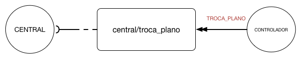

# Troca Plano
A mensagem de troca de plano é enviada pelo controlador para a central sempre que acontece uma mudança de planos.




A seguir estão detalhados todos os eventos possíveis:

## Especificação 
| Campo| Tipo | Obrigatório| Descrição |
| ------|-----------|----------- | ----------------------- |
| momentoDaTroca   | Texto      |S| Data e hora no formarto "DD/MM/AAAA HH:MM:SS" do momento real da troca de plano    |
| momentoOriginal  | Texto      |S| Data e hora no formarto "DD/MM/AAAA HH:MM:SS" do momento original da troca de plano |
| anel             | Objeto [anel](#anel)|S| Objeto anel|
| impostoPorFalha  | Booleano   |S| O plano foi imposto por falha|
| imposicaoDePlano | Booleano   |S| O plano foi imposto |
| plano             | Objeto [plano](#plano)|S| Objeto plano|
| descricaoEvento  | Texto | Descrição da troca de plano|

### Anel
| Campo | Tipo | Obrigatório| Descrição |
| ------|-----------|----------- | ----------------------- |
| posicao   | Número Inteiro      |S| Número do Anel    |

### Plano

| Campo| Tipo | Obrigatório| Descrição |
| -----|------------|----------- | ----------------------- |
| posicao   | Número Inteiro      |S| Número do plano    |
| modoOperacao   | Texto      |S| Modo de operacação do anél    |
| descricao   | Texto      |S| Descrição do plano    |

## Exemplo


```JSON
{
  "tipoMensagem": "TROCA_PLANO",
  "idControlador": "7abfa23d-5646-4b8c-87ae-e68addbabb36",
  "destino": "central/troca_plano",
  "qos": 2,
  "carimboDeTempo": 1479929117853,
  "conteudo": {
    "momentoDaTroca": "23/12/2016 11:00:00",
    "momentoOriginal": "23/12/2016 11:00:00",
    "anel": {
          "posicao": "4"
    },
    "impostoPorFalha": false,
    "imposicaoDePlano": false,
    "plano": {
      "posicao": "2",
      "modoOperacao": "TEMPO_FIXO_COORDENADO",
      "descricao": "PLANO 2"
     },
    "descricaoEvento": "Plano 2 - TEMPO_FIXO_COORDENADO de tabela horária"
  }
  "emResposta": "null"
}
```


